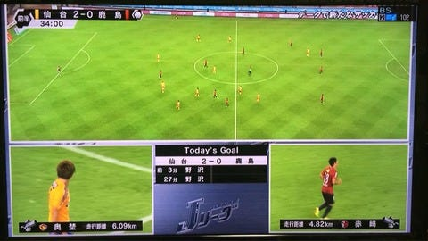

### ゼミ論～テーマ決め～

こんにちは。先週、ゼミ論進捗報告でテーマが決まっていないのは自分だけだと気づき多少の焦りを感じています、古橋研究室四年の松本です。

前回のブログ更新から、早一週間が経とうとしていますが少なくともテーマは決めようと思いいろいろと調べていました。結論から申しますと、、

_**スポーツにおけるトラッキングデータとその可能性_**

抽象的ではありますが、このテーマについて研究をしていこうと考えています。

### 背景

このテーマにした背景としまして、まずは自分の**興味**があるかが大前提でした。興味というのもただ単に「好き」なものではなく、深く知りたいという自分の欲求から生まれたものであります。

その深く知りたいものとは、、、

- トラッキングという位置情報技術技術を駆使し、プレーを「見える化」したことにより視聴者側にどのような変化があったか

- そのデータの活用法は何か

- そのデータを応用することはできるのか、また技術の将来性

です。

まだ、調べて間もないためテーマも背景も知りたいことも非常に抽象的でではありますが、ひとまず先生にいろいろ相談し、進めていければいいなと考えています。

次回のゼミは遅れると思いますが、出席させていただきます。よろしくお願いいたします。
