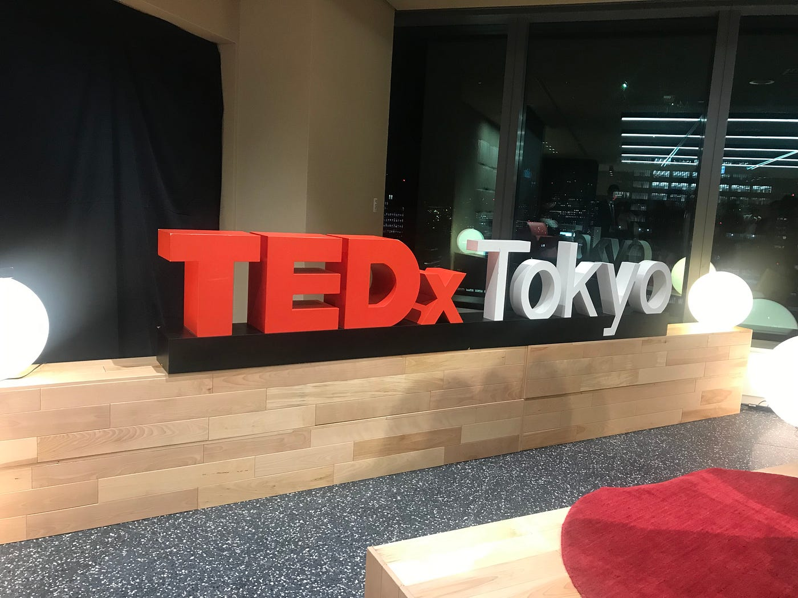
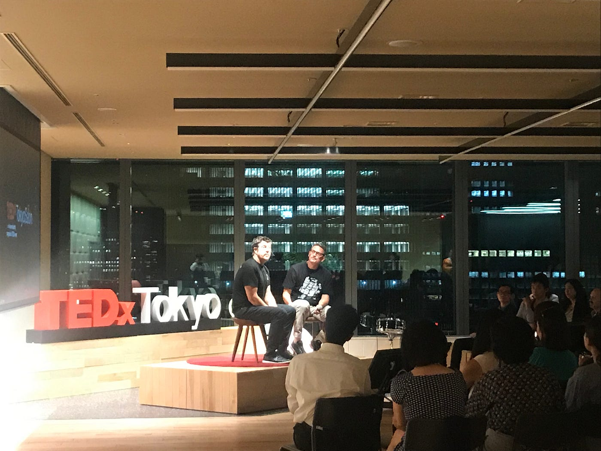
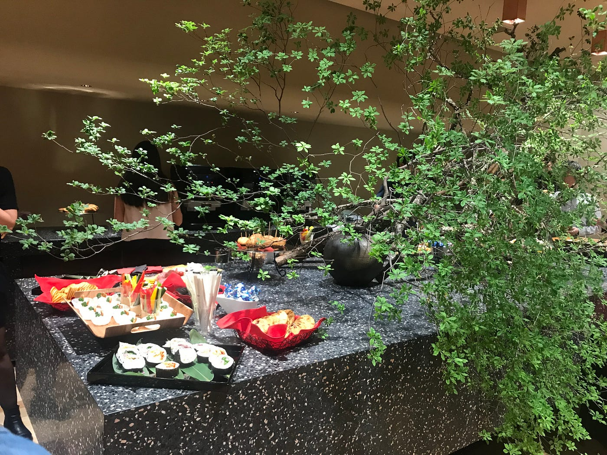

### TEDxの始まりin JAPAN

どうも、青山学院大学古橋研究室4年の末光香織です。

今回はTEDxTokyoについてのお話をしていきます。

### TEDxTokyo

世界中にあるTEDx団体ですが、

このTEDxTokyoは本拠地であるアメリカ以外で初めてのTEDxとして作られました。なんと世界で2番目なんです！

第一回目は、2009年にお台場の日本科学未来館にて行われました。

### これから

最後の開催は2016年。

今年2019年はTEDxTokyo10周年ということで

9月に3年ぶりの開催を目指しています。

そのために現在、3月から毎月TEDxTokyoSalonというプチイベントを日本橋にある大学院大学至善館にて開催しています。

5月17日（金）に行われた様子が動画で掲載されているので興味のある方はぜひ見てみてください。今回はTEDxTokyo Talkオーディションのため様々なバックグラウンドを持つ方々のお話を聞くことができました。

[TEDxTokyo Salon Live Streaming on Monday, April 8th 2019
Lorem ipsum dolor sit amet, consectetuer vitae adipiscing elit. Aenean commodo ligula eget ut, dolor. Aenean massa. Cum…www.tedxtokyo.com](https://www.tedxtokyo.com/news/shizenkan-live-streaming-on-april-8th-2019/?lang=ja)

微力ながら、私もフード担当で参加させてもらっています！

この経験をTEDxAoyamaGakuinUでも活かしたいと企んでいます。

次回はこの前のゼミで古橋先生からいただいたアドバイスを元にこれからのことをまとめていきたいと思います。
