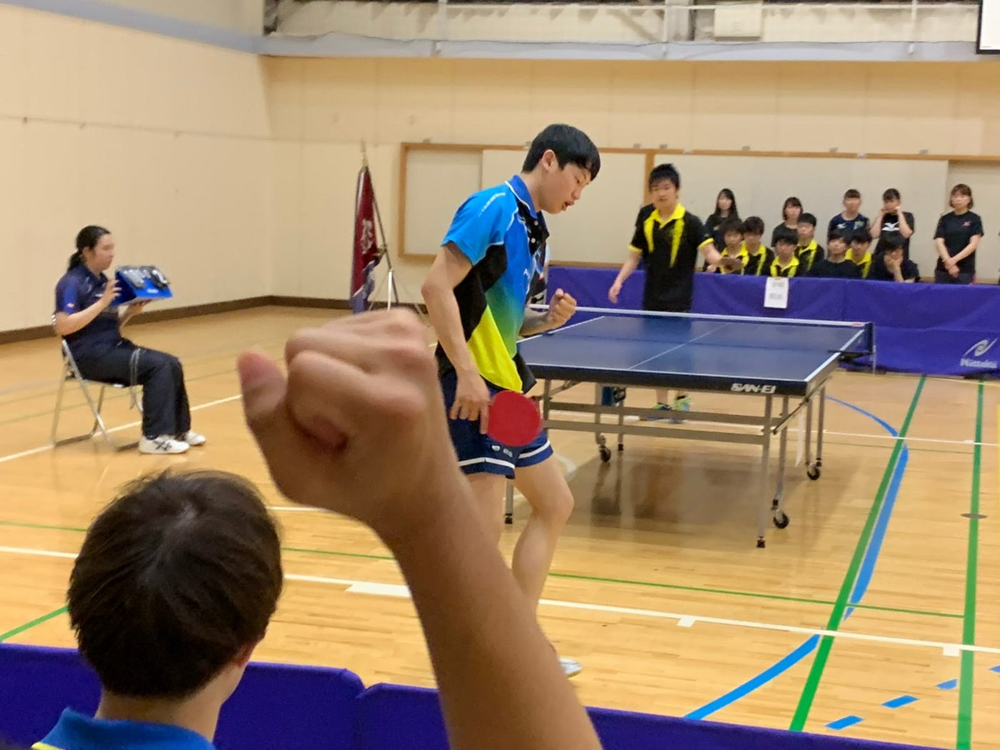

### 卒論ブログ②

こんにちは
青山学院大学 古橋研究室４年の増田将馬です。

今回はゼミの進捗具合について書くことがないので最近の自分の生活について書きます。

最近自分は部活三昧で全く他のことに手がつけられていません。
午前中：就職先の推奨資格勉強、午後：部活、帰宅後：風呂入って３０分で就寝
というサイクルをここ三週間ほど続けています。
ここまで部活ばかりやっていると、たまになぜ自分が部活を行なっているかわからなくなりますね笑

４年生なのであと二回しかリーグ戦はありません。
最後の青春を全力で駆け抜けたいと思います！

ゼミの話とは一切関係ありませんでしたがこれで今回のブログを終わりにします。
最後まで読んでいただきありがとうございます。
