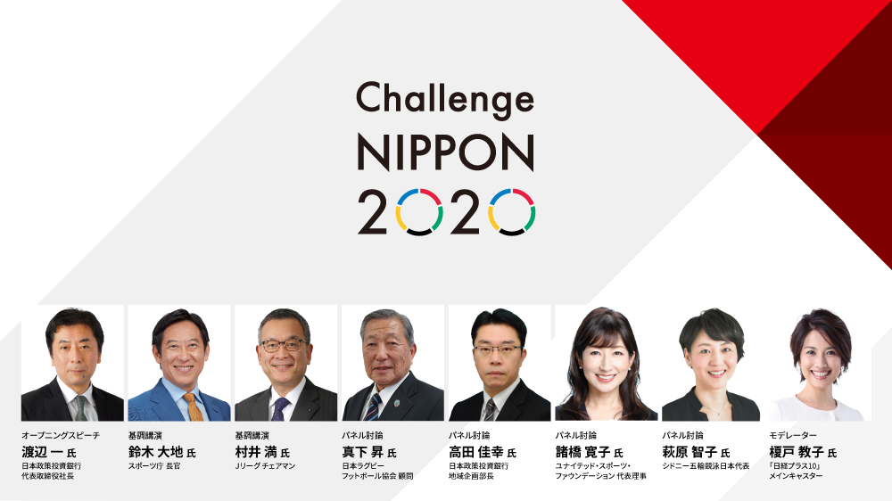

### ゼミ論ブログ③

こんにちは。古橋研究室四年の松本です。

前回のブログ更新日から怒涛の面接ラッシュが続き、本日まで都内を駆け回っている状態で疲労が溜まっております。。。今日やれば、次回は面接解禁の6月なので少し休養です、と言いたいところですがゼミ論も並行してやらなければならないということで休む暇はありませんね。（笑）

そんな一週間だったので、ゼミ論についてはあまり進んでいません。前回紹介してくださった神武直彦教授のプロフィールくらいしか調べていないので今回は近況報告とさせていただきます。

先日、**「チャレンジニッポン スポーツで生み出す地域の活力」**（日経主催）の講演会に行ってきました。スポーツ長官の鈴木大地氏やJリーグチェアマンの村井満氏などスポーツ業界では著名な方々から、スポーツで地域活性化を目指す取り組みやビジョンについてのお話を聴いてきました。

今年から三年間はスポーツゴールデンイヤーズと呼ばれ、特に日本の魅力を伝えたり地域活性化に繋げられるチャンスの年ということを聴きスポーツに関連させたゼミ論を書く自分には関連してくるのではないかと思うと同時に、非常に充実した講演会でした。

来週は、ゼミ論の内容を少しでも濃くできるように調査を進めていきたいと思います。
