### Maprayを使ってみよう！（後編）

_使ってみてわかる、高い技術力。_

### 1. はじめに

当ブログは、前編である[Maprayを使ってみよう！（前編）](https://medium.com/furuhashilab/mapray%E3%82%92%E4%BD%BF%E3%81%A3%E3%81%A6%E3%81%BF%E3%82%88%E3%81%86-%E5%89%8D%E7%AF%87-c4a503765fef?source=friends_link&sk=7eaca99379e8a43574941694008bce5e)の続きとなっている。前編では使用する環境の構築を説明しているので、できていない場合は前編より読んでいただきたい。なお、予定では後編完結後、時期を見て前編後編をひとつに繋ぐ予定。

今回も卒論進捗報告は一旦置いて、Maprayの紹介をしていこうと思う。

### 2. Mapray cloudへの登録完了

さて、前回の記事通りに環境を構築できた場合、お問い合わせフォームからMapray cloudへの参加申請が完了し、登録方法が記載されたステップガイドを入手できているはずだ。ログイン→ユーザー登録まではガイド通りに進めていこう。

以降はユーザー登録まで完了していることを前提に話を進める。

[https://cloud.mapray.com/](https://cloud.mapray.com/)

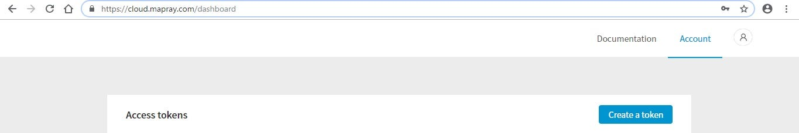

上記にアクセスし、ログインするとdashboadに飛ぶはずだ。ここでは各種Maprayの説明書であるDocumentationと現在のタブであるAccountにアクセスすることができる。

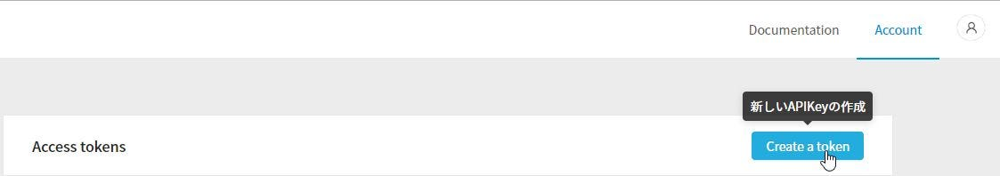

Accountタブの右上にある「Create token」から新しいAPI Kyeを作成しよう。

API Kyeとはなにか？という方へ簡単な説明。

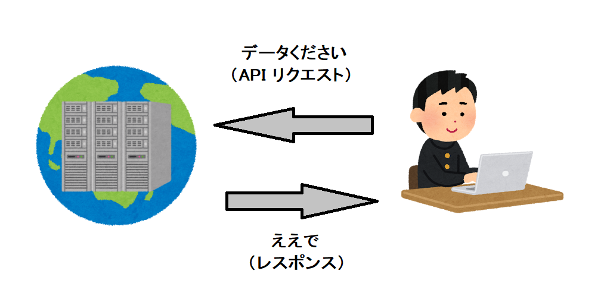

通常のサーバー通信は、ユーザーからリクエストを送られるとそのリクエストに対して計算結果をレスポンスとして返す。

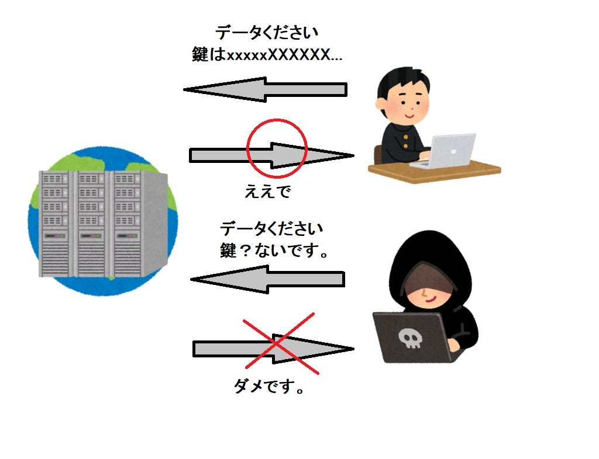

それと対照的に、データの通信に鍵を必要とするタイプもある。この場合通常のAPIリクエストと同時に鍵を送る。この鍵が無ければデータを受け取ることはできない。この鍵がAPI Kye、アクセストークンなのだ。

今回のMaprayもメンバー限定サービスとして公開されているので、アクセストークンを必要としているというわけ。

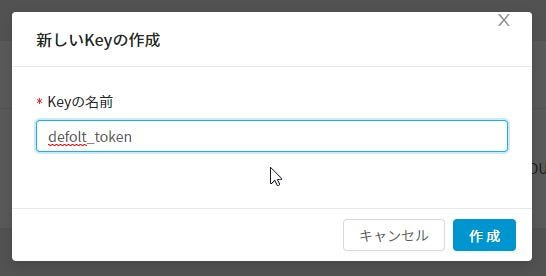

さて、先ほどのCreate token をクリックするとこのウインドが出てくる。トークンに好きな名前を付けて、作成をクリックする。なお、この名前は特に使用しないので英語じゃなくても良い。

これでトークンの作成が完了。まずはMaprayの動作確認として、

Hello Globe !! を試してみよう。

### 3. Hello Globe !!

さて、プログラムを初めて学習する時にいつもお世話になる「Hello World!」のMapray版を動作させよう。

[https://cloud.mapray.com/documentation](https://cloud.mapray.com/documentation)

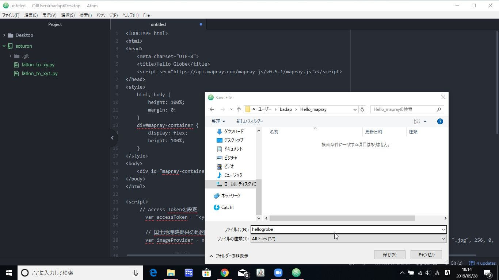

Hello Globe!!のソースコードを公式ドキュメントから拝借する。

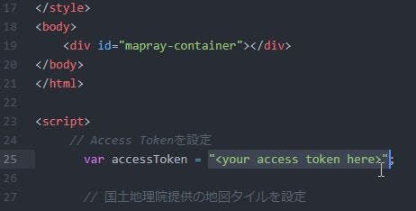

この25行目にアクセストークンの設定があるので、ここを先ほど取得した自分のアクセストークンへ変更する。

‘(Your access token)’

注意点としてアクセストークンを囲むのは” ”ではなく、’ ’。

編集が完了したらhtmlで保存。

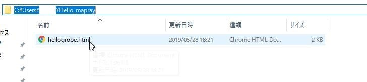

適当なフォルダに保存したら、Pythonでこのフォルダを起点にローカルサーバーを立てる。

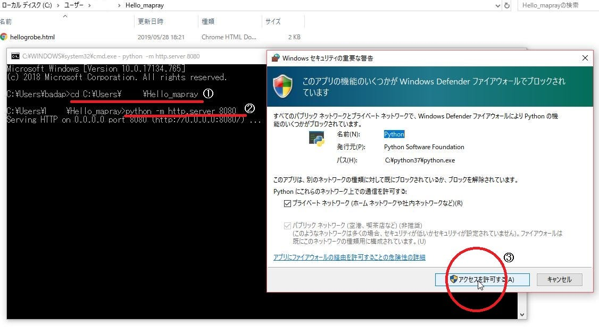

コマンドプロンプトを立ち上げ、①cdコマンドでhtmlを置いたフォルダへ移動。その後、②Pythonでローカルサーバーを立てる。③セキュリティ警告が出るのでPythonのアクセスを許可。

なお、前回の項目で説明したが、導入しているPythonのバージョンによっては、このコマンドが違っているので注意。（正確には呼び出すモジュールが変更されている）

[pythonでローカルwebサーバを立ち上げる - Qiita
概要 pythonで検証用のwebサーバを起動する方法です。 ローカル上で動作確認をしたいので、pythonの標準ライブラリでwebサーバを立ち上げてHTMLの表示まで。 #環境 Mac Sierra 10.12.6 python...qiita.com](https://qiita.com/okhrn/items/4d3c74563154f191ba16)

ここがわかりやすいので参照すること。

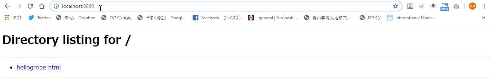

IEやChoromeなどのブラウザでアドレスバー（URL入力するところ）にlocalhost:8080と入力する。きちんとローカルサーバーが建てられていれば次のような画面が表示されているはずだ。

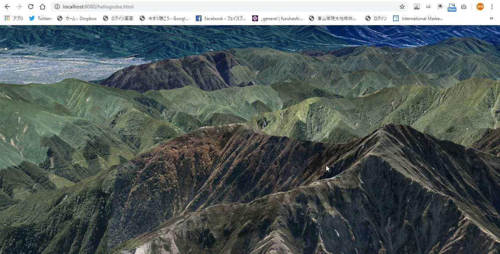

先ほど保存したhtmlをブラウザ上から開くと、このような画面が表示される。Hello Globe!!成功だ。

### 4.感想

ここまででとりあえず、Maprayを使うことができた。しかし、これはMaprayのほんの一機能でしかない。今後のアップデートで更に使いやすく、高機能なサービスもアップデート予定である。今後、正式にリリースされ、多くのユーザーに使われることで、新しい使い道や調整が行われることは間違いないだろう。

Maprayは既存のライブラリと異なり、高い技術力が無くても利用できるようにというコンセプトがある。実際にここまで触ってきた方なら、その意味を理解できたように思う。この記事はかなり易しく説明を行っているので、公式リファレンスもさることながら、新規ユーザーの助けになったのなら、嬉しく思う。

なお、サンプルプログラムの動作説明は、古橋研究室のQiitaブログで書かせて頂く予定なので、もし気になる方はそちらも参考にして頂きたい。

最後にアルファテストに参加させて頂き、なおかつ貴重なお話を聞かせていただけた開発者の松本様にこの場ではありますが、感謝を述べさせて頂きます。本当にありがとうございました。
