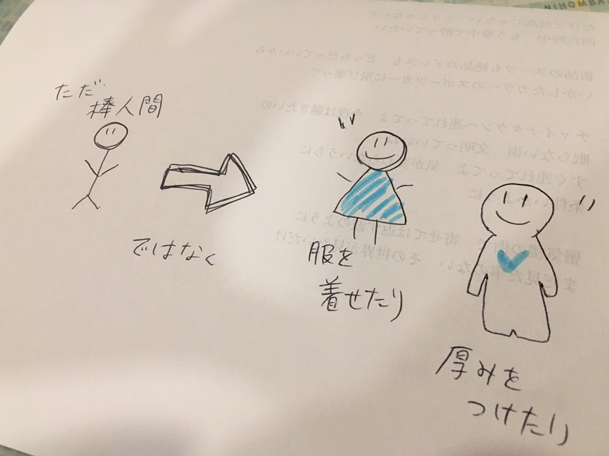

### 卒論ブログ vol.2

お疲れさまです、ほりです。

間隔が空いてしまいすいません、、、週2ペースで更新してみんなに追いつきたいと思います、、、。

今日は、昨日ゼミ終了後に行ったグラレコ部のミーティングについて書きたいと思います。

卒論もグラレコ関連なので一応卒論関連ということで。

いまのとこグラレコ部は末光さんを部長として、

毎週火曜5限のゼミ後にミーティングと、

月に一度(おそらく土日？)に時間を決めてzoomなどを利用してオンラインでのミーティングを計画しています。

火曜のミーティングは、それまでに事前に決めておいたTEDtalkのグラレコを各自作成し、それを持ち寄ってお互いのフィードバックをしていこうという流れになっています。(まだ昨日の話し合いに全員参加していたわけではないので未確定ですが…)

月に一度のオンラインミーティングは、普段学校に来られない社会人の先輩方にも参加していただき、何かできたらいいなと思っています。

わたし的には、最初はお互いの自己紹介のグラレコを描いたりすれば、グラレコ力もプレゼン力もついて良いのではないのかな、、、と思ったり。

せっかく時間を割いてオンラインで集まるので、何か普段のミーティングとは違うことができればなぁと思います。

あとは個人的にはかおりちゃんからグラレコの本を見せてもらって、なるほど、、、という発見が沢山ありました。

もともと絵が得意とかでは全くないので、人物を描くときなんかは棒人間を多用してたタイプだったのですが、棒人間にも描き方があるようで、

こんな風に服を着せたり、厚みを持たせることで一気に凝ってる風に。

とても面白くてめちゃくちゃ参考になりましたありがとうございました、、、！

次回はこの間たまたま就活で描いたグラレコのエントリーシートについて。
