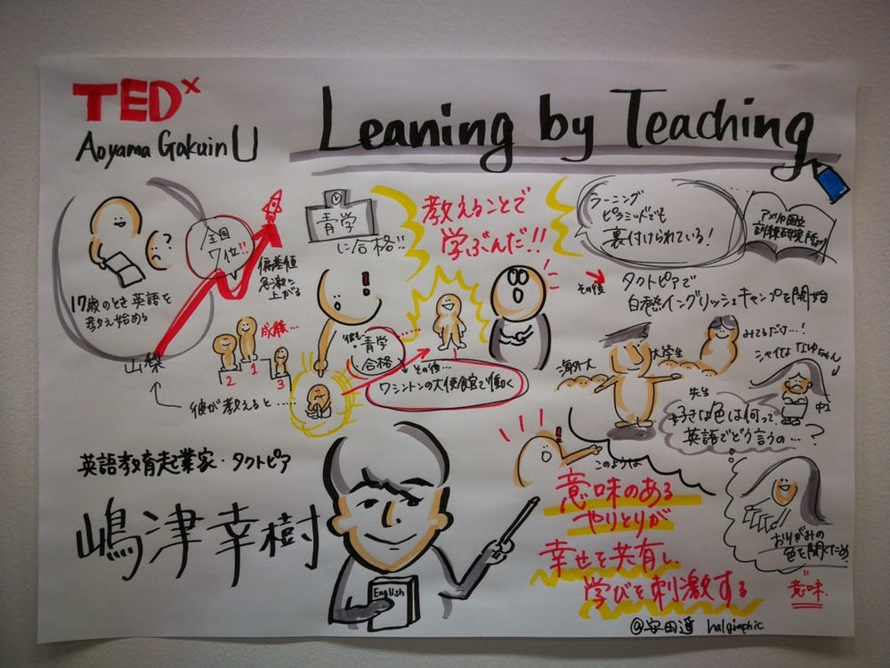
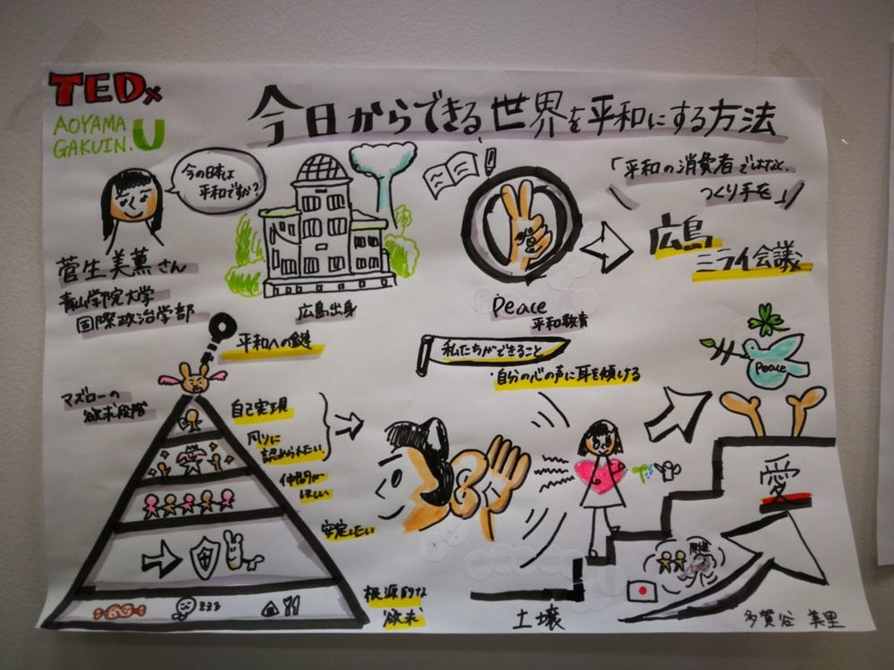
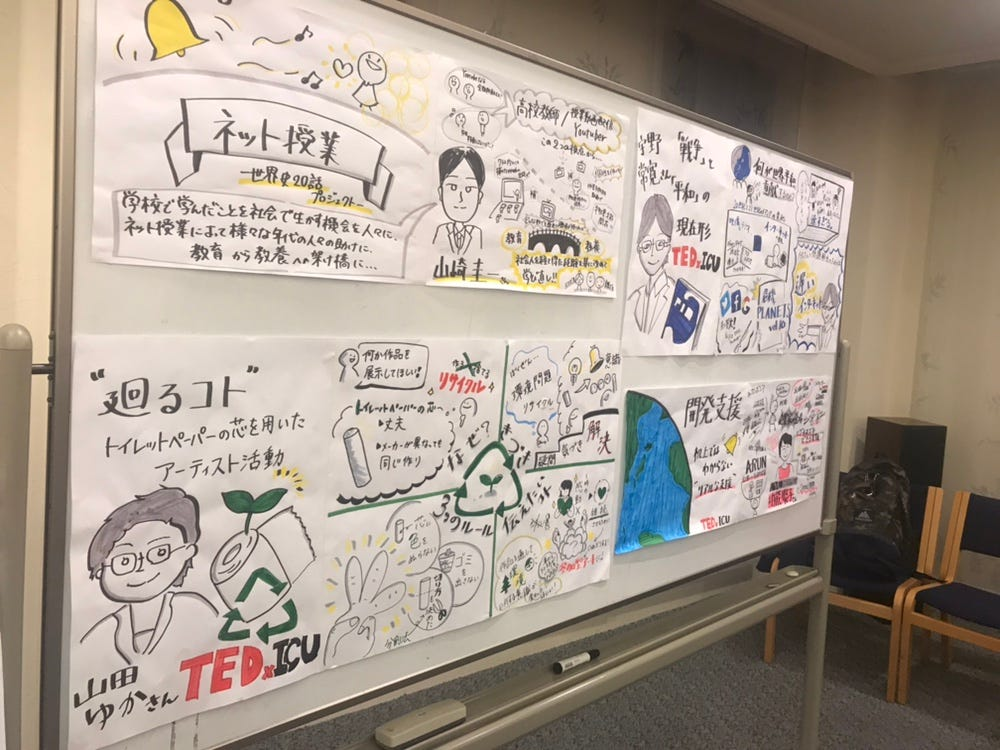
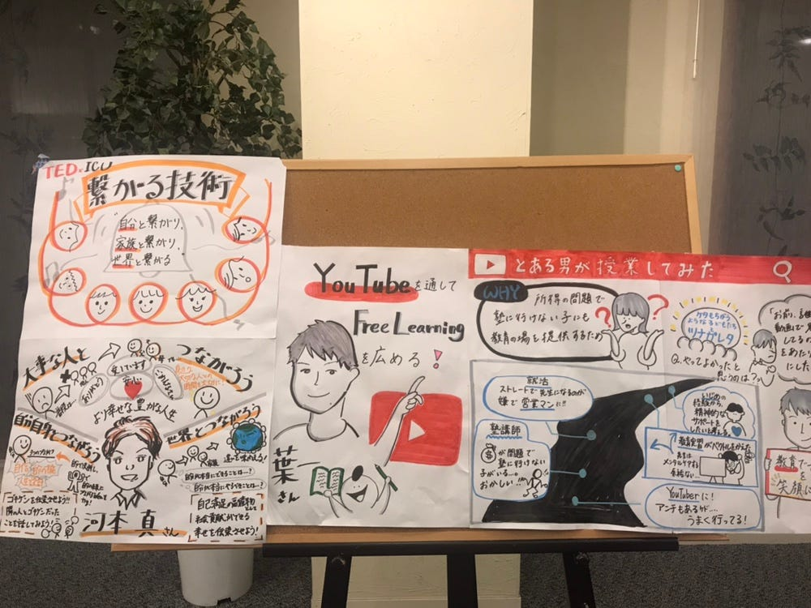

### TEDx × グラレコ

どうも、青山学院大学古橋研究室4年の末光香織です。

今回は自身の卒論・ゼミ論のテーマでもあるTEDxとグラレコについて書いていきます。

### この二つを掛け合わせた理由は？

私の所属しているTEDxAoyamaGakuinUカンファレンス愛好会での活動（そういえば正式に愛好会になりました！笑）と古橋研究室で学んでいるグラレコ。

せっかく素晴らしいトークをしたのにイベント後のレセプションに内容を覚えていないなんてもったいないですよね。そんな時にイラストで内容が可視化された物があったらより記憶に残ると思います。

昨年に開催したTEDxAoyamaGakuinU2018で実際に行っているんです！スピーカー１人につきA4用紙1枚、グラレコをして展示をしました。

#### 結果としては好評！！

スピーカーの方々にも「いただいてもいいですか？」と言われるほどでした。トーク後のレセプションでも多くのお客さんが興味深く見てくださっていました！！

この時に当日ボランティアとして来てくれていたTEDxICUのオーガナイザーの高橋さんがグラレコに興味をもってくれて、ICUでもグラレコをかとゆかさんとドットの方と一緒にしにいきました。

こんなふうにグラレコが広まっていくのは嬉しいです。

### 今後やること

今までに関わってくれた人にTEDx×グラレコについてのフィードバックをもらったりして、グラレコの在り方について検討していきたいと思います。
