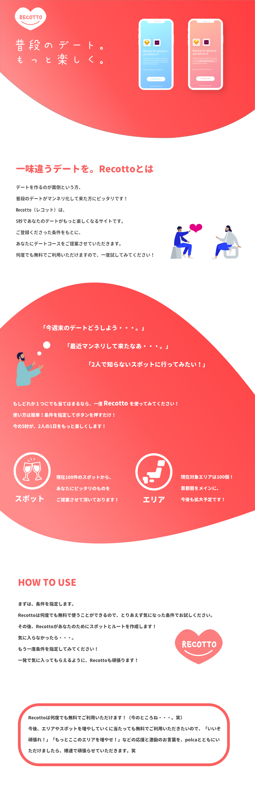

### デートをアップデートせよ！UI編

どうも、こんにちは！古橋研究室4年の板垣勇渡です！😃

> _**今回の取り組んだこと_**

UI設計を改めて考え直しました。

これまでのUIはただ見栄えがよければいいとしか考えず、設計した結果、結局何のサイトなのかわからない問題が発生してしまっていました。

[http://35.247.120.126/](http://35.247.120.126/)
↑これが作成しているサイトです。

> **現在の課題**

① 説明が全くなく、何のサイトかわからない。

②使っているイラストが、カップルな為、マッチングサイトのようになっている。

> **改善点**

上記二つの課題の解決策をそれぞれ考案しました。

① → 現在作成しているサイトとは別にサービス説明のLPを作成し、そこから遷移させる。

② → カップルのイラストではなく、スポットの写真を使い、デートコースのサイトだということを認識させる。
