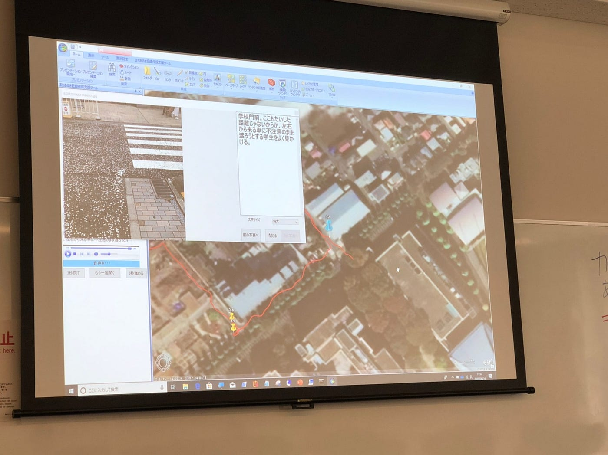
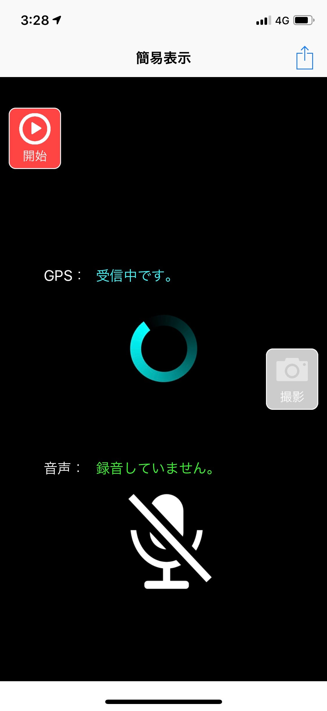
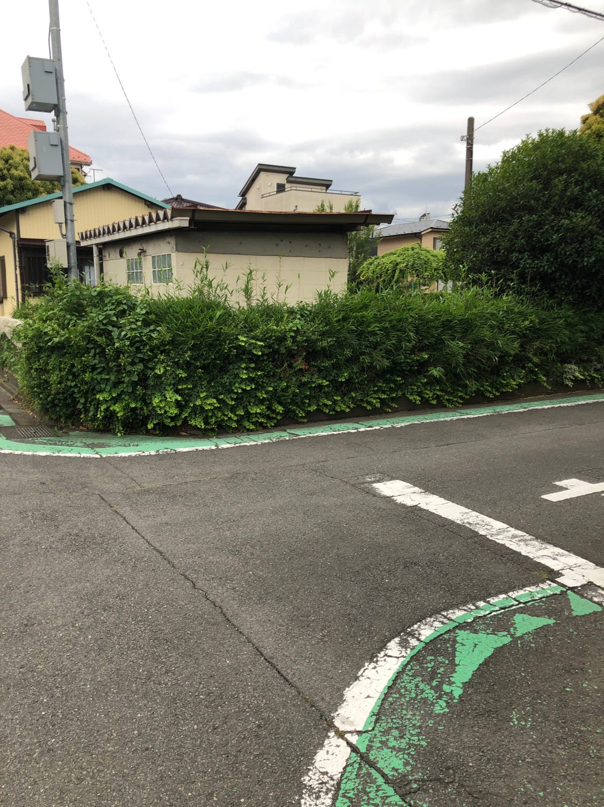
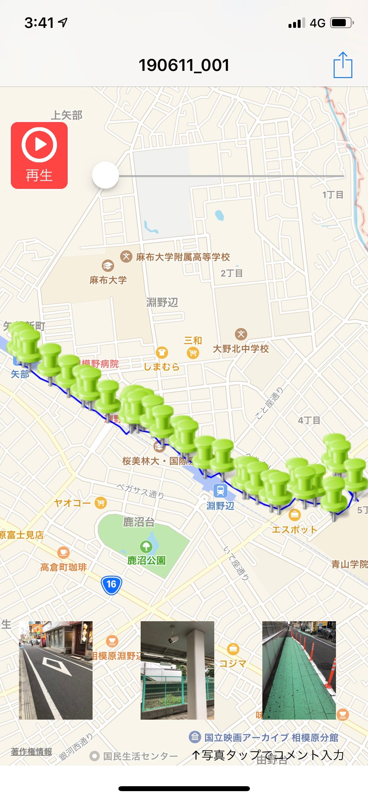
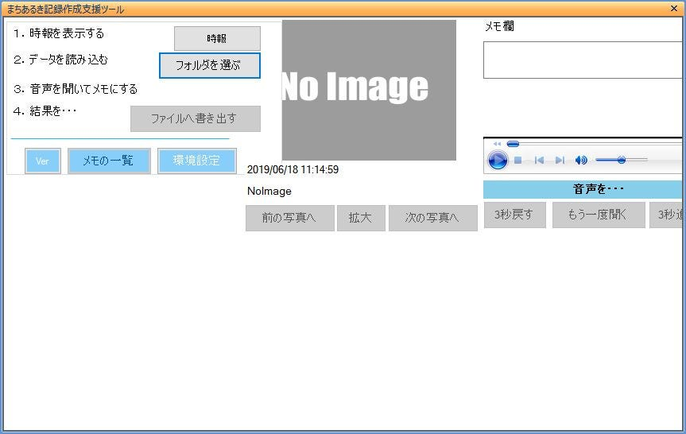
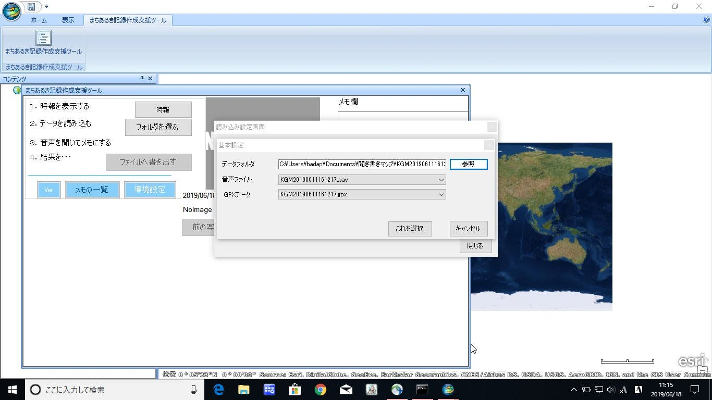
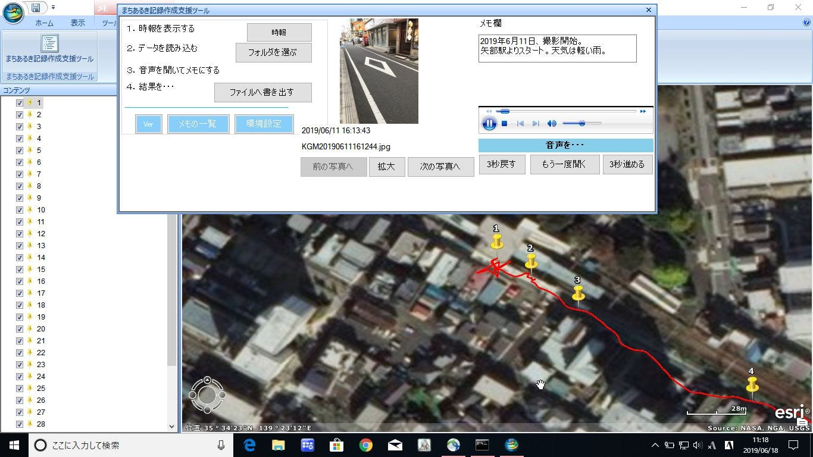
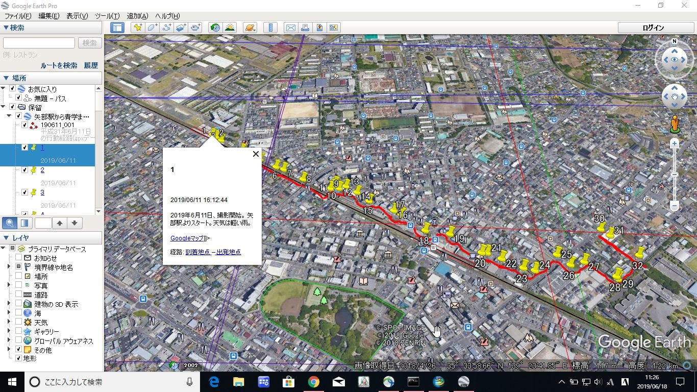
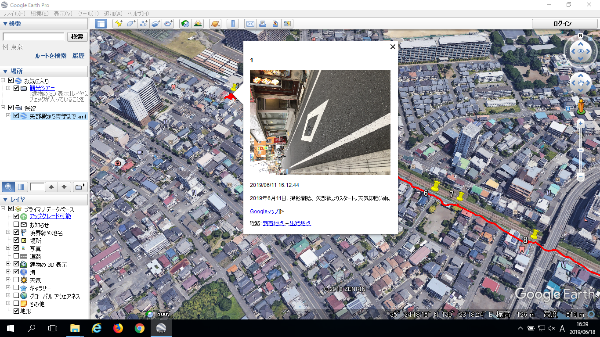

### 聞き書きマップを使ってみよう！

_アプリ越しに見るいつもの街並みは。_

### 1. はじめに

皆さんこんにちは。2期生の武末です。順調に就活が続いており、六月中には終えられそうでホッとしています。つい気が緩んで夏休みの計画を立てたりしていますが私は元気です。

さて、私は前期の授業として応用空間情報Ⅲを履修しています。先生は原田豊先生..そう、もうおわかりですね？｢聞き書きマップ｣です。

B棟のPCを使っていて、1度はそのアイコンを見たことがあるんじゃないでしょうか？（使ったことある人は少ないと思うけど）

今週、聞き書きマップを使って街の危険な場所の調査を行い、授業で発表をする機会がありましたのでついでにこちらでもブログを書いてみようと思います。

### 2. 聞き書きマップとは？

[『聞き書きマップ』とは
www.skre.jp](http://www.skre.jp/KGM_3100_top/KGM_top.html)

> 『聞き書きマップ』は、その名のとおり、防犯まちあるきなどで気づいたことを、現地で紙にメモするかわりに音声で録音しておき、あとでそれを「聞き書き」してパソコンのデータにするためのソフトです。「聞き書き」した文字データを、現地で撮影した写真や歩いた経路のデータとともに、地図データの形で保存できるので、いつ・どこを歩いて、現地の状態がどうだったかを、誰にでも一目でわかる「まちあるき結果地図」として示すことができます（公式サイトより）

と、説明がある通り、街を歩きながら写真を撮って音声を保存し、最終的にkmzへ出力することが出来るソフトウェア・アプリのことです。

みなさんは普段の通勤、通学路で危険な場所、或いは気をつけなければいけない場所を知っていますか？それらの情報というものは普段その道を使っている人にしかわからないものばかりです。その情報を収集し、公開することは街全体としての防犯機能を向上させ、よりよい街づくりを実現することができます。

防犯マップやハザードマップというものは市や自治体が制作する場合が殆どです。しかしこれらを整備するには大変コストが掛かり、常に最新の状態を保つことは難しいのが現状です。そこで街を利用する私たち市民が自主的にこのような情報を作成、共有することができればこれ以上に素晴らしいことはありません。

また、制作することによって改めて街を｢防犯｣という視点から見直すことができ、自らの防犯意識を高めることもできます。

さてそんな聞き書きマップ、実際に使ってみるとこんな感じでした。

### 3. 聞き書きマップを使ってみた

今回はiOS版の聞き書きマップを使って紹介していきます。といってもAndroid版と使用方法についてはそこまで変わらないと思います。

ちなみに公式サイトにも使い方の紹介がありますので、詳しく知りたい方はそちらもご覧下さい。

アプリを開くとこんなUIが飛び込んできます。直感的に使い方がわかる良いデザインです。

左上の開始ボタンを押して、歩く。気になる場所を見つけたら撮影ボタンを押してパシャリ。

その後スマホに向かって声でメモを残す。また歩く。撮影する..。その繰り返しです。

撮影し終わって終了するとこんな感じになります。写真をタップすると、撮影した瞬間に音声データが移動し、録音したメモを聞くことが出来る、という仕組みです。

### 4. PC版聞き書きマップに読み込ませる

聞き書きマップを起動すると、このような画面が立ち上がります。

あらかじめiTunesを経由して保存したスマホのデータを読み込ませると

このように、撮影したポイントと音声がArcGISへ読み込まれます。メモを残すことも可能で、この情報が属性情報としてkmzへ保存されます。

出力したkmzをGoogle Earth Proで表示するとこんな感じ。

※写真が表示されていないのはリンクがdata/xxx.jpgとなっているからだが、直リンクで表示しようにもver7.3では読み込めないjpgのフォーマットらしくちょっと困ったことになっている（要確認）

<追記2019/06/18>

Google Earth Pro 7.1.7.2602では正確に表示されていた。

おそらく7.3系の処理違いによるものと考えられる。

### 5. まとめ

以上、授業で使った範囲ではありましてが聞き書きマップの紹介となります。

とても簡単に使えるので、実際に小学校の授業などでも使われていて、大変有意義なツールになっているんだなと思いました。

防犯というテーマだけでなくても、例えばOSMのマッピングなどに使ってもいいかなって思います。写真と移動の軌跡をひとつのアプリで完結出来るのは楽ですし、管理もしやすいです。

ぜひ皆さんも、様々な観点から聞き書きマップ越しに街を見直してみはいかがでしょうか？
