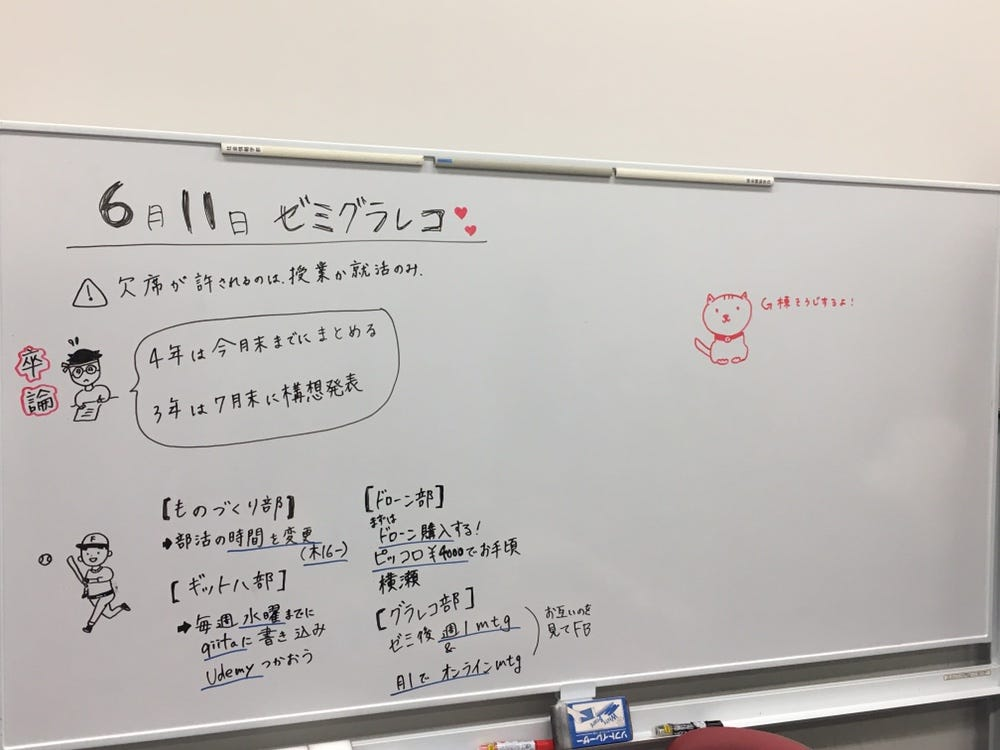
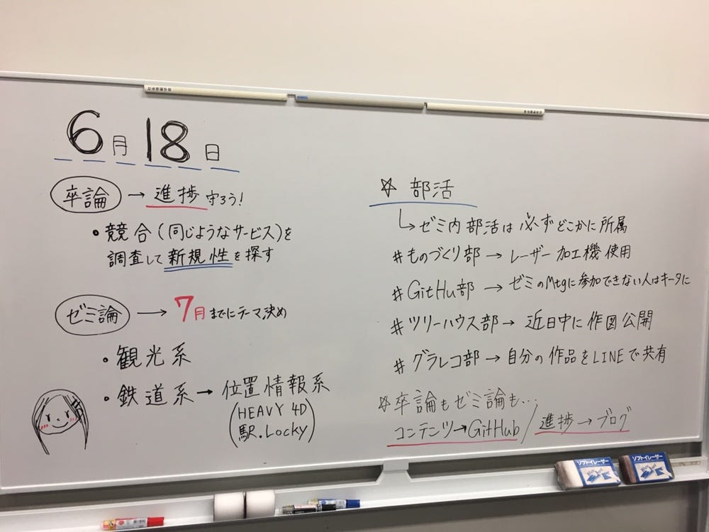

卒論ブログ vol.3

お疲れ様です、ほりです。

次はESのグラレコを載せます！と前回宣言していたのですが、先に先週今週とやったゼミグラレコについて書きたいと思います。

6月11日分はこちら。

この時はゼミの時間の半分が研究室の清掃だったので、内容が少なめ。

それを踏まえてバランスよく描けばよかったなあと反省。

あとはグラレコ中に御社から電話が来たので（笑）

その間にあっちゃん(中西)が絵を描いたりしてくれました。上手だ〜〜！！！

そして昨日6月18日分がこちら。

今回は前回の反省を踏まえて、詰めて描き過ぎないことを意識しました。

あとは元々置いてあるペンの種類が少ないというのもありますが笑

あまり色を多用しないよう、文字の大きさ、強弱、間隔を注意しました。

また、色で文字を書くと見づらいと思ったので、色は下線を引くか、使う場合は大きさを気をつけました。

こうやって見てみると、やはり赤っていうのはすごく目立ちますね。また、重要な感じが伝わります。

今回は締め切りやルールなど大事そうなところに赤を使いましたが、もう少し色分けも工夫できたらなあと思います。

また、2週通じて感じたのは、わたしが左利きだからというのも関係あると思いますが、

### ホワイトボードで文字を書くのってすごく難しい！笑

黒板にチョークで文字を書く時ほど筆圧が要らないので力加減と、手を置きながら書けないのでバランスが難しいです！

サラサラと綺麗に黒板やホワイトボードを使う先生方はすごいですね。わたしも早く綺麗に描けるようになりたいです。

次回のブログこそ、ESグラレコをあげたいと思います！

ただ中身が自己PRとかなので大分恥ずかしい！笑

多少モザイクをかけて載せたいと思います笑

それでは次回につづく！
