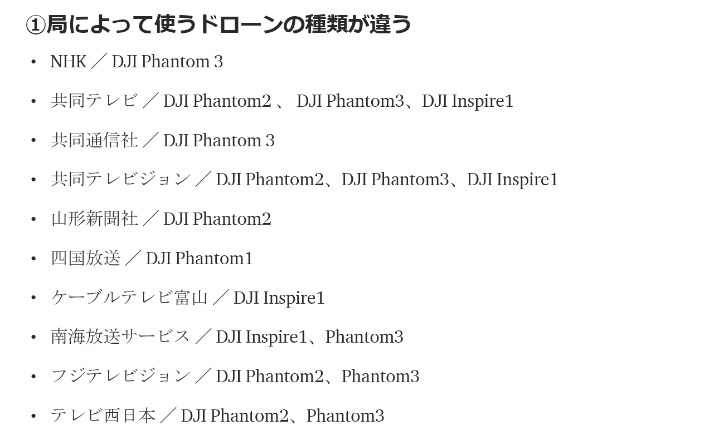
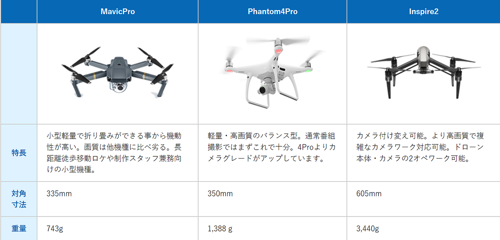
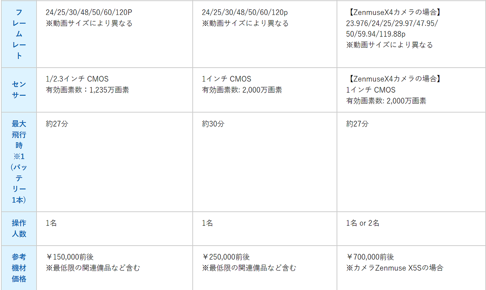

ゼミ論進捗

こんにちは。再びの中西でございます。

周りよりも進捗遅れているのでアップできるときにしていきたいと思います。

さて、私のゼミ論テーマ「テレビ局とドローンについて」

関係ないのですが今ドローンのタイムリーな問題といえばイランvsアメリカのドローン偵察問題…。

ドローンが国際問題に関わっているなんてちょっと驚きです。

どんなドローンが使われていたのか少し気になってしまいました。

ドローンとテレビ局について調べていたら非常に興味深いサイトを発見したので本日のブログで紹介します！

> ドローン事業部ソラカメラ

テレビ局から依頼されてドローン映像を撮影している会社みたいです。

いろいろと、ドローン映像の基準などについてホームページでまとめていました。

[テレビ番組撮影：目的別ドローン発注ガイド！ | ドローン空撮・撮影【ソラカメラ】
テレビ番組ドローン空撮の時に必ず押さえておきたいポイントを徹底解説。5分でわかる情報。ぜひソラカメラへ空撮のご依頼を！www.soracamera.jp](https://www.soracamera.jp/case/tv.html)

_**「空撮で主に使われる機種として下記の3種があります。いずれもDJI社製の機種です。通常のロケ番組ではPhantomが一番よく利用されているでしょう。1オペレーションで扱いやすく、適度に軽量で、画質も高い。いわばバランス型のタイプです。長時間の徒歩移動（登山）や、空撮専門スタッフ以外のディレクター・ADさんなどが兼務で撮影する場合は軽量なMavicProがよく利用されます。Inspireやそれ以上の大型機種はドラマ・CM・映画・ハイビジョン番組で使われる機種です。Inspireや大型機種はカメラ取り付けタイプで、用途に併せてカメラを付け替えることが可能です。機種の特性をあらかじめ確認のうえ撮影業者に相談ください。_**

_**またInspire以上の撮影を行う場合、撮影費用もその分上がる事も多い（撮影人数が2オペの場合や機材が高額）ので、御見積段階より特別な撮影仕様があれば撮影会社との調整が必要です。」_**

という記述がありました。

私のゼミ論進捗②のまとめなのですが…

確かにphantomが多いですね！あとはinspireも多いですかね…

用途によって使うドローンが変わるのですね。考えたら当たり前なことかもしれないけどなるほどと思いました。

高い…￥￥￥

> 本日のまとめ

①どんな映像が欲しいのか(ドラマ、特撮、映画、CM、バラエティ)によって使用するドローンが違う。

②使用されるドローンがPhantom、Inspireが多い

③普通のロケでは持ち運びが楽で画質も劣らないPhantomが頻繁に用いられる。さらに高度な映像が必要になった際Inspireが使用される。

ドローンの知識が少しずつですがついてきています…

では、失礼いたしますm(__)m
