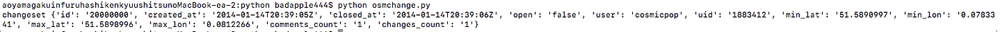

### 卒論レポート６回目

_書くことが無くなってきたぜ_

### 1. はじめに

お疲れ様です、二期生の武末と申します。無事就活も終了し希望していた企業に入社することができました。就活と学業の両立はとても大変でしたが、最終的に納得のいく結果になったのは皆様のおかげです。関係者の皆様、本当にありがとうございました。

さて、やることもなくなりこれで卒論に100%力を向けられる！というとそうでもなく、必須の単位や飲み会や飲み会や飲み会など、（？）学生特有の忙しさもあり、進捗らしい進捗を挙げられていないのが現状です。

悲しいレベルですが、少しでも報告という形でレポートさせて頂きます。

### 2. 卒論進捗

学校でお借りしているサーバーとssh通信が確立しました。外部からのアクセスはファイヤーウォール設定でhttpアクセスを許可してるつもりなのですが、いまいちアクセス出来ないので、その辺りの設定を今一度見直していく所存です。

スクリプトについては兼ねての通り、changesetをxmlからパージすることに成功しました。

あとはここから緯度経度の値を引いて、緯度経度から場所を逆引きして、その数を判定することで地域の更新状況というものを判定させることができるんじゃないかなぁ・・・。いけると思います！

以上、そんな感じです！がんばります！
