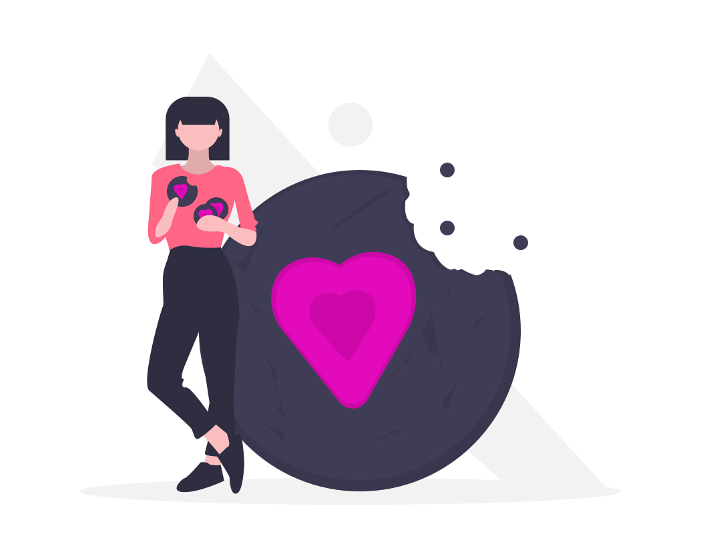
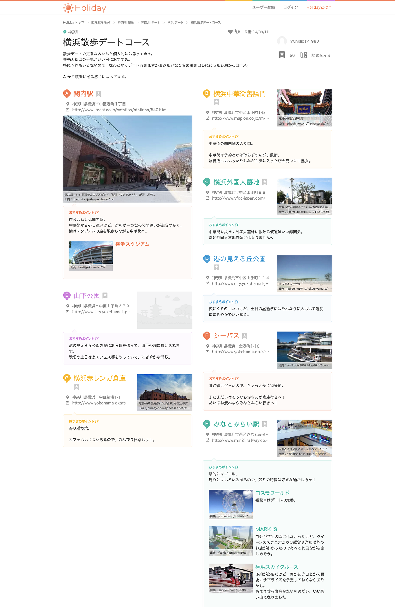
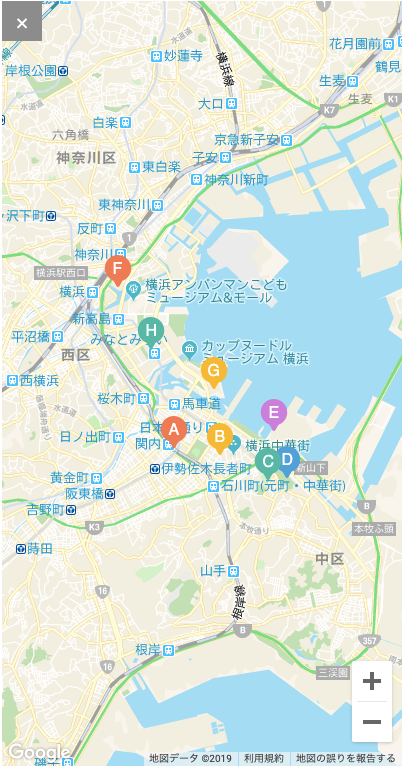

### デートをアップデートせよ！先行研究編 Part2

どうもこんちは！古橋ゼミ４年生の板垣勇渡です！
今回も進捗レポートやっていきます！前回に引き続き、先行研究です！😋

> **前回やったこと**

競合サービスのJOYMOの研究。

サービスが既にクローズしてしまったことから、デートコースのオーダーメイドに人はお金を払うほどの価値を感じない可能性が高い。

→ 基本、**使用無料**の方向で考える。

> **今回取り組んだこと**

Holidayという、お出かけサービスの研究。[
https://haveagood.holiday/](https://haveagood.holiday/)

> **Holiday**とは？

自分がしたお出かけをコース形式で他のユーザーに紹介するCGM型のサイト。

例えば、これはある横浜のコースですが、このように基本的にスポットの紹介がメインとなっています。右上にある、地図ボタンを押すと下記のようにA→B→C→D…といった感じでコースが表示される。

CGM型のサイトはこちら側が何もしなくても（少し語弊がありますが）、ユーザーが投稿をしていってくれるので、どんどんとサイトが充実していのが、メリットです。

基本僕が作成しようと考えているのは、CGMではなく、ランダムでのコース表示なのですが、CGMの要素を入れるのも、検討しようと思いました。
