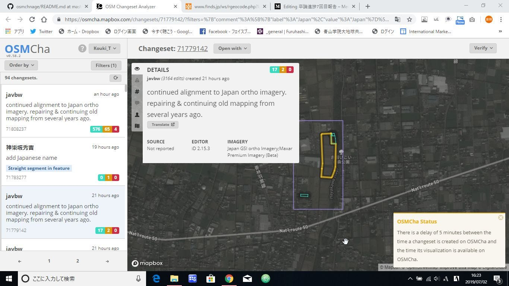
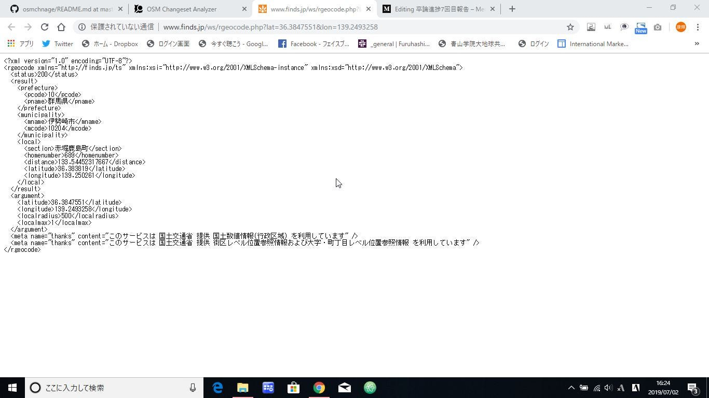

### 卒論進捗7回目報告

_定期報告する毎に進んでいく卒論..?_

### 1. はじめに

皆さんお疲れ様です、2期生の武末です。やっとこさ内定先からも今後のスケジュールの連絡が来て、10月の内定式に向かってスケジュールを立てているところであります。雨も続き、ジメジメした季節が続きますが私は元気です。

さて、進捗報告ということで今週のまとめをブログという形式で報告させていただきます。本日はゼミ内で構想発表の時間もあるのでそこで使うプレゼン（予定）も終わったら貼り付けておこうかなと考えております。

### 2. 進捗報告

今回は前回に引き続きデータ収集の部分を改修しました。具体的には前回目標としていた、changesetから取得したlat、lonから逆ジオコーティングによる住所の取得です。

逆ジオコーティングには様々なAPIの候補が考えられましたが、処理するデータの量とお値段と手間を考えた結果、今回は農研機構様の｢簡易ジオコーティングサービス｣を利用させて頂くことになりました。

[簡易逆ジオコーディングサービス
全国各地の陸地(無人島等の一部は除く)の緯度経度座標(世界測地系)を指定すると、その地点の属する都道府県、市区町村名を検索することができます。www.finds.jp](http://www.finds.jp/rgeocode/index.html.ja)

理由としては

- 一日のアクセスが10万件まで許可されている点

- 今回使用する住所が区表示までで充分な点

- 取得したデータはCCBYで運用できる点

- **lat lonをURLに入れるだけでデータが返ってくる簡易設計**

以上の要素からこちらのサービスを利用させて頂くことになりました。（今後はどうなるかわからないですが..）

今回使用するchangesetはこれ。ここからlat lonを取り出して・・・

能研機構に渡すとこんな感じに逆ジオコーディングができる。

あとはこのxmlからデータを取り出してデータベースにすれば良い。

### 3. 今後の展開

ひとまずchangesetから住所を引き出すことが出来たので、あとはこれを使って過去1年分のデータベースを作り、（SQLITE）それを分析してOSM地図上にビジュアライズする（Leafretかなぁ？）感じですね。（アバウトすぎる）

Webサービスとしてはどういう仕組みにしようかなぁ、SQL使うならJSに移行してもいいですし、node.js系でリアル処理っていうのもありですよね..。サーバーの負担しだいですが！

その辺は夏以降ということで！ひとまず今週の進捗報告は以上となります。ありがとうございました。

おまけ

[Preziリンク](https://prezi.com/view/M8nHjgqN17z1Ta9sj9te/)
