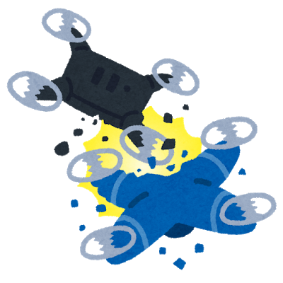

### 卒論ブログ ④

ドローン知識

みなさんこんにちは
古橋研究室４年の増田将馬です。

今回はドローンを飛ばす上で知っておかなくては行けないルールについてまとめていこうと思います。

まずドローンを飛ばす上で知っておかなくては行けないのは航空法についてです。

[きっとあなたも間違えている。国内ドローン規制3つの落とし穴
＜最新記事＞…viva-drone.com](https://viva-drone.com/restriction-for-drone-use-in-japan/)

上記サイトを参考にさせていただきまとめました。

無許可で飛ばすと航空法に触れる、場所や状況が7つあります。
①空港周辺②150m上空③人口密集地区④夜間飛行⑤目視外飛行
⑥第三者の30m未満⑦イベント会場上空⑧危険物の輸送⑨物を落としてはいけない
の７つがあります。
補足として③の人口密集地区ですが、具体的な数値として定められており「市区町村の区域内で人口密度が4,000人/km2以上の基本単位区が互いに隣接して人口が5,000人以上となる地区」（Wikipediaより引用）となっています。

これらのルールを守らないと最悪逮捕されるので気をつけましょう！
しかし例外として200g以下のドローンは航空法対象外です。練習するときは200g以下のドローンを操作すれば安心です。

上記した航空法以外にも
①国の重要な施設、外国公館、原子力事業所等の周辺②私有地の上空
③条例による制限④電波法に触れる行い⑤道路からの離着陸
などの規制があるので注意しましょう！

以上ドローンを飛ばす上で知っておかなければいけない知識でした。
次回はドローンの撮影手法について少しづつ触れていきたいと思います！

最後まで読んでいただきありがとうございました。
