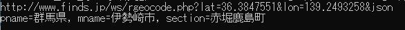
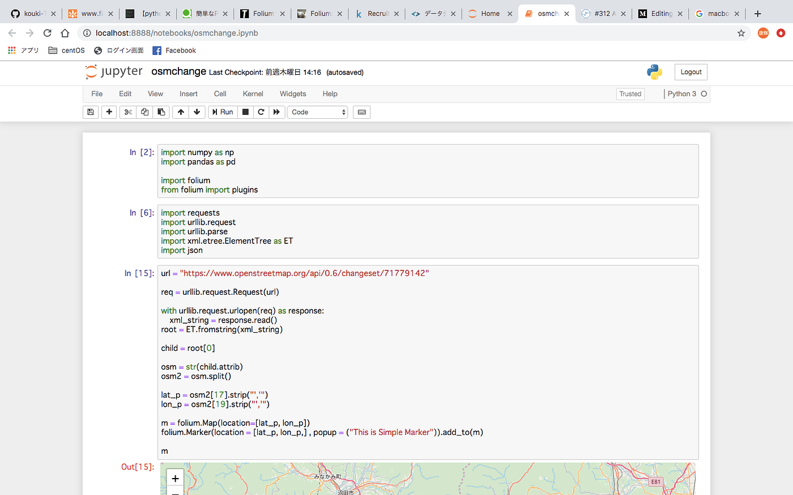

### OSM UC進捗1回目

卒論進捗報告８回目。

### 1.はじめに

みなさんこんにちは、二期生の武末です。やっとこさMacbookのインターフェイスにも慣れてきました。家での開発環境がWindows、外での開発はMacbookと使い分けているため、進捗共有のためのGithubが使えるようになったり、bashとの意思疎通（？）も少しづつできるようになってきました。今後もこの調子で10月のローンチに向けて頑張りたいと思います。

さて、気になるそのOSM UPDATA CHECKER(今後はOSM UCと表記)の進捗ですが、今回ついにFoliumの導入を行いました。

データ整備とどっちを優先させるべきか悩んだのですが、とりあえずビジュアル化できればモチベに繋がるかな、というのともしかしたら、内定先の方に成果報告を迫られる可能性が？と思い、ひとまずこちらを優先させました。

結果から言えば正解でしたね。やっとこさここまでの成果が見えるようになってきたという感じがあります。それでは進捗報告に移りましょう。

### 2.進捗報告

まず、この度changesetの緯度経度から農研のAPIを叩いて住所を引くところまで完成しました。友人の熱い支援により、xmlからjson形式での処理に変更し、憎きELから解き放たれました。（chengesetは未だxml処理ですが）

これにより、changesetから住所録を作るところは出来そうなのですが、ここで一つ問題を思い出しました。そう、Foliumのマーカーって緯度経度指定だよな？ということです。特に何の疑問もなく日本の住所を引いていましたが、Foliumを使うなら緯度経度のままで良かったのでは？と。

カラム地図なら使えるよな…と思いながらも泣く泣くこの処理から離れ、とりあえずFolium導入に移行しました。

[https://kouki-t.github.io/](https://kouki-t.github.io/)

こんな感じ。今回からjupyterを導入したんですが、楽すぎる…。

以前まではpy保存して、bashで開いて…という作業が無くなりました！もっと早くから使っておけばよかった。まぁAtomだとそのままGithubに共有できるので一長一短ですが。nbstripoutを導入すればpyを随時吐き出してくれるのでGit管理もしやすいみたいですが、とりあえず今後に。

今回はマーカー表示でしたが、次回はヒートマップ表示までやってみたいと思います。ヒートマップはできても、逆ヒートマップってどうすんだろ、色表示を逆にってできるのかな？それとも値をマイナスにするか。

来週はこの辺を考えながらやっていきたいと思います！以上！
