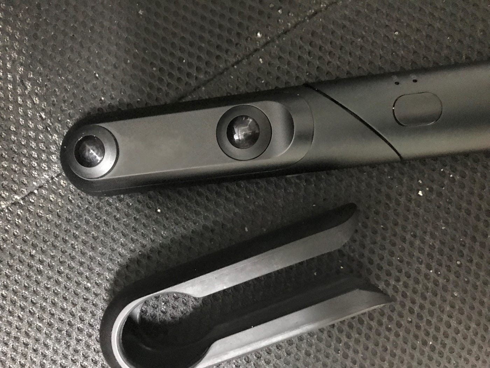
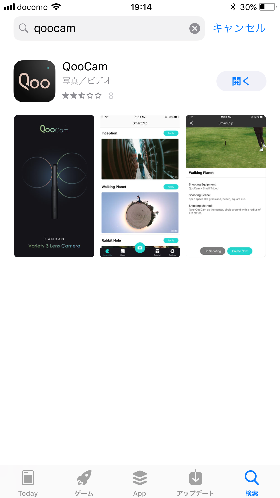
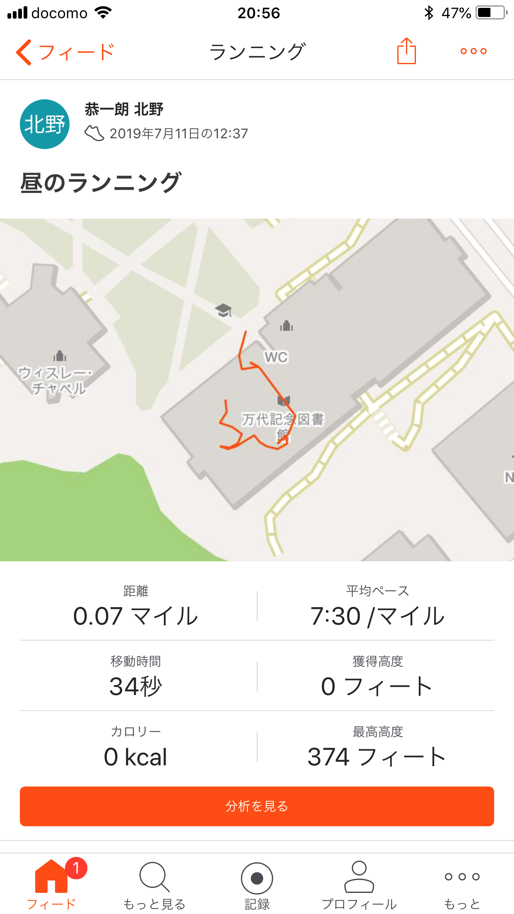

ゼミ論進歩

先週でやることの方針が決まり、古橋教授と大和市とのミーティングとカメラをお借りし少しずつではありますがスタートしました。

最終的な目標としては簡潔に言うとAED、防火水槽や消火器などの位置データをアップロードしそれぞれに分かりやすい固有名詞をつけそれを提出という形で完了となります。その作業で使うのが画像の360度カメラです。

このカメラに加えてこのQoocamというカメラアプリをスマートフォンにいれて使用していきます。使い方としてはカメラの電源ボタンとWi-Fiボタンを入れてスマートフォンと接続して撮影を行っていくというシンプルな使い方です。

位置情報の習得としては撮影と並行してStravaのアプリを使用しています。本来は自転車を使うのですが今回はアップロードの手順把握のためその辺りは省いて行っています。

現状位置情報と撮影データのアップロードに手間取っており来週中にはその辺りの問題を解消したいと考えています。
