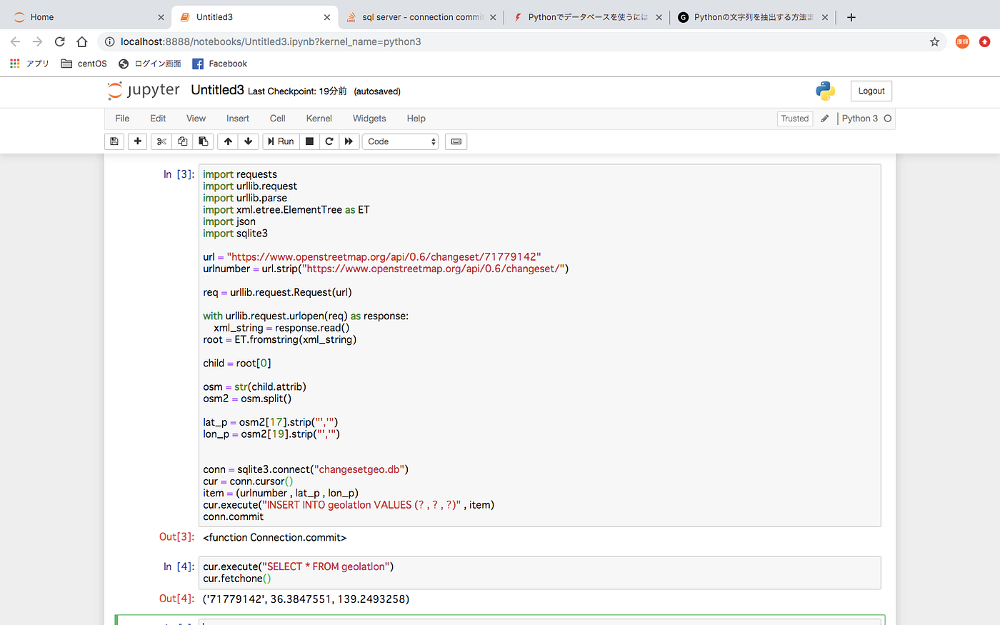

### OSM UC 進捗報告二回目

ゼミ論進捗9回目

### １．はじめに

お世話になっております、二期生の武末です。内定先でまさかのJava必須ということがわかり、勉強しなきゃなぁと思いつつも授業の最終課題に追われる日々を過ごしております。みなさんはいかがお過ごしでしょうか。

さて、今回の進捗報告は短いです。ひたすら短い。SQLの勉強を始め（昨日）既存のコードでデータベースに保存までやりました。（ついさっき）同時並行で進んでるWEBプログラミングの課題が忙しかったんです・・・。申し訳ない。

というわけでその報告をしつつ、今後の流れを書いて次週への繋ぎとしていきたいなと思います。

### ２．進捗報告

[kouki-T/osmchnage
osmchange ver2. Contribute to kouki-T/osmchnage development by creating an account on GitHub.github.com](https://github.com/kouki-T/osmchnage)

コードを見れば一目瞭然ですが・・・。chengesetgeo.dbに、changesetから引いてきた緯度経度を番号と一緒に保存し、ワイルドカードで呼び出してます。

ここからが問題で、このdbへの保存を日本のみにする（保存前に緯度経度の範囲指定で分岐させる）か、全データを保存してから呼び出しの時のみ日本のみにするのか（保存後にWHEREで条件指定）するのかを考えています。現時点では日本以外でのサービスの提供は考えていないのですが、OSMは国際的プロジェクトであるという点、システムの構成自体に日本に限定する作り方は想定していない点など、対応は可能なのではないかなと思います。ただ、容量と読み込み時間がね・・・。dbの作成も日本のみならともかく、1から全てとなると制作時間も馬鹿にならなそうです。

書いてて気づいたんですが、これタイムスタンプ保存し忘れてますね。ある意味いちばん大事な部分だと思うんですけど。直しときます。

ある程度データの準備ができたら、ヒートマップの制作に入ろうかな。割と完成見えてきたかなと思います！！

とりあえず今回はここまでで。
