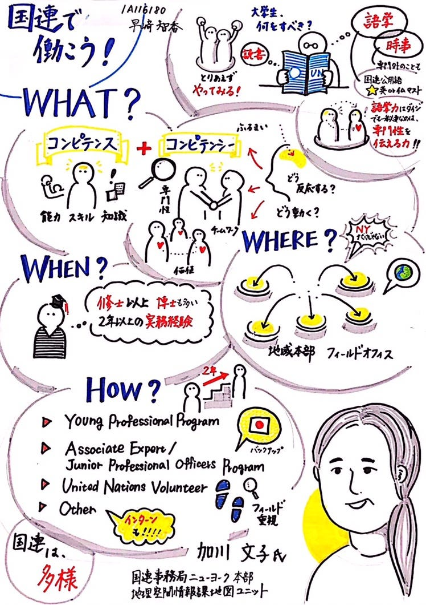

### グラレコ部ブログ 7月②

こんにちは！

グラレコ部4年の保利です！

グラレコ部活動ブログ、今週はわたし保利が担当します。

今回ピックアップしたグラレコはこちら！

今回は3年生ともかちゃんのグラレコです！

内容は先日あった加川さんの講演です。

そもそもわたしがその講演会に授業で参加できなかったので、話を聞いていない人でも伝わるグラレコ、という基準で選ばせて頂きました。

パッと見で色が少なく、what、howなどカテゴリー分けされていることで、頭の中で情報が整理しやすいなあと思いました。

また、黄色の使い方が上手だな！というのが個人的に印象残りました。

黄色は文字を書くには不向きですが、目を惹く色なので部分的に使うととても効果的だなというのがこのグラレコの印象でした。

来週金曜にはグラレコナイトが控えています！

授業があるので途中参加になってしまうのが残念ですが、よい意見交換の場になればいいなと思います。
