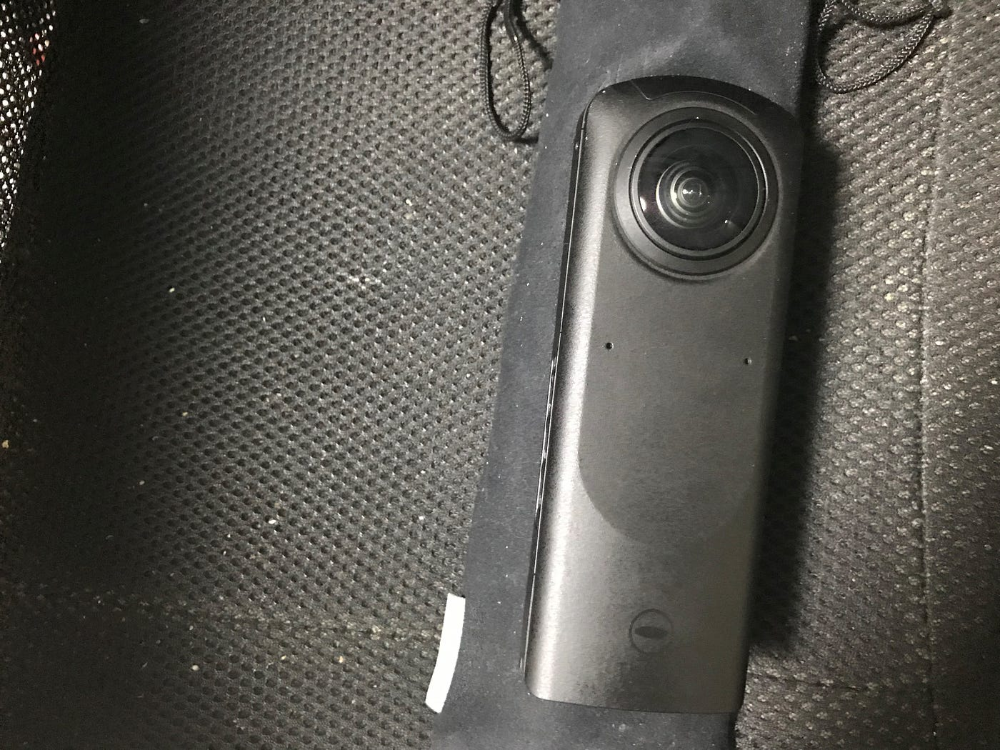
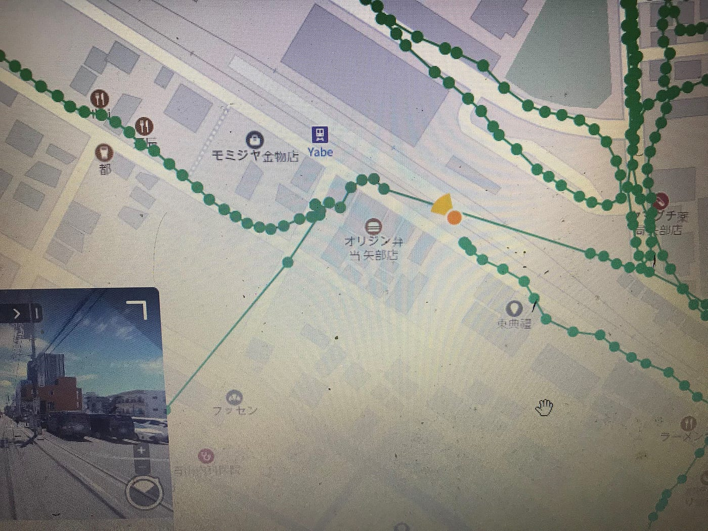

### ゼミ論進歩

今週はTHETAを借りての作業となりました。

こちらもアプリをスマホに入れての運用なのですがQoocamと違って専用のアプリだけでなく他のアプリとの運用も可能なようです。今回はMapillaryのアプリと接続しての撮影兼アップロードを行いました。最終的にはMapillaryのアプリに接続して撮影を行いそのデータを転送しMapillary上にアップロードするという方針をとりました。前日には違うやり方でアップロードする予定だったのですが上手くいかずこのやり方になりました。（前日は今回のやり方が上手くいかないので緊急的な手間の多いやり方でやっていたのですが当日はそっちが上手くできなくなるという事態になりました。どうも歩きではなく自転車の撮影だとExifデータの習得がされない予感が・・・）

今回の撮影データはこのようになっています。

このオレンジのポイントが私が撮影したポイントで今回は２０分約１００枚撮影しました。（画像は事情でスマホの直撮りです。）今回は感覚を掴む意味合いだったのでカメラの固定も高さも緩くしてやりましたが本番などではしっかり決めてやっていく手筈です。最後にデータのリンクを貼っておきます。

[Map data at scale from street-level imagery
Mapillary is the street-level imagery platform that scales and automates mapping using collaboration, cameras, and…www.mapillary.com](https://www.mapillary.com/app/user/track356?lat=20&lng=0&z=1.5)
