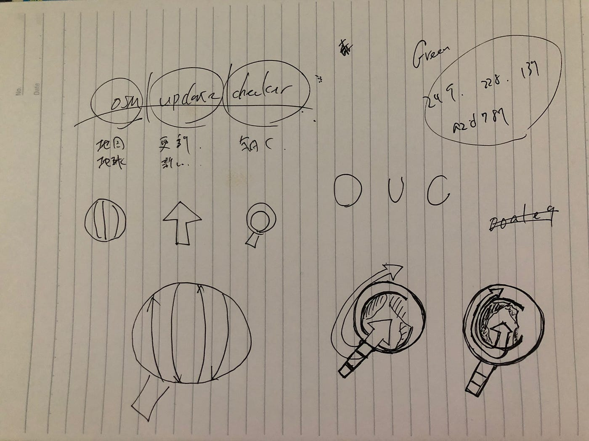

### 卒論進捗が生み出せなくてロゴ作った話

_OSMUCはイトナブまでに間に合うのか？_

1. はじめに

皆さんお世話になっております。2期生の武末です。

やっと大学の授業が終了しました..。申請単位も問題なく、授業の参加度も申し分ないので恐らくこれで大学の授業は満了だと思います（思いたい）

しかし、そこへ追い打ちをかけるように夏も始まってしまいました。照りつける日に負けながら、ゼミ論の進捗をどう更新していこうかと悩む毎日です。

ところで今回、宮城県で開かれる石巻ハッカソンへ参加することが決定しました。

[石巻ハッカソン
ishinomakihack.com](http://ishinomakihack.com/#/)

我ら古橋硏、ギットハ部からも3人の精鋭（？）が参加します！スタッフとしてのお手伝いもしつつ、参加者としてサービスのお披露目も出来たらな〜と考えております。

参加される方、運営の方々の皆様におかれましては、是非ともよろしくお願いします。

何をやるかは特に未定ですが、僕としては自分のサービスを持ち込んで三日間で仮発表まで作っていきたいなと考えています。

そうです、**OSM UPDARA CHECKER**です。

前回、データベースの作成と保存までテストが進んだのですが、そこからchengeset保存をループで回そうとし始めた段階で躓いてしまいました..。

どうもSQLの仕組みが理解出来ておらず、dbも直接開けないからちゃんと保存できてるのかもわからんし、家のWindowsはJupiter動かんしで、夏の暑さも相まってよくわからないヤダヤダ期へ突入してしまいました。

そんな夏の暑さにやられた僕は、自分のGithubを見ながらこう思うのでした、

### ｢あれ、人に見せるならそろそろロゴ欲しくね？｣

..と。よくよく考えてみればSlackもPythonのロゴをお借りしてるし、Githubのアイコンもデフォルトのままだ..。これから素晴らしい技術者の方々へ出会うのにこんな初期アバターみたいなのでは失礼じゃないか..と。

そんなわけで僕とサービスのロゴ作成が始まったのでした。

2. ロゴ作成

そんな経緯から始まったロゴ制作でしたが、未経験者の僕。悩む。デザイナーでもなければ絵心も無い。とりあえずGoogle先生にロゴとは？と聞いてみた。すると、

> 「ロゴタイプ」の略。会社名・商品名などの文字を特別にデザインしたもの。意匠文字。

だそう。なるほど？文字なのか。

とりあえず、サービスの名前から連想するワードを書き出し、それをマークに置き換えてみる。

この3つのマークでこだわりとしては虫眼鏡は入れようと最初から考えていた点。OSMというサービスと関連があることを示したくて、一つは同じモチーフを使おうと考えていた。

そしてOsm Updata Checkerということで、そこから更にO U Cという文字を入れたい。ここまで考えたら意外とすんなり形になった。

説明しないとわからないというのは、シンボルとして問題なのだが、一応説明すると、虫眼鏡がO、矢印がU、そして半分欠けている地球がCを表している。

ここまでデザインが決まったらあとは形にするだけだ。様々な大きさで出力することを考慮して、最初からベクターイメージで作ると決めていた。

授業で扱ったこともあり、Inkscapeを選択。ちょこちょことパスを引いて、完成した。

（ここにInkscapeのスクショ）

そして出来上がったロゴがこちら。

個人的にはすんなりとできた割にいい出来じゃないかな？と思っている。

ただ、安直なデザイン案過ぎて同じようなロゴありそうだな、という印象ではある。（あったら変えよう、そうしよう）

使っていれば愛着が湧いて、良く見えてくる..というのは作品あるあるだと思う。

3. さいごに

今回はサービスの開発、というよりはサービスの概要、質の部分について突き詰めた回になったように思う。大学生最後の夏休みに突入し、有り余る時間をどのように管理していくのか、自分との戦いになっていくように感じた。

次回こそは技術面での更新になることを願っている..。
