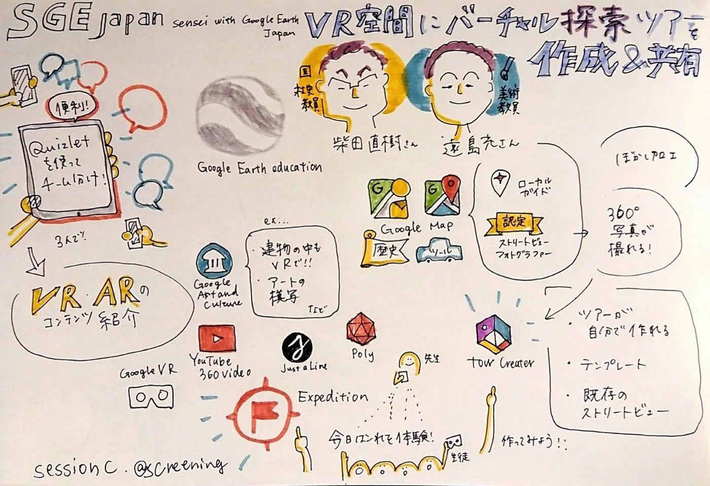

### 【参加レポ】Sensei with Google Earth Japan Boot Camp 2019

7月28日（日）に参加した先生による、先生のためのGoogleツールの活用法を学ぶイベントに関してのイベント参加レポートです。

[Sensei with Google Earth Japan - SGE Japanとは？
Edit descriptionsites.google.com](https://sites.google.com/view/sge-japan/sge-japan%E3%81%A8%E3%81%AF?authuser=0)

4つの選べるセッションのうち、2つを選んで受講しました！

1. 初心者大歓迎！Google Earthの基本と、ツアーの作り方(Google Earth,Voyager,Tour Builder)

2. 調査したデータを共有して議論！My Maps で協働学習 （Street View, My Maps など）

3. VR空間にバーチャルツアーを作成し、参加者同士で共有（Street View, Tour Creator,Expeditionsなど）

4. プログラミングでデータ分析！Google Earth Engineを活用した探求学習（Google Earth Engine）

私が参加したのは２と３です。

#### 「3. VR空間にバーチャルツアーを作成し、参加者同士で共有」に関して！

VR・ARコンテンツによって授業の幅を広げ、今までいかなければわからなかったことが学べるようになりました。

便利なGoogleのアプリやツールをここでも紹介します！

#### ▶Quizlet

[Quizlet
夏休み明けの新学期は辛いですよね ...quizlet.com](https://quizlet.com/ja)

アイスブレイクで活用されたのが、このアプリ。みんなで英単語を楽しく覚えることのできるツールです。英単語以外にも適応可能です。ポイントとしては、グループ内のスマホで違った回答が表示されるため協力しなければ、正解できない点。スマホとPCを使える状態ならかなり盛り上がることまちがいなしです！

#### ▶Expedition

[Expeditions で授業にリアルな体験を | Google for Education
Google Expeditions を利用すると、一連の 360° パノラマシーンの中や 3D オブジェクトの間を進みながら、教師が生徒たちに興味深いスポットやオブジェクトを指し示すことができます。edu.google.com](https://edu.google.com/intl/ja/products/vr-ar/expeditions/?modal_active=none)

今回のセッションのテーマ、バーチャルツアーを可能にするツールがこちら。

[Tour Creator
Tour Creator makes it easy to build immersive, 360 tours right from your computer.vr.google.com](https://vr.google.com/tourcreator/)

ツアークリエイターと組み合わせて、簡単に世界各地を回るVRツアーを作ることができます。

こういったツールは、楽しいだけでなく社会や美術の授業にも生かすことができます。

新しい教育テクノロジーは使い方が難しいので、先生たちとGoogleのスタッフとノウハウを共有しながら、学びと結びついた活用法に関する議論が活発にされていました。

Googleのテクノロジーを活用したいと考えている方は参加してみてはいかがでしょうか？

参加はこちらから！
