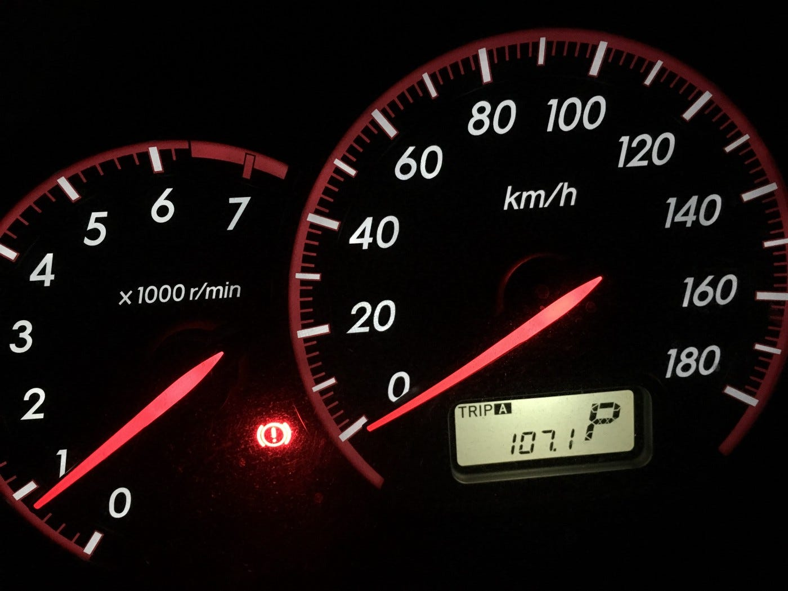
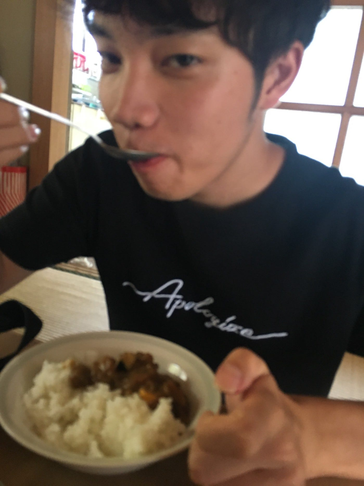

### ゼミ合宿 19.8.1~8.3@横瀬町

約一年ぶりの登場です！３年の依田峻輔です！

今回の合宿の目的は

①ゼミ論構想発表

②横瀬町のマッピング

先に言います、マッピングという作業で一番重要なのは

### 車

では早速！！合宿の報告を！

この写真の意味は最後に書きますね！！

### 8/1 ゼミ合宿初日

初日は到着組は依田カーのメンバーと牧さんだけだったので、二日目からの活動をスムーズに行うための下準備って感じの１日でした。！

主に、３６０度カメラの同期確認、アップロード方法、撮影可能時間などの確認を行いました！

この作業がなんだかんだで一番大事だったかなと！機械の性能を把握することで結果的にマッピングを円滑に行えました！

初日は古橋邸でそばを食べたんですけど写真がなくて残念。おばあちゃんそば美味しかったです！

ストラバング！

[https://www.strava.com/activities/2581240615?share_sig=59E8EFB41565322723&utm_medium=social&utm_source=ios_share](https://www.strava.com/activities/2581240615?share_sig=59E8EFB41565322723&utm_medium=social&utm_source=ios_share)

初日の夜は暑すぎてねれんかった！

＊今回マッピングに夢中で写真ありません。

この写真の説明も最後に！！

### 二日目

二日目は５時起床６時マッピング開始！！

機材トラブルもなく撮影は無事終了、、、と思いきやQoo Camの撮影データのアップロードがうまくいかない。。

これに関してはsuemituさん（漢字がわからん！！）がマニュアル化してくれたのでアップロードの参考に！[https://github.com/furuhashilab/mapping/issues/39?fbclid=IwAR2JbKcjxY1vg7SfzX_lFeTDeXRx0wA34TXH-LYG6ef7SezW9-nAFmgMX0g#issuecomment-517978062](https://github.com/furuhashilab/mapping/issues/39?fbclid=IwAR2JbKcjxY1vg7SfzX_lFeTDeXRx0wA34TXH-LYG6ef7SezW9-nAFmgMX0g#issuecomment-517978062)

午後も撮影は問題なく終了！ただアップロードは時間がかかった。。。

二日目夜にして参加予定ゼミ生全員揃ったので三日目頑張ろうと意気込んで爆睡でした！

ストラバぁ！

[https://www.strava.com/activities/2582823082?share_sig=6D0386B41565322647&utm_medium=social&utm_source=ios_share](https://www.strava.com/activities/2582823082?share_sig=6D0386B41565322647&utm_medium=social&utm_source=ios_share)

[https://www.strava.com/activities/2583436058?share_sig=A3DE72671565322529&utm_medium=social&utm_source=ios_share](https://www.strava.com/activities/2583436058?share_sig=A3DE72671565322529&utm_medium=social&utm_source=ios_share)

### 最終日

最終日は８時くらいからマッピング開始！

依田カーは機材トラブルもなく３日間無事マッピングできました！

ありがとうQoo Cam！！！

最終日は昼で帰ったので私の活動はここまで！

ストラバです！

[https://www.strava.com/activities/2585452794?share_sig=A4718DAC1565322426&utm_medium=social&utm_source=ios_share](https://www.strava.com/activities/2585452794?share_sig=A4718DAC1565322426&utm_medium=social&utm_source=ios_share)

### 反省など！

①今回はたまたま車で来る人が多かったけどマッピングには車が必要！またマッピングの機会があれば是非車で！

②横瀬町で合宿があるときは早く来た方が良い！テント張る場所も選び放題だし！

③車では通れない道を自転車部隊にうまく伝えたかった。。。初日はとりあえず写真を撮って説明しようとしたのですが、あまりにも多くて、挫折しかけました。。と思ってる最中、古橋先生がMapsMeにピンを立てればいいとご教授してくださいました！さすが位置情報の使い手です。。

### ④ 大事これが一番

とにかく情報の共有とノウハウの伝達が大切！無駄な時間を過ごさないためにもこれが一番大切！時間は大事効率的に！初日にやったことを二日目以降繰り返してたら今回の合宿は絶対何もできなかった！

### 最後になりますが！

写真の説明です！１

最初の写真は今回の合宿で走った走行距離です！いやーよく走った！ストラバの軌跡がすんごいです。。。。。

二枚目の写真は8/3のあさおばあちゃんがみんなのためにツックタカレーを一人でがめつく食べている証拠写真ですね！！

いやぁ〜本当に卑しい、汚い、、、まるでトカゲ。。顔が爬虫類。。

横瀬走り過ぎてどこでも案内できる気がする。横瀬ふれあい公園と謎の大仏をすこれ！
