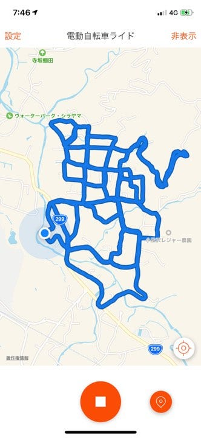
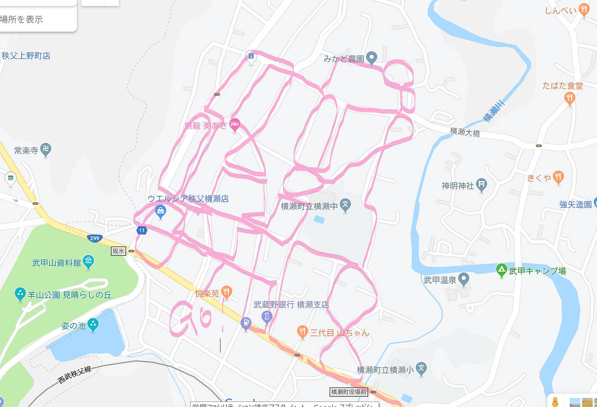
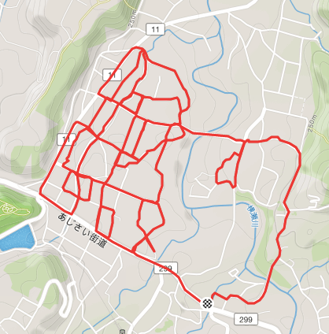
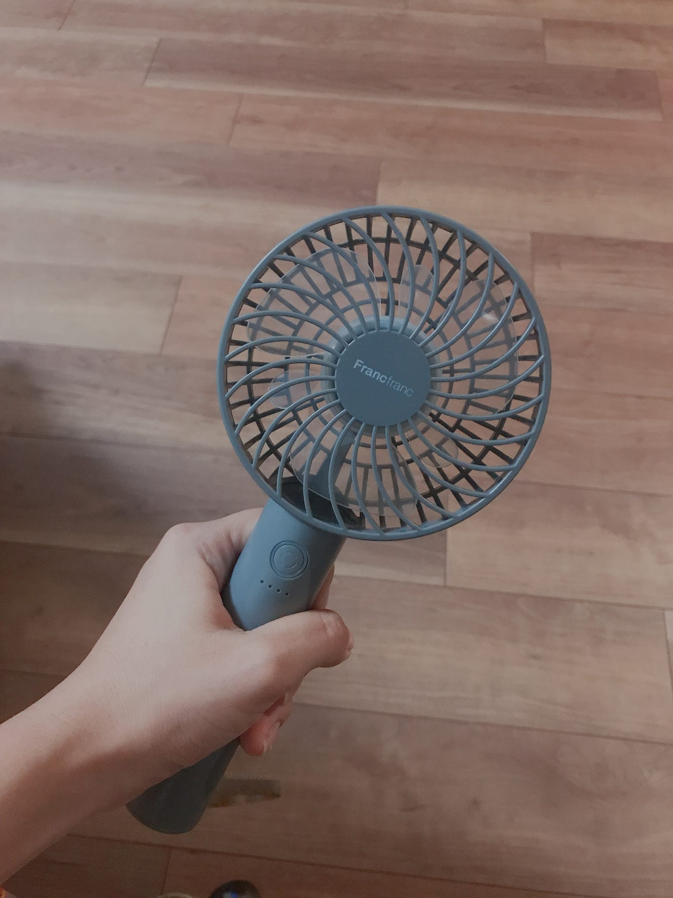

### 初めてのゼミ合宿へ！

初めまして！3年の吉田奈生と申します。

私は前期のゼミについては授業が被っているので参加したことがなく、ゼミへの本格的な参加は今回が初だったので、ドキドキの初合宿でした！

私は8/1〜8/3で参加したので、その三日間についての報告をしていきたいと思います。

### 【8/1：合宿1日目】

今回の合宿での目標は「横瀬町全域の360°マッピング」！！！

1日目は、2日目と3日目のマッピングに際しての準備をしたり、この時点で来ている3年生のゼミ論の構想発表をしました。

マッピングの準備は全体の作業量を考えながら各日程の調整、そして引き継ぎなどをスムーズにできるようにカメラの動作確認や容量の確認などをしました。

構想発表に関しては、それぞれの課題を共有して夏休みに向けた取り組みを明確にしていきました。

Stravaはこちら↓

[https://www.strava.com/activities/2581241240](https://www.strava.com/activities/2581241240)

### 【8/2：合宿2日目】

いよいよマッピング開始です！

この日は午前と午後でのマッピングを行いました。

#### 午前中

まず午前では、国道299号線を境に二手に分かれてマッピングしていきました。私は古橋carに乗車し、THETA360 Z1とTHETA360 Sを使用しました。

ここで、初回のマッピング時にやってよかったことや気づいたことを挙げていきたいと思います。

#### １. 効率の良い回り方を考える

私たちが使っていたTHETA360 Z1は4Kの画質で約8~9分撮影すると3.5~3.7GBの動画になるということだったので、あまり同じ道を通らずに、どれだけ効率良く回れるかを意識してルート案内をしていました。初めてだったので完璧にとはいきませんでしたが、比較的うまくいったと感じています。

#### ２. 役割を分けていた方が良い

午前中の段階では古橋先生がTHETA Z1の操作をし、私ともう1人が撮影に合わせてstravaを起動させ、私がルートを、もう1人がタイムキーパーをしていました。この時感じたのは、2人ともTHETAに合わせてstravaを切り替えていたので、今まで通ったかどうかを戸惑うことがあったということと、タイムキーパーは別にした方がいいのではないかということでした。

#### ３. 充電は十分に！

前述したように、私たちは2台のTHETAを担当していたのですが、午前のマッピングでは「充電コードを忘れる&THETA360 Sが満タンに充電されていない」という事態がありました。幸いにもTHETA360 Z1の持ちが意外と長かったのでTHETA360 Sは帰り際にしか使用せず、タイムロスなどはありませんでした。しかし、不注意は禁物だと改めて考えさせられました。。。

#### 午後

午後は午前に撮った動画がきちんとMapillaryにアップロードできるかをそれぞれ確認しながら途中合流組と引き継ぎをしながらまた二手に分かれてマッピングしました。

引き継ぎの際は前回のフィードバックを含めて進めていたのですが、実際にマッピングする時に１つ問題がありました。

2回目にはあらかじめ道筋を決めて挑んだのですが、地図アプリでは存在している道が現実には存在していないことがありました。

上が予定のルート（GoogleMap）、下が実際に通ったルート（OSM）です。このように更新されていない道があったのでめちゃくちゃ焦りながらルート修正していました。

その後古橋邸へ戻りBBQ、2日目合流組のゼミ構想発表をしてこの日は終了です。

Stravaはこちら（13区間に分かれています）↓

[https://www.strava.com/activities/2582624321](https://www.strava.com/activities/2582624321)

[https://www.strava.com/activities/2582644468](https://www.strava.com/activities/2582644468)

[https://www.strava.com/activities/2582660977](https://www.strava.com/activities/2582660977)

[https://www.strava.com/activities/2582678111](https://www.strava.com/activities/2582678111)

[https://www.strava.com/activities/2582694464](https://www.strava.com/activities/2582694464/embed/f0b571a2d9f841c6dbe35caa4547f5eb424c148e')

[https://www.strava.com/activities/2582706390](https://www.strava.com/activities/2582706390/embed/313a28ac1effcd92f4598c683aa9542a4db4527d')

[https://www.strava.com/activities/2582725563](https://www.strava.com/activities/2582725563/embed/7db30bf188a94a27932dacf10b04d9cce039dd92')

[https://www.strava.com/activities/2583334382](https://www.strava.com/activities/2583334382/embed/8ae2cc0d51a69909e4704aa5fd7a42b8c3bbc340')

[https://www.strava.com/activities/2583351669](https://www.strava.com/activities/2583351669/embed/3e65a621fa505be52e2f255841e68e4dfef7bc69')

[https://www.strava.com/activities/2583368153](https://www.strava.com/activities/2583368153/embed/bd1ff2026088a14b6d19e7cc27027c1134563001')

[https://www.strava.com/activities/2583387126](https://www.strava.com/activities/2583387126/embed/93235896257a10aa7b75bd756f315e972f272630')

[https://www.strava.com/activities/2583403006](https://www.strava.com/activities/2583403006/embed/e59ddf62300b1d7889dfb0e4293568c58761e091')

[https://www.strava.com/activities/2583414424](https://www.strava.com/activities/2583414424/embed/96e9b041a9e33a20fb9c83ae58c090a87803c55c')

### 【8/3：合宿3日目】

（私にとっては）最終日！

この日も2日目と同じように引き継ぎをしながらマッピングです。

合流組の車も合わせて5台も使えるようになったので一度に広範囲をマッピングすることができました。

この時も何かと問題が起こりましたが、なんとか終了。（詳しくは[飯塚さんのmedium](https://medium.com/furuhashilab/%E5%88%9D%E3%82%BC%E3%83%9F%E5%90%88%E5%AE%BF-%E6%A8%AA%E7%80%AC-8-1-4-bfa3bd3992e1)で！）

私はこの日、午前中の活動までだったのでここで帰宅。こうして私の初ゼミ合宿が幕を閉じました。

Stravaはこちら（3区間に分かれています）↓

[https://www.strava.com/activities/2585342681](https://www.strava.com/activities/2585342681/embed/1c9de0d4d72abf9c4a3526fe6a48a4fbe4c76ad4')

[https://www.strava.com/activities/2585397419](https://www.strava.com/activities/2585397419/embed/a936b4770d46db083d211c5cb092a0b04ffc91db')

[https://www.strava.com/activities/2585516404](https://www.strava.com/activities/2585516404/embed/f3848af23cd00b5cedb3a90acb97278ac53dddf4')

### 【最後に】

今回の合宿全体を通して感じたことをまとめていきたいと思います。

**・小型扇風機は神**

本当にこれがあってよかった。私は大汗かきなので夏の暑さは天敵です。昼は太陽の熱から自分を守るため、夜は寝苦しさから解放されるため、常備していました。実際、私と一緒にいた人はよくこいつを見たと思います。本当に超絶にオススメです、、！！

・**この時期に寝袋はいらない**

一切使いませんでした。私が持っていった寝袋は幅が少し大きいので枕にするにも大きくて本当一切役に立ちませんでした。大後悔です。ただ、これは夏に限りますので他の季節はわかりません。

**・一応上着は持っていこう**

先ほど寝袋はいらないと言いましたが、やはり夜中は冷え込みます。それに備えて上着は必要でした。実際に私は夜中に寒くて上着着ました。

**・小さいバッグがあれば便利**

私は大きいリュックと大きいボストンバックで今回参加したのですが、マッピングなどの作業中にはもちろんこんな大荷物は一切必要ないです。その時にモバイルバッテリーや財布を持つにはやはり小さいバッグが必要です。私は持ってきてなかったのでクソ不便でした。

**・テントの張り方は知ってる？**

私が持っていったテントはNaturehikeのテント。このテントは他の人が持ってきたテントよりもやや不親切で、細かい説明書きがありませんでした。そのおかげでめちゃめちゃ戸惑いながら設置していました。なので、可能であれば張り方の練習を、それができない場合は張り方をYouTubeなどで予習していくのもアリかと思いました。

**・蚊が半端ない**

テント周りは特に蚊が多かったです。うざったいほどに。それに加えて毛虫なども見つけたので、虫刺され全般の対策は必要かもしれないですね。

今回の反省点などを生かして次のゼミ合宿にまた挑んでいきたいと思います！！

以上、3年の吉田でした！
