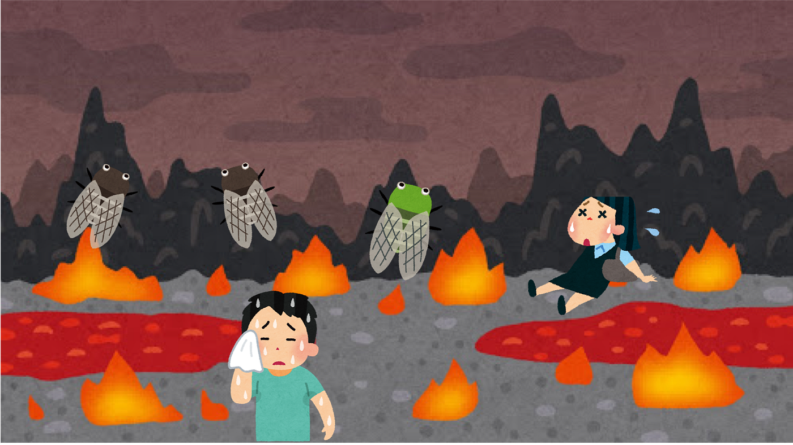
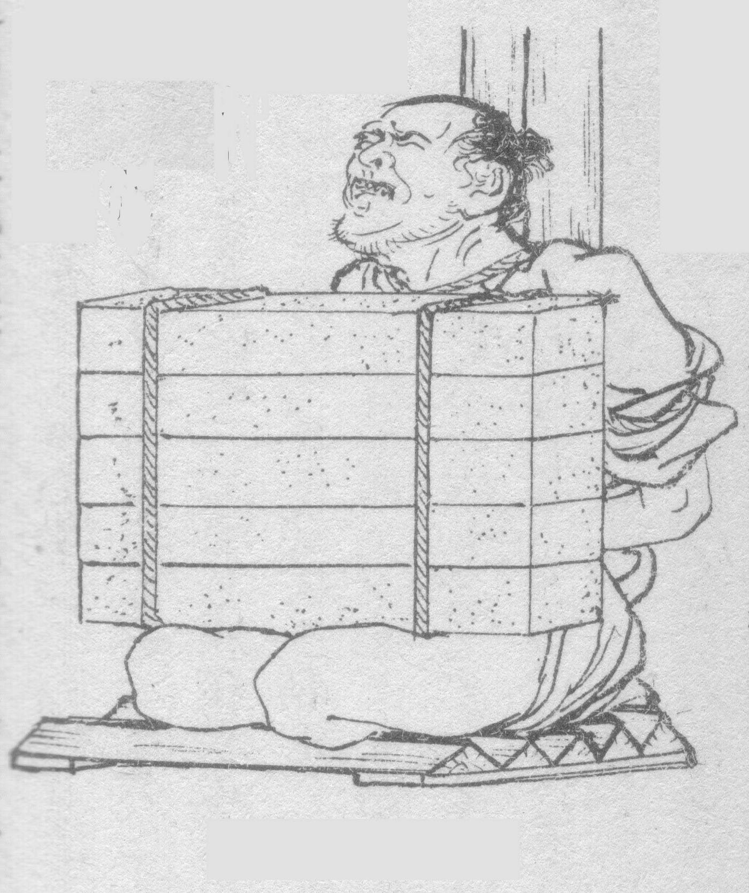

### 大学生地獄体験記

*僕は決して横瀬という地が嫌いというわけではございません。寧ろ好きです。大好きです。ということを念頭にこのレポートをお読みください。

青山学院大学 古橋ゼミ3年の平澤彰悟です！
今回ゼミ合宿で埼玉県 横瀬にやってきました。
横瀬という街は、鳥はせせらぎ、自然は豊か。まさに日本の桃源郷。
なんてことはなく、ひたすらに地獄でした・・・。
ないているのは、暑さを憂う大学生かセミ。あるのは日に当てられ陽炎をみせるコンクリート。まさに生き地獄そのものでした笑
（イメージ図）

このレポートでは地獄体験した僕が少しでもこの苦しみを和らげる
ために、こうしたほうがいいんじゃね？？って思ったことを書きます。

### 【地獄対策1 】 マットを持っていくべし

古橋ゼミでは２泊３日の間、テントで寝泊まりしなくてはいけません。
テントということは、下にはゴツゴツした土、石が待ち構えています。
寝心地は言うまでもなく最悪です笑 
 江戸時代行われていた、”石抱”という拷問を彷彿させるゴツゴツ具合です
（石抱 図）

こんな地獄から開放してくれるのが、マットです。できるだけ厚さがあるものを選ぶのが良いと思います！ 
↓これとかオススメです！

[【2019最新改良】エアーマット キャンプマット エアーベッド ハンドポンプ付き 枕付き 折畳み式 キャンプマット 超軽量 40Dナイロン TPU生地 アウトドアマット 防水防潮 山登り 花見…
【2019最新改良】エアーマット キャンプマット エアーベッド ハンドポンプ付き 枕付き 折畳み式 キャンプマット 超軽量 40Dナイロン TPU生地 アウトドアマット 防水防潮 山登り 花見 車中泊 テント泊 防災 キャンプ 用品…www.amazon.co.jp](https://www.amazon.co.jp/%E3%80%902019%E6%9C%80%E6%96%B0%E6%94%B9%E8%89%AF%E3%80%91%E3%82%A8%E3%82%A2%E3%83%BC%E3%83%9E%E3%83%83%E3%83%88-%E3%82%AD%E3%83%A3%E3%83%B3%E3%83%97%E3%83%9E%E3%83%83%E3%83%88-%E3%83%8F%E3%83%B3%E3%83%89%E3%83%9D%E3%83%B3%E3%83%97%E4%BB%98%E3%81%8D-40D%E3%83%8A%E3%82%A4%E3%83%AD%E3%83%B3-%E3%82%A2%E3%82%A6%E3%83%88%E3%83%89%E3%82%A2%E3%83%9E%E3%83%83%E3%83%88/dp/B07QZJNT42/ref=sr_1_18?__mk_ja_JP=%E3%82%AB%E3%82%BF%E3%82%AB%E3%83%8A&keywords=%E3%83%9E%E3%83%83%E3%83%88&qid=1565416632&s=gateway&sr=8-18)

### 【地獄対策2】 速乾性のある服装で

青学生として、いついかなる時もオシャレに！気になる人と２泊３日。いかなる時でも可愛くいなきゃ♡。
なんて考えは、捨てていくことを強くおすすめします。
「できる女or男は常にオシャレに！」的な文言を雑誌等で目にしますが、ここは地獄なのでそんなもの関係ありません。現世での常識は捨てましょう。服装はできるだけ動きやすく、速乾性のあるものを選ぶのが吉です！
理想は運動部が着ている服装だと思います！
ちなみに、僕は３日間ずっと水着で過ごしていました。

以前、とある女性と話していたときのこと。女性は汗でTシャツ（普通の布生地）が濡れ、下着が透けてしまっていました。男というか、生物レベルで下着が透けていたら目がいってしまうのが男の性です。それを見てしまった僕は女性から、変態、最低など言われてしまいました。
いや、待て。俺はお前の下着なんか1ミクロンも興味はないし（ガッキーなら興味ある）、お前が勝手に透けさせていただけだろ！（ガッキーならむしろ見たいです）。しかし、そんなことを直接相手に言う勇気もなく、ひたすら罵声を浴びさせられていました。
このような、誰も救われないことが起きないように古橋ゼミ生は服装をよく考えて合宿に参加しましょう！

### 【地獄対策3】長いものに巻かれよう

この合宿は現地集合、現地解散でした。合宿中は横瀬のマッピングを行います。マッピングでは車と自転車を使います。車で合宿所まで来たブルジョワ学生御一行は車でマッピング作業を行い、電車で合宿所に来た貧乏学生は自転車をこがされます。なかには、電車で来てもブルジョワ学生に目をかけられ、マッピングの際一緒に車に乗れる学生もいました。しかし、そういった学生はほぼ確実に女の子なので、男はそんな希望は皆無といってよいでしょう。
僕自身電車で行き、自転車をこがされました。古橋ゼミでは、女の子を優遇し、男はモノのように扱って良い。「死ぬまで働け」 某居酒屋チェーン店ワ◯ミと同じモットーが暗黙の了解としてあります笑

では、貧乏男子学生は炎天下のなかチャリをこぐしかないのか？
この合宿は3年生にとって初めての合宿。ゼミ生同士知らない人も多く、まだ人間関係が出来上がっていない。そこがミソなのです。
人間関係が出来上がっていないからこそ、上下関係を見極め、ブルジョワを見つけ次第、自分の中にある奉仕の精神をフルに活用するのです。BBQのときはいち早く、お酒とお肉を持っていき、汗をおかきになればうちわで扇ぐ。現代の豊臣秀吉が古橋ゼミを制するのです。
ここまでやれば炎天下のなか自転車をこがされることはないでしょう。

以上が私が考える地獄を乗り切る方法の紹介です。これが次回以降のゼミ合宿に活かされることを祈ります笑

### 【Strava 記録】

[朝のランニング - Shogo Hirasawa's 8.7 km run
Shogo H. ran 8.7 km on Aug 1, 2019.www.strava.com](https://www.strava.com/activities/2583003470)

[朝のウォーキング - Shogo Hirasawa's 0.8 km walk
Shogo H. completed 0.8 km on Aug 2, 2019.www.strava.com](https://www.strava.com/activities/2583033677)

[ランチタイム ランニング - Shogo Hirasawa's 1.4 km run
Shogo H. ran 1.4 km on Aug 2, 2019.www.strava.com](https://www.strava.com/activities/2583160138)

[ランチタイム ランニング - Shogo Hirasawa's 2.0 km run
Shogo H. ran 2.0 km on Aug 2, 2019.www.strava.com](https://www.strava.com/activities/2592223091)

[午後のランニング - Shogo Hirasawa's 1.5 km run
Shogo H. ran 1.5 km on Aug 3, 2019.www.strava.com](https://www.strava.com/activities/2586901172)

[午後のランニング - Shogo Hirasawa's 1.4 km run
Shogo H. ran 1.4 km on Aug 3, 2019.www.strava.com](https://www.strava.com/activities/2586905066)

↓私は帰り横瀬から都内までヒッチハイクで帰りました。
まじできつかった・・・
もう二度とやりたくないけど思い出になりました笑 
これはその帰り道を記録したものです。

[横瀬-八王子ヒッチハイクの旅 - Shogo Hirasawa's 95.7 km run
Shogo H. ran 95.7 km on Aug 4, 2019.www.strava.com](https://www.strava.com/activities/2589131353)
