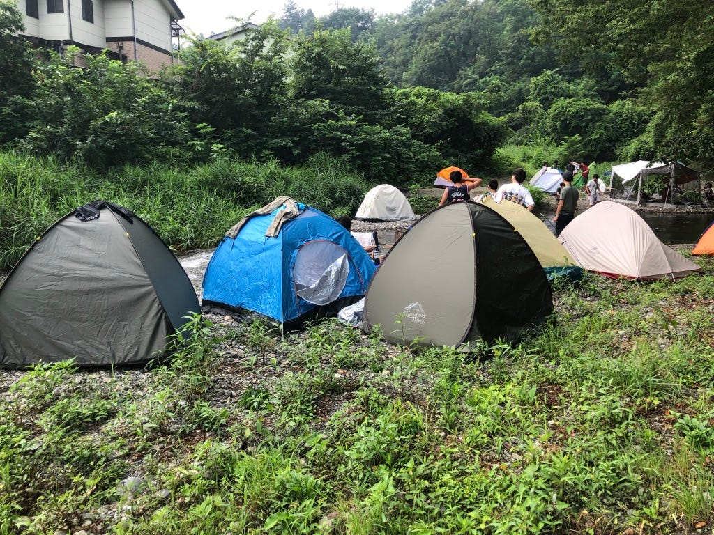
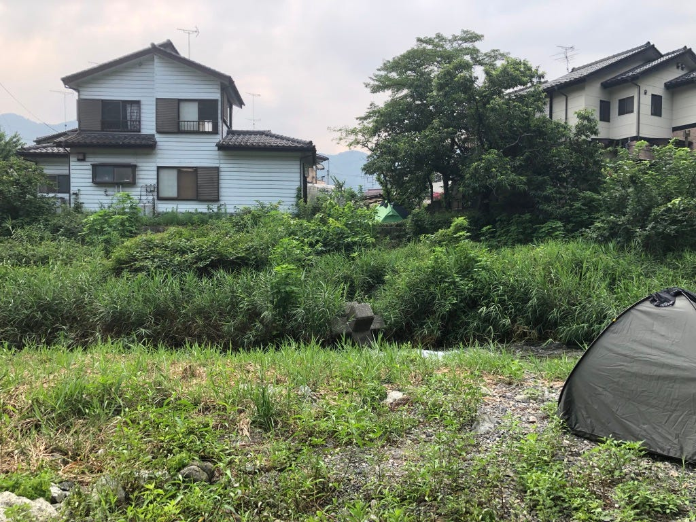
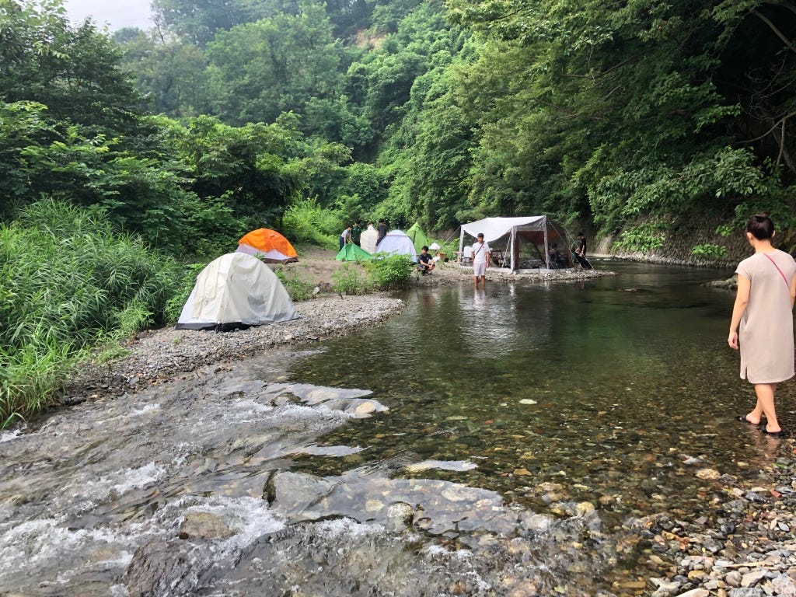
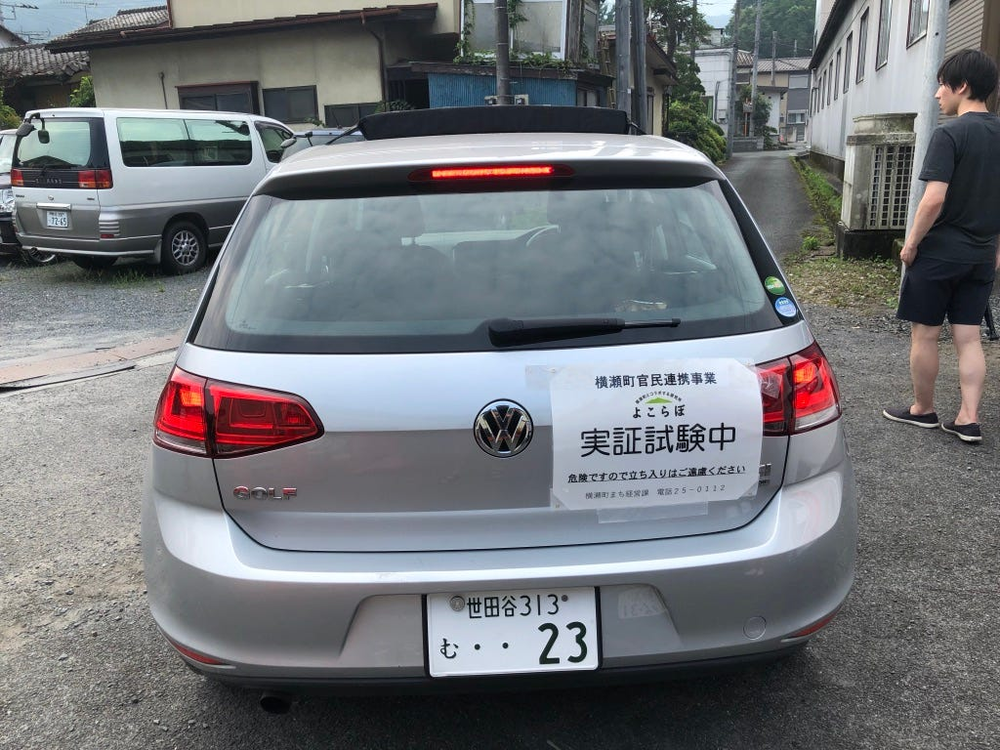
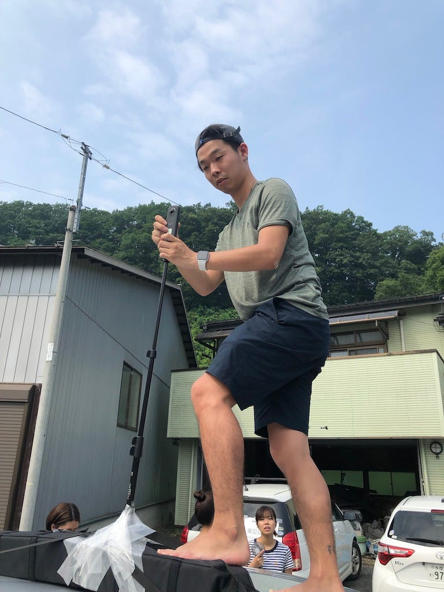
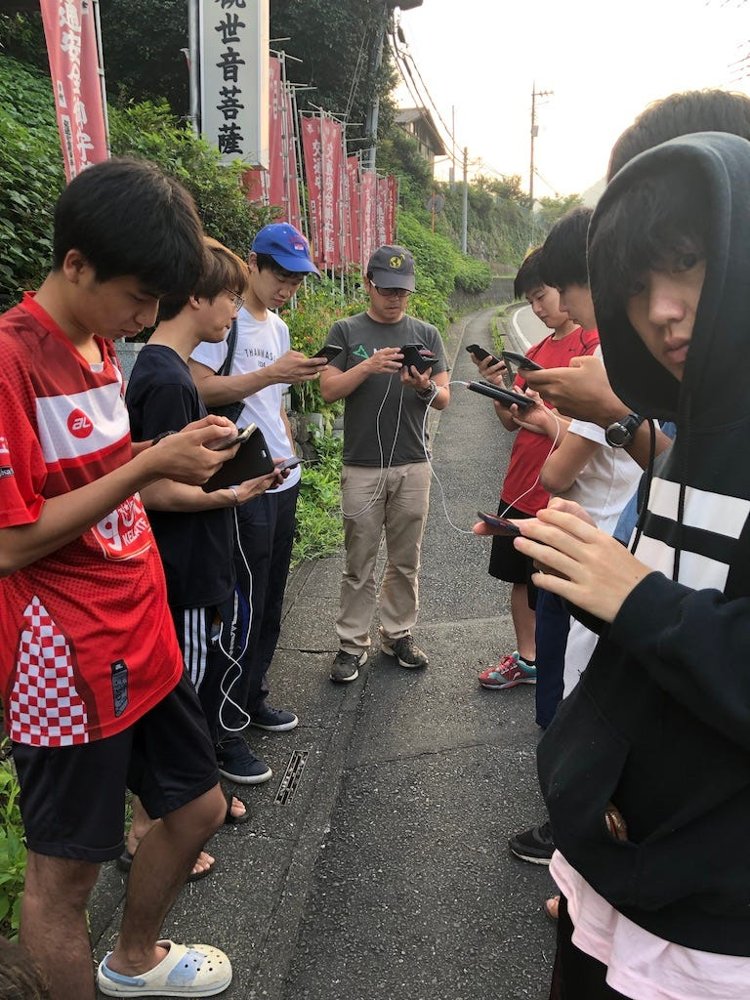
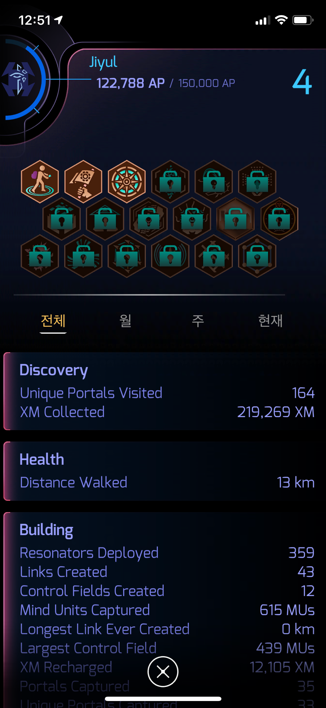

### もう２回目の合宿＠横瀬８.２〜８.４

こんにちは！3年のイジユルです。

今回の夏休みは古橋先生のゼミ合宿で始めました！夏休みに入ったら、みんなとあまり会えなくなるから、最後に友達とキャンプして楽しもうという気持ちで参加しました。もう二回もゼミ合宿だったので、テント、寝袋など古橋ゼミの必須品は全て揃っていたので、前と比べてとても楽な感じでした。実際にキャンプした場所も前回の長野のツリーハウスと比べて最高にいい条件でキャンプできたと思います！（寒い夜中の山より川近く涼しかった今回の横瀬は天国以上でした〜）そして、アンリミテッドとの活動で１回横瀬に足を運んだことがあったため、また素晴らしい横瀬の風景を見れるという期待も大きかったですね。

それでは早速ゼミで行なった活動を日程順に説明して、今回のゼミから得られたものについて書き出します〜

### **1日目**

1日目はアンリミテッドとの仕事があったため、着いたのが遅くなってしまって、テント設置と夜の最後のミーティング参加だけ参加しました。今回は川の近くの場所だったので、超超超超超楽でした。（前みたいにスコップで土を掘る作業はいらなかったので、本当にテント設置だけでも疲れることはなかったです〜）ぱっぱとテント設置して、隣の川にダイビングして水遊び満喫しました〜最高！

10時から夜のミーティング開始して、みんなのゼミ論構想発表会しましたが、みんな結構いろんなこと考えていて、びっくりしました。結構アイデアが出たので、今後自分のゼミ論にも活用できるものがありました。

### 二日目

二日目は早速ゼミのメイン活動である360度カメラを利用したマッピング開始！！

こんな感じで半分無理ありに360度カメラを設置して午前・午後をかけて街を走りながら、撮影！

4人で役割分担してドライバー、ストラバ記録、ナビゲーター、シータ撮影操作で分けて行いました。自分はもともと３６０度カメラに興味があったため迷わなくカメラ係で！

撮影に使ったカメラはTHETAーSカメラで容量が少ないため最大30分ぐらいしか撮れなったが、十分に綺麗な動画撮れたので満足でした。

しかし、暑い天気のせいかわからないけど、5分切りで電源が切れてしまって切れるたびに車止めて、カメラの電源付け直す作業が大変だったが、代わりに1秒1秒大切に撮影できたので、いいクオリティの動画を撮れたと思います。

### 三日目

朝4時に起床して、古橋先生の指導下にINGRESS実践活動！！！

キャンプ場の近くのスポットを回りながら、チュートリアル！

その後、最終課題が出せれて、みんなで協力して横瀬にあるポータルを利用してなんかの模様を作る！というミーション！まだ、初めてばかりのユーザーが多かったため、かなりミーション達成が難しかったです。さらに、古橋先生の秘密依頼で高レベルユーザーが邪魔してきたので、ボコボコされて終了しちゃいました。ボコボコされて、終わってしまいましたが、自分にとっては一番古橋ゼミっぽい活動だったと思います！

その後、イングレスに興味深くなってずっとやった結果、今レベル５の目の前までレベルあげました。

古橋ゼミ生だったら、みんなレベル６まで上げなきゃいけないので、自分が今までやりながら、思ったレベル上げやすい方法を簡単に説明します。

**イングレス簡単レベルアップ攻略**

・まず、可能な限りたくさんのポータルをハックしてアイテムを集める！（レベルに上がるほど、アイテムが足りなく占領できなくなるケースが多数発生します）

・白い中立ポータルが見えたら、ガンダッシュで占領することレゾレイタを設置すると一番目は625AP、２〜７番目までは125AP、最後375APで1個の白いポータルで総1125APを獲得できます。さらに近くのポータルとリンクさせたら、313AP獲得！三つのポータルを繋げて、三角リンクをさせると大きさとは関係なく、1250APを獲得できます。なので、三つが集まってる中立ポータル探して、占領すると一気で５,564APが獲得できるので、レベルアップがさらに簡単になります！

### まとめ

今回のゼミ合宿ではたくさんの同年生が参加していたために、楽しく課題をしながら、古橋ゼミこそできる最新機会を使った学習ができたと思います。そして、自分にとっての１番の発見はイングレスというマッピングゲームだと思います。このゲームの世界観と人との繋がりについて古橋先生から説明を聞いて、とても興味深くなり、今ははまっています。今後の活動でイングレスを利用してみんなと協力して何かをやるイベントとかを作ったら、いいなと思いました。！

**STRAVA**記録

[2日目午前マッピング - Jiyul Lee's 5.9 mi walk
Jiyul L. completed 5.9 mi on Aug 2, 2019.www.strava.com](https://www.strava.com/activities/2585407160)

[2日目午後のマッピング - Jiyul Lee's 1.8 mi walk
Jiyul L. completed 1.8 mi on Aug 3, 2019.www.strava.com](https://www.strava.com/activities/2585740329)

[3日目ingress - Jiyul Lee's 1.2 mi walk
Jiyul L. completed 1.2 mi on Aug 3, 2019.www.strava.com](https://www.strava.com/activities/2588216759)
