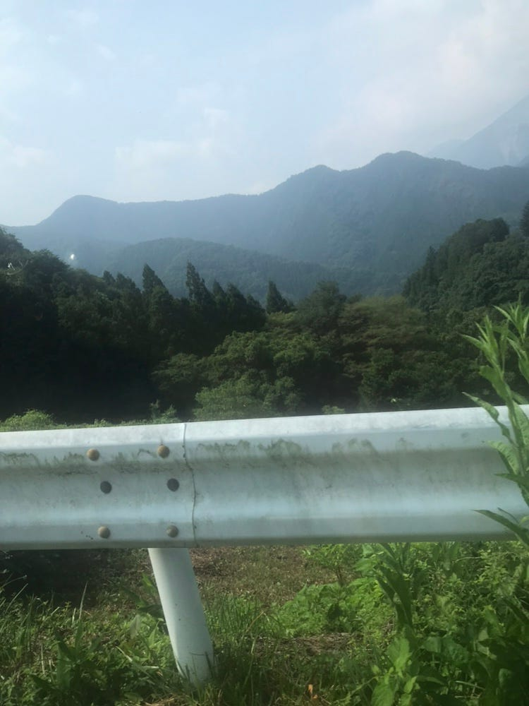
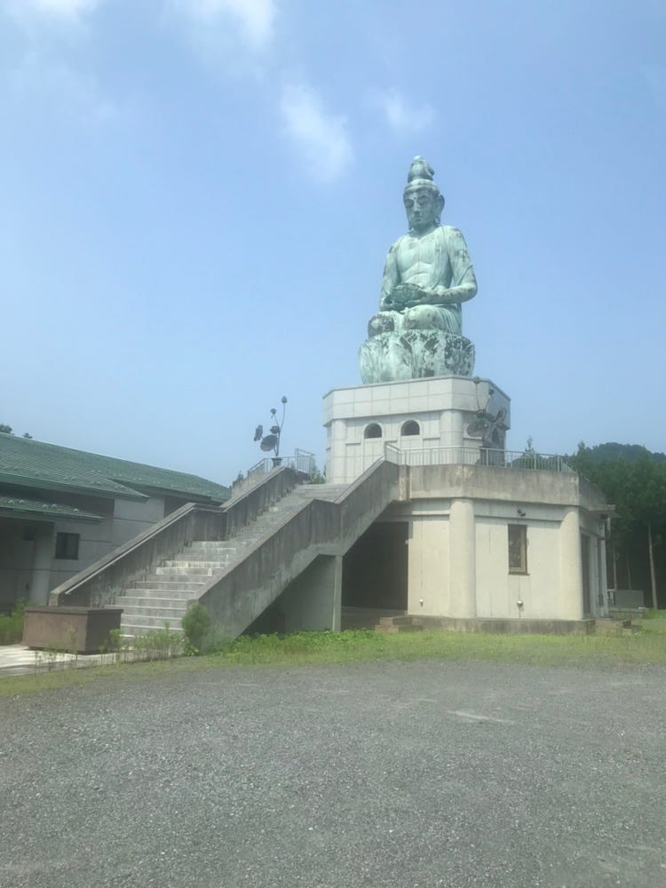

### ドキドキ横瀬キャンプ

こんにちは。三年の佐藤遼です。久しぶりのキャンプだったので緊張しつつ、このゼミ合宿に参加しました。

### 8/1ゼミ合宿初日

初日は人数が少なかったので、次の日に向けての準備とそれに向けての計画を立てました！

じっくりとゼミ論について話を聴けたり、良いテントの位置どりが出来たので、なんだかんだ初日から行ってよかったと思えました！

ストラバ

[午後のウォーキング - 佐藤 遼's 4.1 mi walk
佐藤 遼. completed 4.1 mi on Aug 1, 2019.www.strava.com](https://www.strava.com/activities/2581327228)

### 二日目

この日は朝早くから行動するために五時に起きて6時から行動開始しました。(前日二時くらいまで起きてたので辛かったー)

自分は自転車で撮影したのですがinsta 360 oneの機材トラブルで途中原因究明のため古橋邸に帰還。色々試した結果データの容量不足が原因でした。

午後は途中から来た人たちにそのノウハウを教えて、このゼミ合宿一番最初のmappillaryにアップロードすることができました！

午前のストラバ

[朝のウォーキング - 佐藤 遼's 0.0 mi walk
佐藤 遼. completed 0.0 mi on Aug 1, 2019.www.strava.com](https://www.strava.com/activities/2582614715)

[朝のウォーキング - 佐藤 遼's 1.0 mi walk
佐藤 遼. completed 1.0 mi on Aug 1, 2019.www.strava.com](https://www.strava.com/activities/2582750754)

[朝のウォーキング - 佐藤 遼's 0.3 mi walk
佐藤 遼. completed 0.3 mi on Aug 1, 2019.www.strava.com](https://www.strava.com/activities/2582925560)

午後のストラバ

[２日目 - 佐藤 遼's 5.6 mi walk
佐藤 遼. completed 5.6 mi on Aug 2, 2019.www.strava.com](https://www.strava.com/activities/2585162507)

### 最終日

最終日は八時くらいから開始！

この日は機材トラブルもなく無事マッピングすることができました！

ストラバ

[朝のランニング - 佐藤 遼's 11.0 mi run
佐藤 遼. ran 11.0 mi on Aug 3, 2019.www.strava.com](https://www.strava.com/activities/2585464917)

### この合宿で学んだこと

1. 自転車を乗って身に染みてわかったのはマッピングするなら車！ということ。細い道は通れないが、やはり早く快適な状態でマッピングできるのは素晴らしい！

1. アクシデントは付き物ということ。二日目の機材トラブルでマッピングができなくなった時に、トラブルが起こるのは仕方ないこととして、いかにそこから早く立て直すことが大切かを学んだ。

1. 情報共有が重要だということ。何か問題が起こっても皆で対処すればスムーズに作業を進めることが出来る。

### 最後に

この合宿を通してゼミの大変さとやりがいを同時に感じることができました！

次回マッピングすることがあればこの経験を活かしていきたいです！
