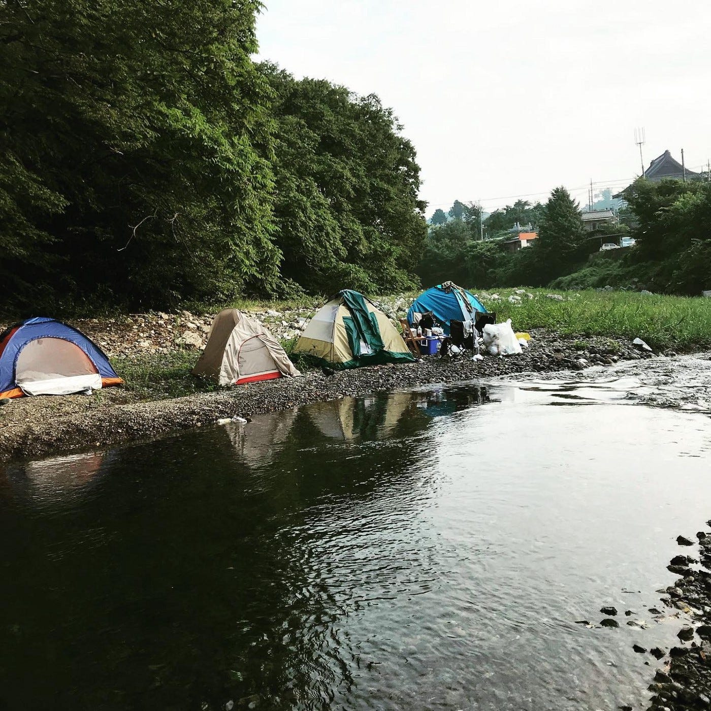
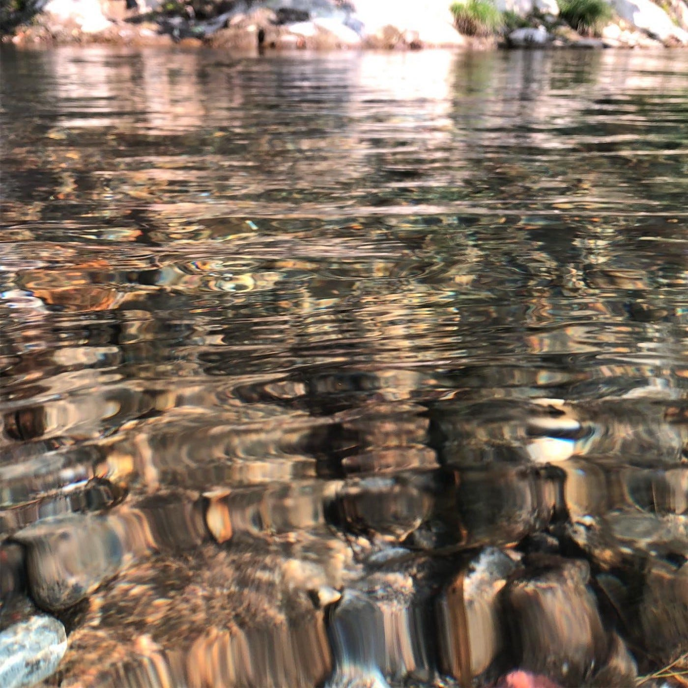
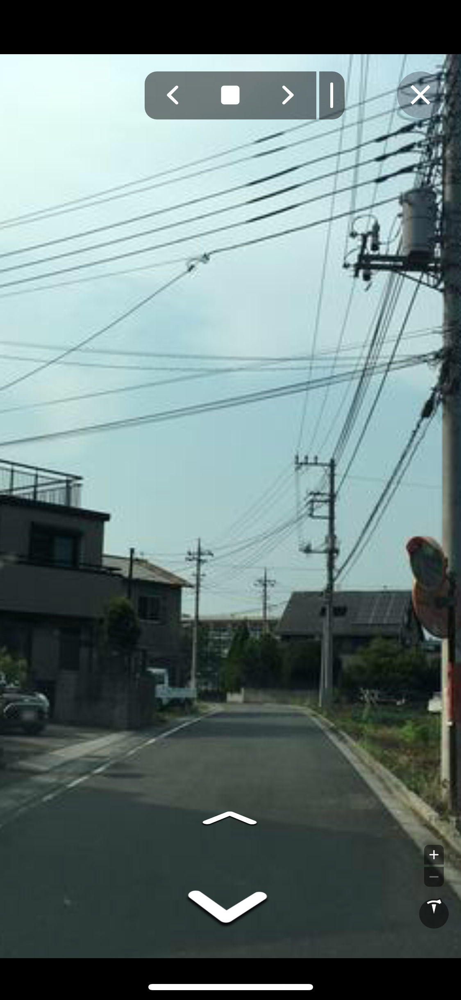
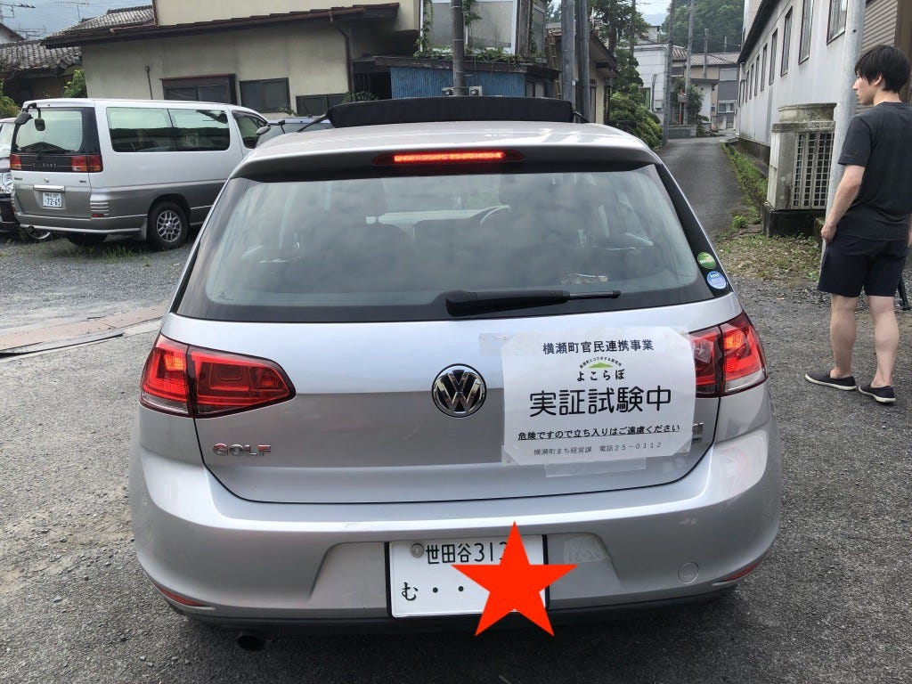
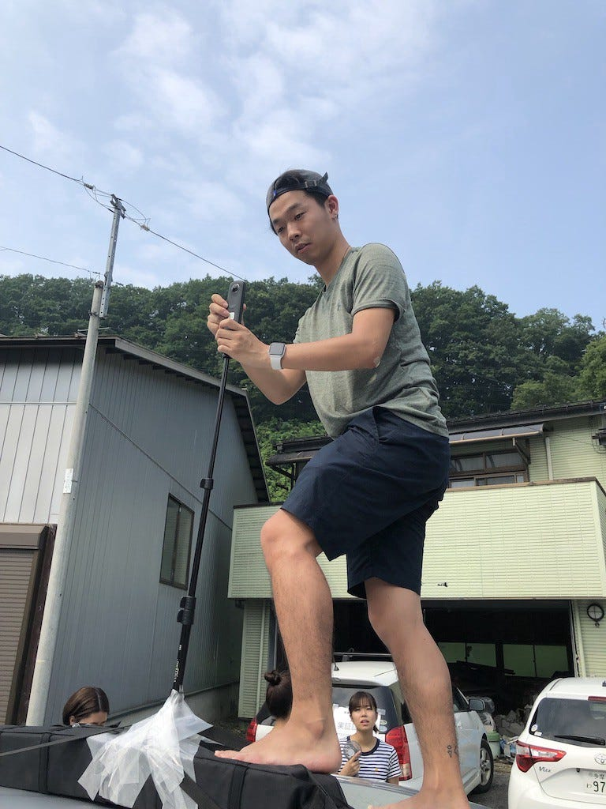

### 乗用車でのストリートビュー撮影について考えてみる＠夏合宿in横瀬

テント村＠古橋邸

こんにちは！3年の大庭です！
今回は、横瀬で行われた夏合宿の参加レポートをかねて、上記のタイトルで綴っていきたいと思います。

### まず、合宿全般について

合宿は、8月1日〜4日にかけて、埼玉県横瀬町にて行われました！そのうち、ゼミ生は２泊以上の参加が必須でした！
私は、2日に期末試験とお仕事があったため、2日の夜から4日の２泊3日で参加しました。
今回の合宿場所は、自分が所属する愛好会で合宿を行ったこともある横瀬ということでテンションMAX！この横瀬、今年の5月に行って以来、その魅力に取り憑かれて、8月もあともう一回行く予定があるくらいはまってますw
食べものも美味しいし、何と言っても、

この自然が最高なんです！ぜひ一度足をお運びください！

合宿の流れや全体的なスケジュールについては、他のメンバーがたくさん書いてくれていると思うので、端折りたいと思います！！

### 乗用車でのストリートビュー撮影について考える

今回の合宿の主なミッションは横瀬町の行動を３６０度カメラで撮影し、Mappilalyに反映するというものでした！

そう、ストリートビューとはみなさんもよく目にするこんなやつです！

最近では、Googleなどの車が街中を走って、撮影しているのを見ますよね。実は、Mappilalyはボランタリーで私たちも撮影を行い、データをアップできるわけなんです。

その撮影をこの合宿地である横瀬にて全ゼミ生総動員で行ったのです！

撮影方法は主に２通りあります。「自転車 OR 車」です。今回は、2日は自転車部隊もあったようですが、何と言ってもこの猛暑！私が参加した3日は、乗用車４台を使用し、行いました！

この撮影も簡単ではありません…

### ３６０度カメラの設置位置

撮影には３６０度カメラを用いるのですが、原則としてそのカメラの設置位置は地上から２メートル離れた場所です。そして、３６０度撮影してくれるので、車のちょうど真ん中に綺麗に設置するのが理想的な訳です。

そうすることで左右対称な綺麗な映像が取れるわけです。

しかし、Googleが使用しているような専用車があるわけではないので、窓のところに一脚につけた３６０度カメラを養生テープで固定するくらいしかできないわけです…

本当は車の屋根の真ん中に綺麗に設置したい…

なんとかならないかと考えた結果思いついた方法が…

### 取り外し可能なルーフキャリアという方法

今回、私がドライバーを務めた班ではこのようなルーフキャリアを使用することで、真ん中に近い位置にカメラを設置して撮影することができました。

なんといってもこのルーフキャリア、

ルーフキャリア装着時

こんな感じで、工事一切不要でどんな車にも取り付けが可能なんです！

このルーフキャリアをつけることで、普通の乗用車であっても、屋根に３６０度カメラを噛ませるための柱が完成するわけです！

取り付け中の大庭

そして、このルーフキャリアをうまく利用して、３６０度カメラをぐるぐると養生テープで固定！

以外に耐久性もあり、1日の撮影を終えてもしっかりとくっついていました。

この撮影方法によって、窓から一脚を伸ばしていた班よりも綺麗な映像が取れたと思います。

今回私が使用したルーフキャリアのAmazonリンクを貼っておきますのでぜひ参考にしてみてください！

[https://www.amazon.co.jp/LACOMETA-%E3%82%BD%E3%83%95%E3%83%88%E3%82%AD%E3%83%A3%E3%83%AA%E3%82%A2%E3%83%BC-%E3%82%BD%E3%83%95%E3%83%88%E3%83%A9%E3%83%83%E3%82%AF-%E3%82%AB%E3%83%A4%E3%83%83%E3%82%AF%E3%82%AD%E3%83%A3%E3%83%AA%E3%82%A2%E7%B0%A1%E6%98%93%E8%BB%8A%E8%BC%89%E3%82%BF%E3%82%A4%E3%83%97/dp/B01EWX06SQ](https://www.amazon.co.jp/LACOMETA-%E3%82%BD%E3%83%95%E3%83%88%E3%82%AD%E3%83%A3%E3%83%AA%E3%82%A2%E3%83%BC-%E3%82%BD%E3%83%95%E3%83%88%E3%83%A9%E3%83%83%E3%82%AF-%E3%82%AB%E3%83%A4%E3%83%83%E3%82%AF%E3%82%AD%E3%83%A3%E3%83%AA%E3%82%A2%E7%B0%A1%E6%98%93%E8%BB%8A%E8%BC%89%E3%82%BF%E3%82%A4%E3%83%97/dp/B01EWX06SQ)

### さらにあったらいいな…

このルーフキャリアにプラスであったらよかったなと思ったものが一つあります！

それは360度カメラを充電しながら撮影できる設備です。

そう、３６０度カメラのバッテリーは持ちがわるく、１時間も撮影を行うことはできません。

バッテリーが切れることで、撮影が中断っていう場面もありました…

車を使用して撮影していので、USBから給電は行えます。しかし、屋根まで届きません…

ながーい充電コードなどがあれば、充電しながら撮影ができるのでは？と少し思いました。

次回、機会があったら挑戦してみたいと思います！！

### Strava活動軌跡

３日午前→[https://www.strava.com/activities/2585406537?share_sig=A95881131565533438&utm_medium=social&utm_source=ios_share](https://www.strava.com/activities/2585406537?share_sig=A95881131565533438&utm_medium=social&utm_source=ios_share)

3日午後→[https://www.strava.com/activities/2585744880?share_sig=E040D3921565533460&utm_medium=social&utm_source=ios_share](https://www.strava.com/activities/2585744880?share_sig=E040D3921565533460&utm_medium=social&utm_source=ios_share)
