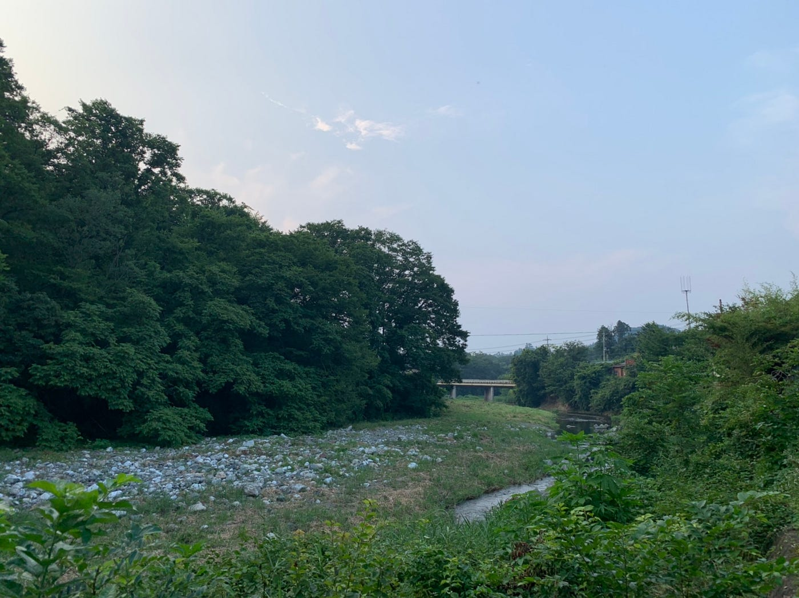
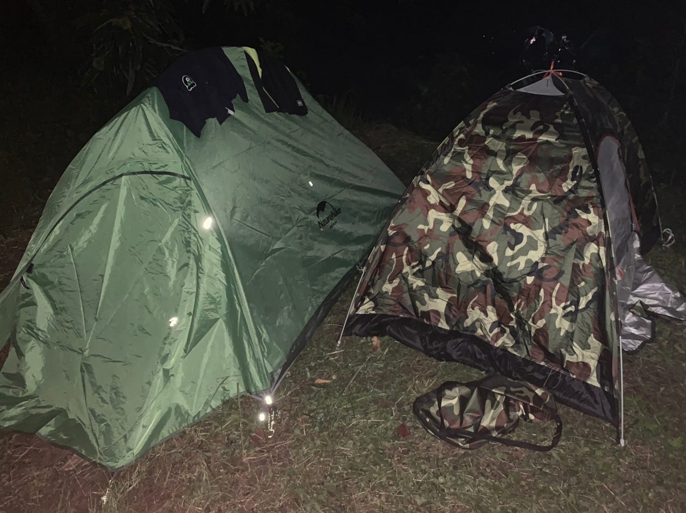
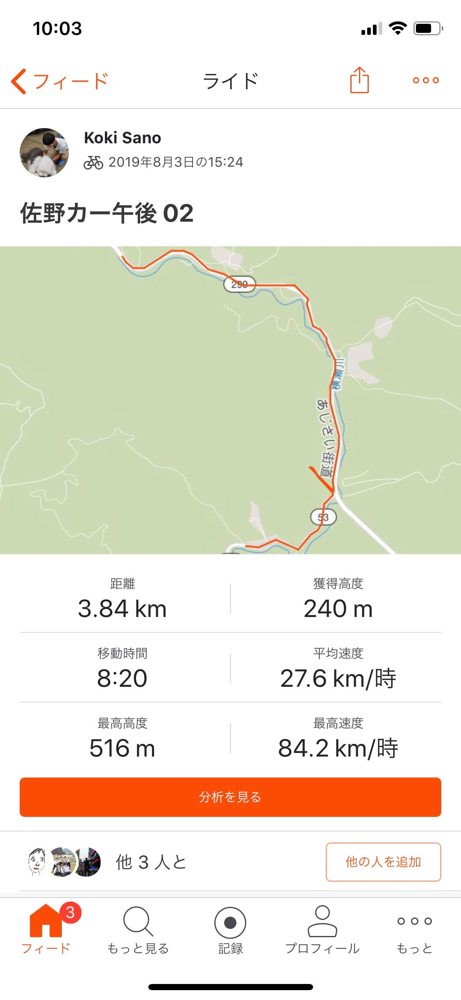

### 夏の幕開け feat.横瀬町

はじめまして！3年生の佐野公紀です。今回初めて古橋ゼミの合宿に参加して来ました！全日程は8／1〜4日ですが、私は2〜4日の2泊3日で参加しました。

#### 8月2日

いざ横瀬町に到着すると、予想を上回る田舎具合にびっくり仰天。しかし淵野辺など、普段自分が生活している町と比較してとても空気が澄んでおり、心身共にどこか「落ち着くな」と感じました。

さて、夜のバーベキューの時間を終えていよいよキャンプの醍醐味であるテントでの就寝。テントに入ると適度な圧迫感があり、お世辞にも広いということはできないが意外にもぐっすりと寝ることができました。

ただ今回の合宿で私は寝袋に入るということをせず、それを枕として代用しました。(笑) こうすることでいつもの寝る姿勢とあまり変わらない態勢を作ることができたことで快適になりました。意外と物というのは、工夫次第で本来の用途以外のものとして代用することができると実感。

この日のストラバ

[strava.app.link](https://strava.app.link/Dr8Uk3cS3Y)

#### 8月3日

この日は自転車部隊と車部隊に分かれて(ほとんどが車だったが)ほぼ丸一日マッピングを行いました。

ゼミの本格的な活動に初めて参加した私にとって、今回いかに自分がこの分野に関して無知であるかを痛感させられました。その一例として、マッピングで使用する機械のなかで、どの機械がどのような特性を持っているかということを知らなかった為、ほとんど先輩方や、知識のある方に助けていただきながら活動しました。今後、少しでもマッピング(もちろん他のものも含む)に関する知識を身につけ、誰かに突発的に質問を投げかけられてもパッと答えられるようにしたいと感じました。

遠い場所でのマッピングを可能とさせた車の恩恵は大きいと痛感。

この日のストラバ

[strava.app.link](https://strava.app.link/T2emNWfS3Y)

[strava.app.link](https://strava.app.link/74KaNShS3Y)

[strava.app.link](https://strava.app.link/iFkcPekS3Y)

[strava.app.link](https://strava.app.link/3zLQXMlS3Y)

[strava.app.link](https://strava.app.link/Yr1ST9mS3Y)

[strava.app.link](https://strava.app.link/k2Z6NzoS3Y)

[strava.app.link](https://strava.app.link/GwDBviqS3Y)

[strava.app.link](https://strava.app.link/FYP8HXsS3Y)

#### 8月4日

最終日。早朝からポケモンgoとingressを行いました。ポケモンgoはさておき、ingressに関しては初耳状態。しかし先生のサポートもありなんとか最低限の仕組みは理解できてよかったです。

8時以降は、自由時間となり私はドローン部ということもあり人生で初めてドローンを飛ばしました。ここで、先生のドローンと、私が購入したドローンとの性能の差が歴然としている(上昇させた時の安定度が雲泥の差)ことが発覚して愕然。やはり、このようなツールを購入する際はあまりケチらずに少しでも高いものを買った方がいいという事も痛感させられました。

#### 気付いたこと

- 夏に寝袋は不要→入ったら暑すぎる。入らずそのまんま寝ることがベスト。

- 自分のやりたい役割・場所を奪い取りたいなら誰よりも早く行動に移すことが必須→マッピングで担当エリアを決めた際、ちょっと発言が遅れただけで一番遠くの場所のマッピング担当になってしまったりw 一早い行動を心がけたい

- 夏のキャンプは虫と共生しなければならない→虫嫌いな人にとってみれば地獄のようなもの。起きてテントから出れば大きいバッタとご対面なんてのは普通にあり得る。だが、避けては通れない。せめてもの対策として、虫除けグッズを予め用意し、持参することが必要。

- 車でマッピングをする際、カメラの取り付け位置はしっかり吟味する必要がある→車によってはうまくカメラが取り付けられず斜めになってしまうケースが今回何台か見受けられた。取り付け方を行く前から考えるべし。

#### 最後に

今回の合宿を通して、古橋ゼミというのが具体的にどのようなことを行うのかということをさらに知ることができました。もちろん自分の力でできたことより、できなかった部分の方が多かったこの合宿ですが、他の人の力があって達成できたことがほとんどでした。もしかしたら、どんな活動においても大切な「助け合い」の精神を今一度認識させられたのは自分にとって大きなものであったと思います。今回の活動が無駄にならないよう、次の合宿につなげていきたいです。
