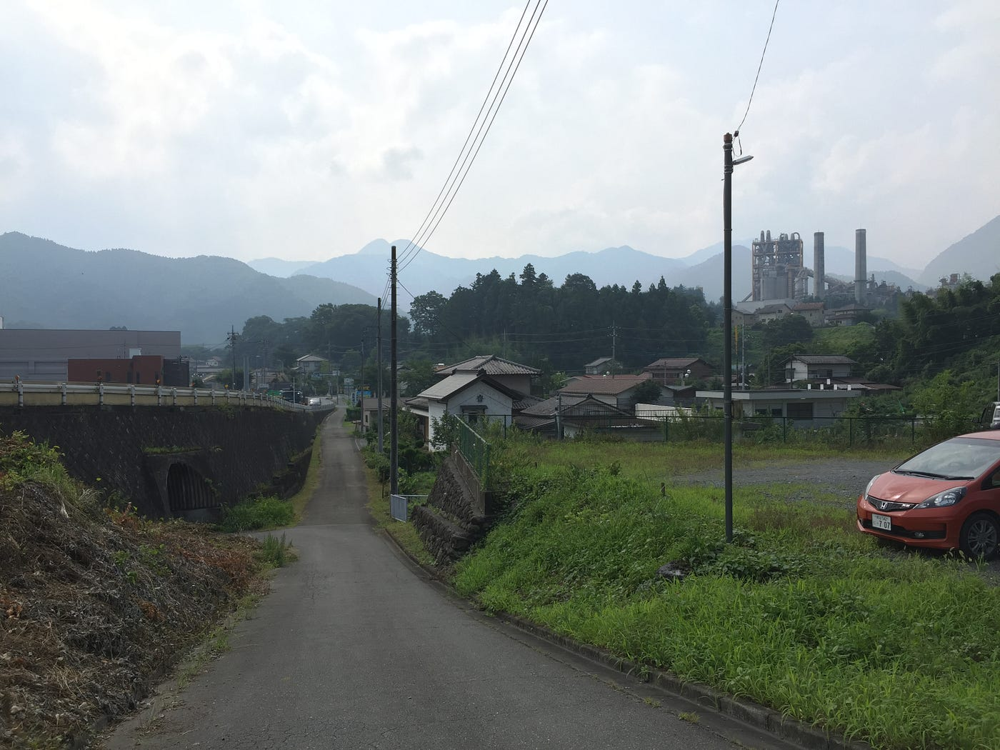
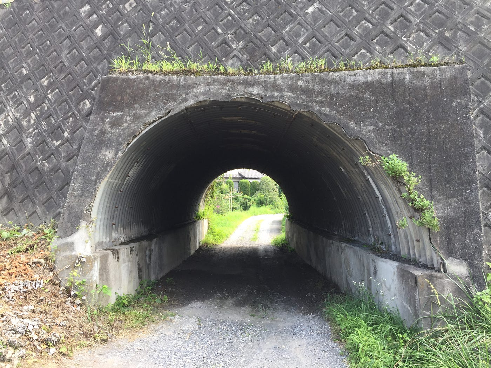
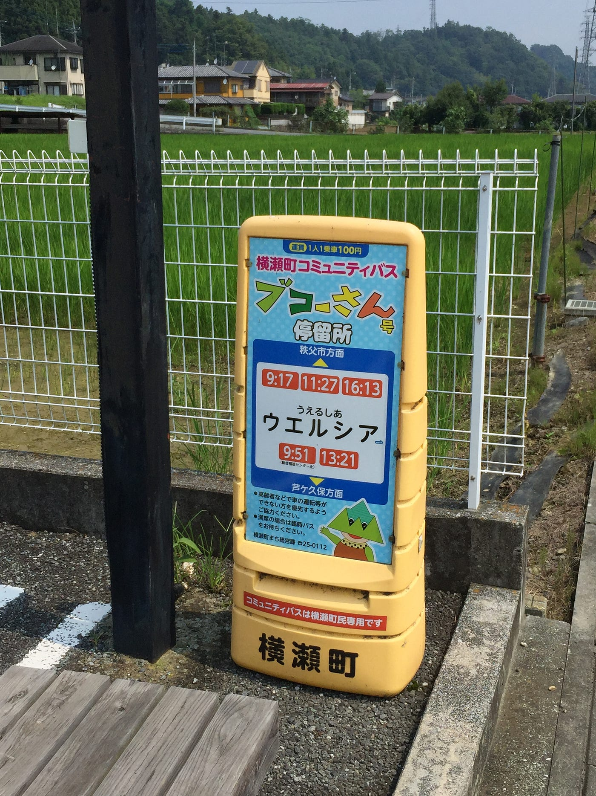
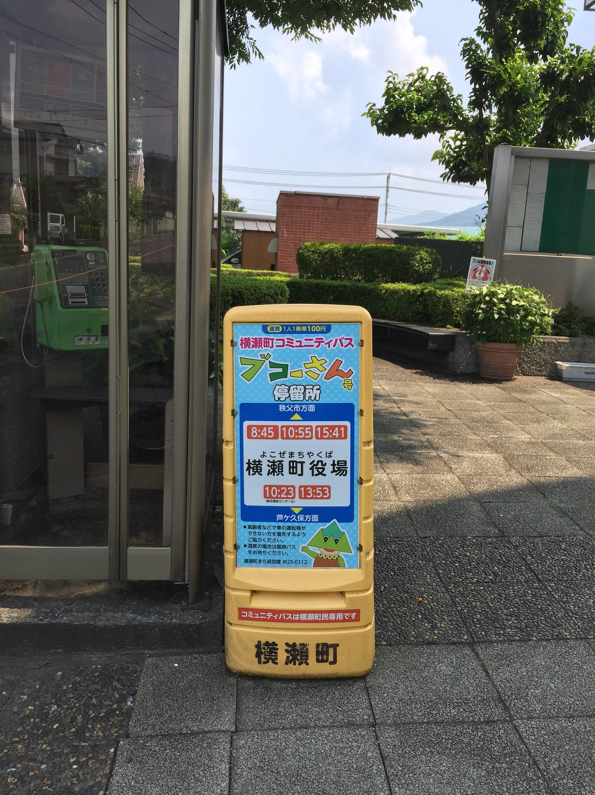
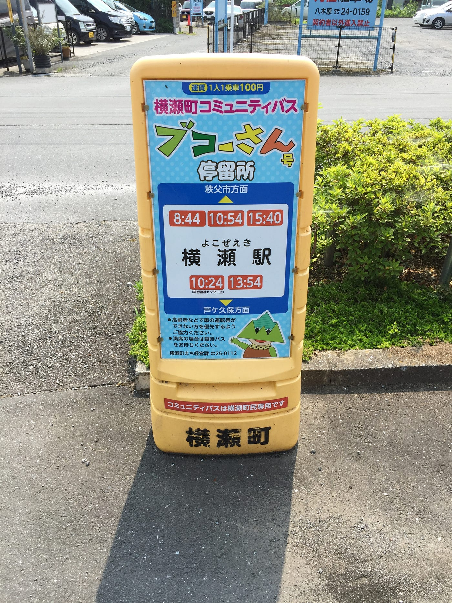
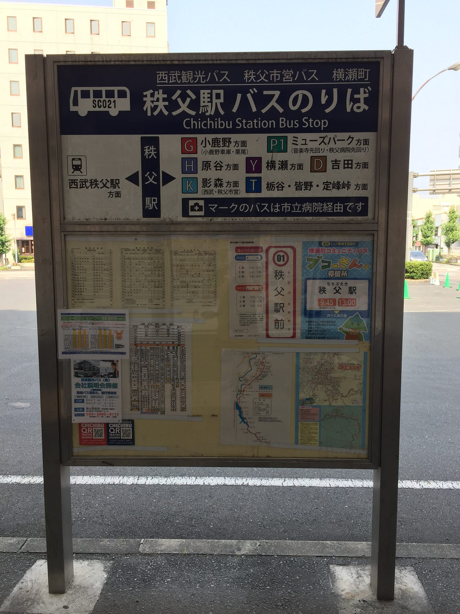

### 帰ってきた森田！横瀬町で修行開始だ！

#### **8/2~8/4@横瀬町**

#### **おっす!オラ森田!!よろしくな！！！**

みなさま、ご無沙汰しております！夏休みが始まったものの全く夏休みが始まらない３年の森田です。今年の蝉は鳴くタイミングを間違えているのかと思うくらい朝３時頃がうるさいですよね。とは思いつつも、ちょっと夜遅くに散歩しますと、蝉の幼虫が歩いていたり成虫になる瞬間を拝見できたり。少し命というものを身近に感じることができるのも、この季節の魅力なのではないのでしょうか。では本題に入っていきましょう。
今回は８/２~４にかけて埼玉県横瀬町への合宿に行ってまいりました。合宿初日は試験の関係で参加できなかったため、２日目から合流することになりました。試験については触れないでください、こう見えても意外とセンシティブなんです…
 総括すると、前回の大町合宿より生存感があります。とにかく寝袋使わなくても良い夢が見れました。何があったか気になる方はこちらを…

[オラも来たぞ！千年の森で修行開始だ！
4/27~4/30 @信濃大町medium.com](https://medium.com/furuhashilab/%E3%82%AA%E3%83%A9%E3%82%82%E6%9D%A5%E3%81%9F%E3%81%9E-%E5%8D%83%E5%B9%B4%E3%81%AE%E6%A3%AE%E3%81%A7%E4%BF%AE%E8%A1%8C%E9%96%8B%E5%A7%8B%E3%81%A0-4e459792bc92)

### ＃行動記録

**初日
**・バーベキュー
・お風呂
・ゼミ論構想発表会
・花火

**2日目
**・ブコーさん号のバス停探し
・川遊び
・ジェラート屋さんに行く
・ドローン撮影
・夕飯作り
・お風呂

**最終日
**・Ingress
・Pokemon GO
・川遊び
・片付け
・帰宅

### ＃ゼミ論について

僕のゼミ論としてのテーマは「GTFS」です。馴染みのない言葉ですよね（笑）なんだそれと思った方、実は恐らくほぼ全員使った事のあるツールになります。GTFSとはGeneral Transit Feed Specificationの略で、「_公共交通機関の時刻表と地理的情報に関するオープンフォーマット_」となります。理解しにくいですね（笑 ）**Googleで行き方を検索した時に、”何分の電車、どこ駅で乗り換え”**って出ますよね、その情報の登録を行うことが僕のゼミ論になります。詳しくは今度のブログで書いていきます！！

### ＃ブコーさん号の登録

横瀬町にはブコーさん号と言うコミュニティバスがありまして、幸いな事にその登録の許可をいただきました。本合宿ではみんなが横瀬町全域の360°マッピングをしている中、別行動でブコーさん号のバス停の位置を確認しに行きました。炎天下の中での自転車移動でしたが、とにかく暑かったです。けども空気と景色が綺麗で、またジブリの世界でしか見た事がなかったようなトンネルにちょっと興奮してました笑





まあそんなこんなでブコーさん号の経路上に。タイミングが合わなかったのでバスには遭遇できませんでしたが、なんとか停留所は発見しました！
このバス停を見かけた時は、是非乗車してみてください！







経路図を頼りに進んで行き、なんだかんだ終点の秩父駅を残すのみとなりました。秩父神社とまつり会館と賑やかな施設を通り抜け、そこには大きな建物が。ついに秩父駅に着いた、合宿での停留所の確認が終わったと思ったのもつかの間、バ、バス停が見当たらない(◎_◎;) とにかくあるはずの黄色い停留所がないんです。そんなことはないだろうと、自転車を止めて駅のロータリーへ。バス停の看板があったため期待して向かってみたら、「西武観光バス」の文字が…。ない、ない、探しても探しても見当たらない。駅周辺にはあるだろうと、散策しましたが見当たらない。とりあえず一旦落ち着く事を決めて、日陰を求めてロータリーへ、少し座って休もうとベンチ向かいました。ん？んん？？ なんか見た事のある文字がある気がしたんです。正確に言えば見えたんです。まさかと思ってもう一回西武観光バス停留所の前に行きました。



あった！あった！！あった！！！ あまりの嬉しさに写真撮ってたら、隣のおばさんが不思議そうな目でこちらを。ちょっと冷静さを取り戻し、ベンチに腰掛けて写真を確認。「おいおい、ブコーさん号の存在感… 」もう少しアピールして欲しかった。気づかなかった僕がいけないんですけど、存在が本当に消えてるんです。秩父駅でブコーさん号を乗ろうと考えてる方、見失わないように気をつけてください。とはこんなで、停留所確認の旅、終了いたしました！ 協力いただいた皆様、ありがとうございました！！！

ブコーさん号 バス停マップ＆時刻表

ゼミ論でしかない今回の横瀬合宿でしたが、実際に来てみないとわからない事がたくさんありました。バス停の位置把握にしても、どのような交通状況であるのかとか。GTFSはある程度の基準にはなりますが、実際に渋滞などは予測できませんですし。今回の調査でわかった静的な情報を登録することから始まりますが、慣れてきたらリアルタイムな情報にも挑戦してみたいと思ったり思わなかったり。また今回の合宿のように撮影を行ったものを確認して修正を加えていけば、最新の情報でGTFSを登録していけるのではないかと考えました。ある意味近日公開されたMapilaryが存在するのであれば、既存のGTFSよりも詳しいかもしれませんね。そして現地に向かわなくても登録をする術を覚えてしまったかも…（笑）とにかくGTFSの登録は大変な作業なのです。早く公開できるように、最善を尽くしていきます！

また次回の投稿も見てくださいねー、じゃんけんぽん（グー）！ うふふふふふっ

```
STRAVA記録
```

[横瀬町 2019/08/02 - Hironori Morita's 6.7 mi bike ride
Hironori M. rode 6.7 mi on Aug 2, 2019.www.strava.com](https://www.strava.com/activities/2584490558)

[横瀬町 2019/08/03 - Hironori Morita's 21.6 mi bike ride
Hironori M. rode 21.6 mi on Aug 2, 2019.www.strava.com](https://www.strava.com/activities/2587045384)

[横瀬町 2019/08/04 - Hironori Morita's 1.5 mi bike ride
Hironori M. rode 1.5 mi on Aug 3, 2019.www.strava.com](https://www.strava.com/activities/2588545143)
