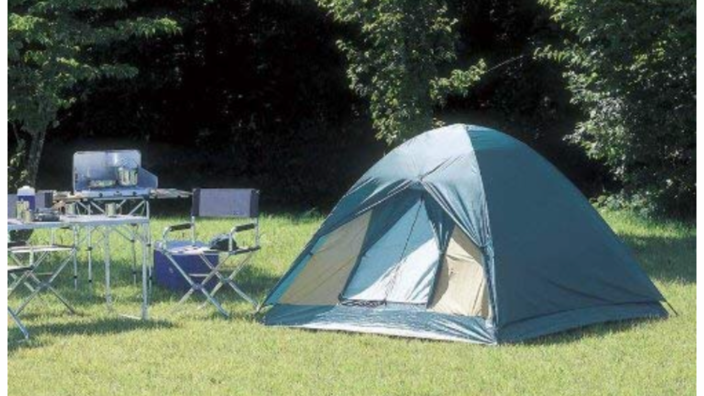
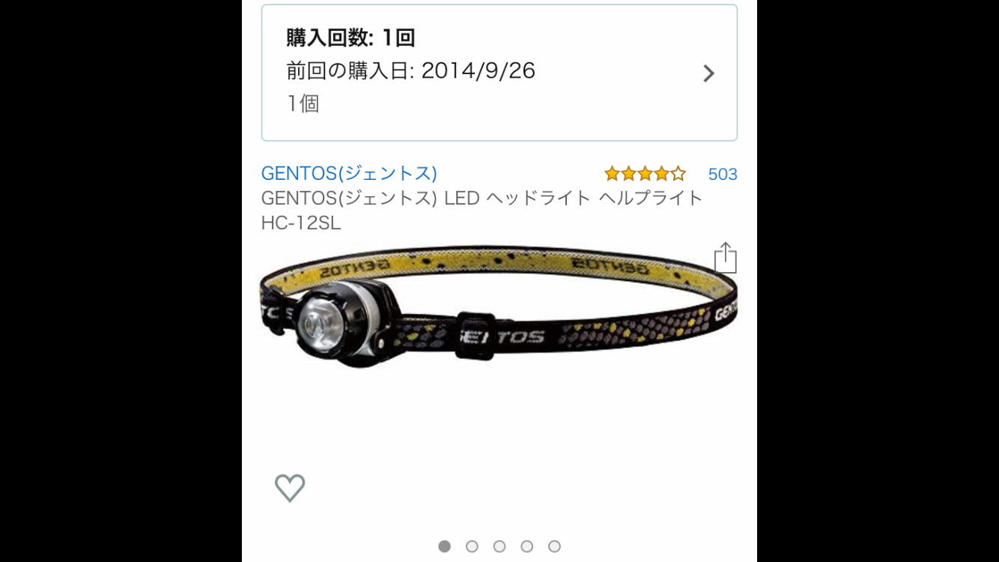
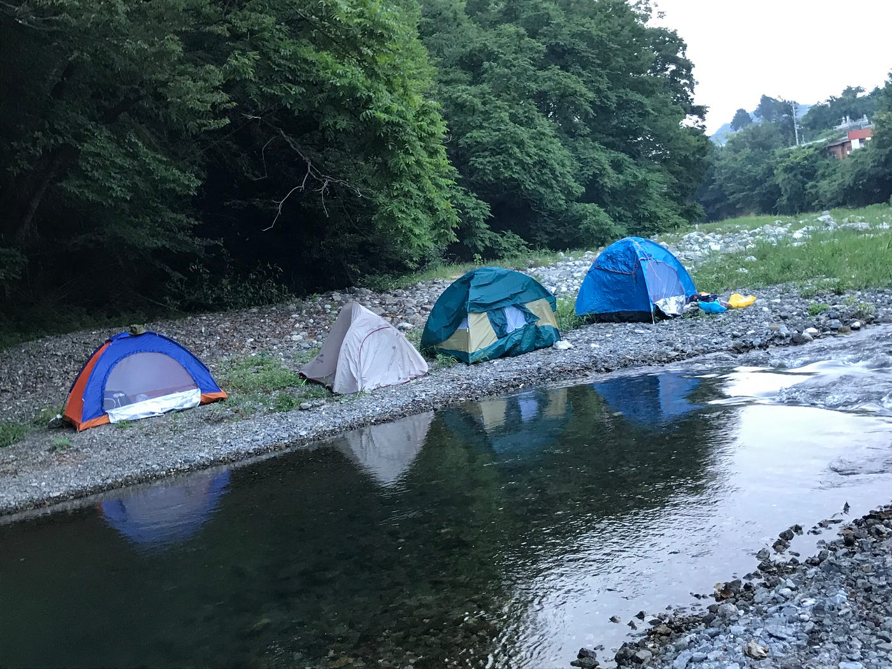
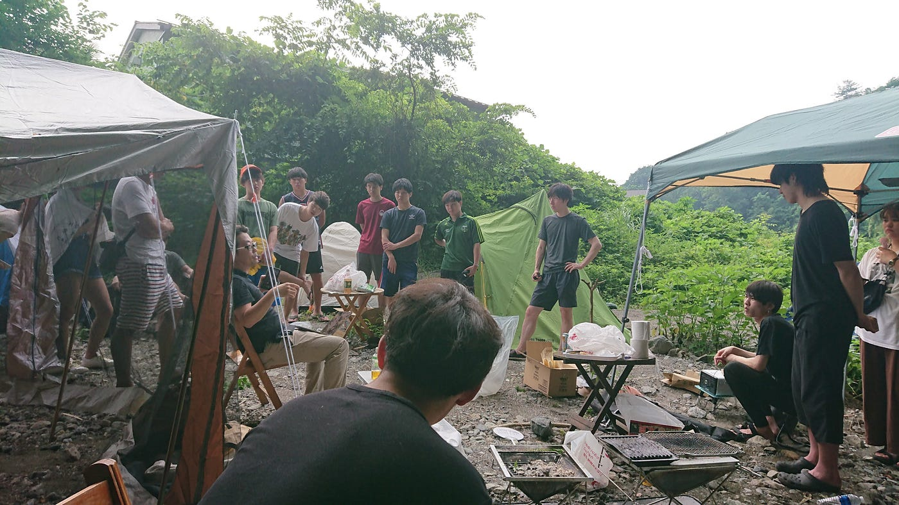

### 真夏のテント泊ゼミ合宿＠横瀬町

こんにちは。３年の浜田皐太です。

山梨県出身という田舎育ちにも関わらず、テント泊が人生初めての体験だったので不安を抱えてのゼミ合宿参加となりました。

### **今回のテント泊で購入したもの**

・テント

ゼミ合宿の前、古橋先生が推奨テントのリストアップしてくれていたのでみてみたところ、どれも一万円越えでちょっと学生には手の届かないものだったので自分で調べてみることに。amazonで探している中で推奨リスト内にもあったCAPTAIN STAGというメーカーの安価なテントを発見。reviewを見てみたことろかなりの高評価だったので即ポチ。価格は４１６９円。[https://www.amazon.co.jp/dp/B000AR4STC](https://www.amazon.co.jp/%E3%82%AD%E3%83%A3%E3%83%97%E3%83%86%E3%83%B3%E3%82%B9%E3%82%BF%E3%83%83%E3%82%B0-CAPTAIN-STAG-M-3105-%E8%BB%BD%E9%87%8F%E3%83%BB%E3%82%B3%E3%83%B3%E3%83%91%E3%82%AF%E3%83%88%E8%A8%AD%E8%A8%88/dp/B000AR4STC/ref%3Dsr_1_10?__mk_ja_JP=)

もちろん折りたたみ式でワンタッチとはいかないものの二人で協力すれば五分もかからず組みたつ代物。意外と優秀。全面に網が張ってあり雨よけカバーをつけなければ風通りもよく快適。逆に言えば冬のキャンプには厳しいところ。

寝袋は友人からもらったので出費は抑えられた。キャンプは夜真っ暗なのでヘッドライトは持ってきて正解だった。今回使ったのはGENTOS(ジェントス) LEDヘッドライト。実は僕の高校が年に１度、２４時間かけて男子生徒が１０５kmを走る強行遠足という地獄のような学校行事があり、その際に買ったもの。購入履歴を調べてみると２０１４年に購入したものだった。それがまだ使えたのは自分でも驚き。とても軽量で小型なので頭から落ちることはなくLEDなので光量も十分。

[https://www.amazon.co.jp/dp/B000BSATDO](https://www.amazon.co.jp/%E3%82%B8%E3%82%A7%E3%83%B3%E3%83%88%E3%82%B9-LED%E3%83%98%E3%83%AB%E3%83%97%E3%83%A9%E3%82%A4%E3%83%88-%E3%80%90%E9%80%A3%E7%B6%9A%E7%82%B9%E7%81%AF16%E6%99%82%E9%96%93%E3%80%91-HC-12SL-%E5%81%9C%E9%9B%BB%E6%99%82%E7%94%A8/dp/B000BSATDO/ref%3Dsr_1_2?__mk_ja_JP=)

**付け加えで、**自分たちが河岸にテントを建てたことが主な原因と思うが、寝る際に石が当たって痛くて睡眠を妨げられたので下に敷くマットはあったほうがいいと感じた。

さてそろそろ本題に

### **8月2日〜4日で参加したゼミ合宿**

### **8月2日**

テストの関係で夕方に到着したこともあってゼミとしての活動には参加できなかったため、テント設営で活動終了。夜はBBQとゼミ論構想をし次の日も早いのでみんな早めに寝床に。

[午後のウォーキング - 皐太 浜田's 5.4 mi walk
皐太 浜. completed 5.4 mi on Aug 2, 2019.www.strava.com](https://www.strava.com/activities/2583577253)

### **8月3日**

この日は朝８時から横瀬の街をマッピング。360°カメラを車に付け、徐行しながら撮影へ。渡された360°カメラはLG360 **ん？？？嫌な予感。。。**sumsungのGalaxy発火事件など韓国企業の電化製品にあまりいいイメージが個人的にないので大丈夫かなとは思いつついざ出発。

マッピング開始場所につき撮影を始めていく。勝手に接続が切れて撮影ができないトラブルが起こったものの無事撮り始めることができ、自分の不安とは反対に順調に進んでいく。しかししばらくすると勝手に録画が止まり、しまいには５秒も録画できない状態となってしまった。車のドアを閉めただけで録画が切れてしまう。おいおい笑 おそらく熱でオーバーヒートした模様。横瀬の気温が凄まじかったのか、単純にLGが悪いのか自分には判断がつかないが結局撮影は中断し他の班にやってもらい、午前の活動は終了。午後は別のカメラを貸してもらい撮影したところすこぶる調子が良く３０分程度でマッピングを完了することができた。 **やはりLGか。。。**

機械の故障は予期せぬことで防ぎようがないことなので解決策を見つけるのは難しいが、二台を常備し壊れたりバッテリーが切れたらもう一台のに変えるというのが最善な方法だと感じた。ただカメラの数も限られているのでなかなか難しいところではある。

⬇︎午前のstrava

[朝のウォーキング - 皐太 浜田's 8.3 mi walk
皐太 浜. completed 8.3 mi on Aug 3, 2019.www.strava.com](https://www.strava.com/activities/2585436797)

⬇︎午後のstrava

[午後のウォーキング - 皐太 浜田's 6.2 mi walk
皐太 浜. completed 6.2 mi on Aug 3, 2019.www.strava.com](https://www.strava.com/activities/2585744941)

### **8月4日**

この日は朝５時からPokémon GOとIngressの活動となった。Ingressはやったことがなくチュートリアルが少し退屈ではあったがみんなで協力しないと成り立たないゲームなので色々意見しながら試行錯誤してやっていくのが有意義ではあった。しかしレベルが低くまだあまりフルに活動ができない中でのミッションだったので少し物足りなさはあった。突如現れたダルマという男にしこたまやられ、みんなで一つのアートを作り上げるという目標が叶うことはなかった。早めに古橋邸に帰ってきて川で自由時間を過ごしつつ昼食を食べ解散となった。

### **最後に**

初めてのゼミ合宿で不安はあったし機材トラブルもあったがその中でいかに最大限のパフォーマンスをするかが重要であった。機材が壊れてそこで諦めていたが他に方法があったのではないかと今更になって考えてしまう。片付けの面であらかじめ役割分担を振っとけばもっとスムーズに終わることができたのかなと思う。分別についても初めてだったから完璧ではなかったので今後に生かしていきたい。
