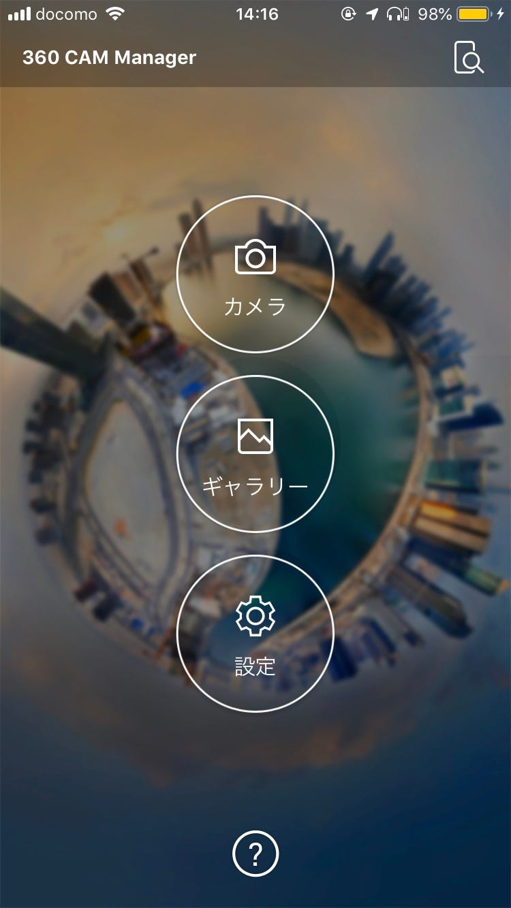

8/1〜8/3の横瀬合宿

はじめまして。3年の古屋百々葉です。

初めての参加でしたが、先輩や、同期の子たちと仲良くなれて今回のゼミではいろんなことが学べました！

1日目

- テント張り

- ゼミ論発表

私は、テストがあったので1日目は夕方から参加しました。まだ日が沈まないうちに到着でき、みんなが手伝ってくれたので、テントをスムーズにはれましたが、暗い時間だと張りづらいかっただろうなぁと思うので、早めに行ける人は早めに行った方がいいと思いました！また、テントを張る場所も早い者勝ちのようだったので、早めに行くのがオススメです！

2日目

- マッピング

- BBQ

- 花火

私は、古橋先生の車でマッピング手伝いました！使ったカメラは、THETA Z1です。

早朝から動いたことで、必要な人数や、どれくらいの時間で撮ればいいか、など下準備ができ、それ以降の活動がスムーズに行うことができました。特に、動画を撮るため、車の速度は20キロぐらいがいいと思いました。そして、ストラバは、8分ごとに止める人と、スタートからマッピング終了までずっとつけてる人と２つに別れた方がいいということもわかりました！ストラバをずっとつけてる事で、どの道を通ってどの道を通ってないのかが一目でわかるので、オススメです！また、道案内をしていた事で、最初は苦手で時間のかかった情報処理が、スムーズに行えるようにもなりました！！

3日目

- マッピング

私は、2日目とは違い、360camを使いました。

このカメラを使用した際、2回トラブルが起こりました。1回目は、Wi-fiの接続状況が悪く、携帯とカメラの連動が行えなかったトラブル。2回目は、カメラの作動が止まってしまったトラブル。一つ目のトラブルは、Google検索したり、先輩に聞き、解決できました！二つ目のトラブルは、1度目の撮影はしっかり8分間できましたが、2度目からカメラが起動しなくなりました。5秒ごとにカメラが止まってしまい、調子がいいと1分持ちましたが、すぐにカメラが作動しなくなり、撮影ができない状態になりました。後から、カメラが熱くなってしまったことが原因だと分かりました。他の班に事情を伝え、他の班が私たちのところまでマッピングしてくれました。今度からは、冷えピタや保冷剤を持参して、自分たちでトラブルに対処するべきだと思いました。

strava記録

1日目

[strava.app.link](https://strava.app.link/DAOeY8B68Y)

2日目

[strava.app.link](https://strava.app.link/TAWbnQN78Y)

[strava.app.link](https://strava.app.link/6S2INsQ78Y)

[strava.app.link](https://strava.app.link/FQGPqZT78Y)

[strava.app.link](https://strava.app.link/ebXQRjV78Y)

[strava.app.link](https://strava.app.link/EJEFzxW78Y)

[strava.app.link](https://strava.app.link/wvvwVDY78Y)

[strava.app.link](https://strava.app.link/P0tS6TZ78Y)

[strava.app.link](https://strava.app.link/2xMZo1078Y)

3日目

[strava.app.link](https://strava.app.link/aUXD5E278Y)

[strava.app.link](https://strava.app.link/SNBSaef88Y)

[strava.app.link](https://strava.app.link/KvcxPfg88Y)

[strava.app.link](https://strava.app.link/j5F2Duh88Y)

[strava.app.link](https://strava.app.link/Q3jm6Ui88Y)

[strava.app.link](https://strava.app.link/SN0mH3j88Y)
