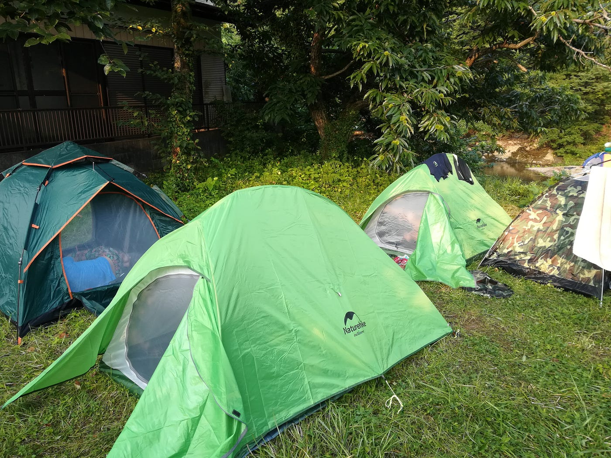
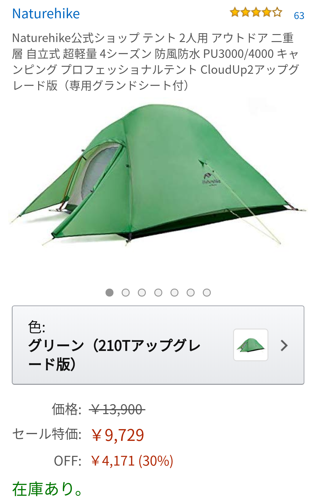
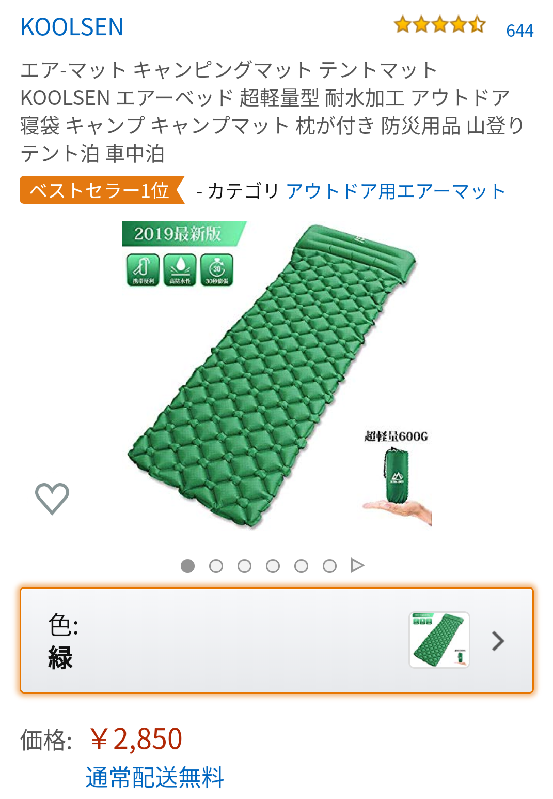
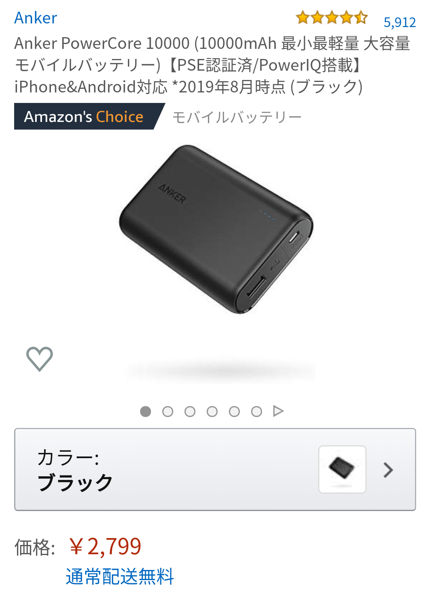
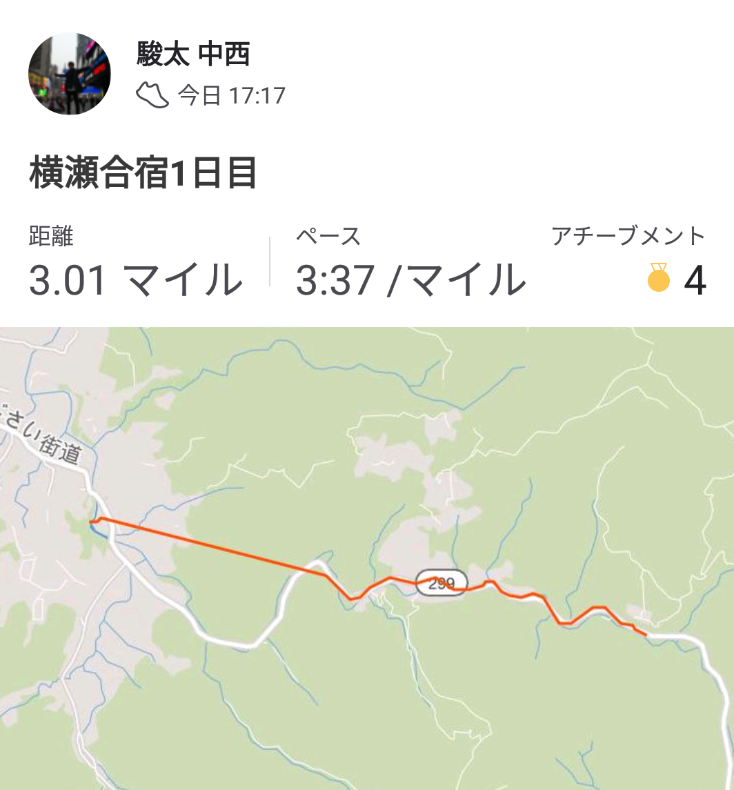
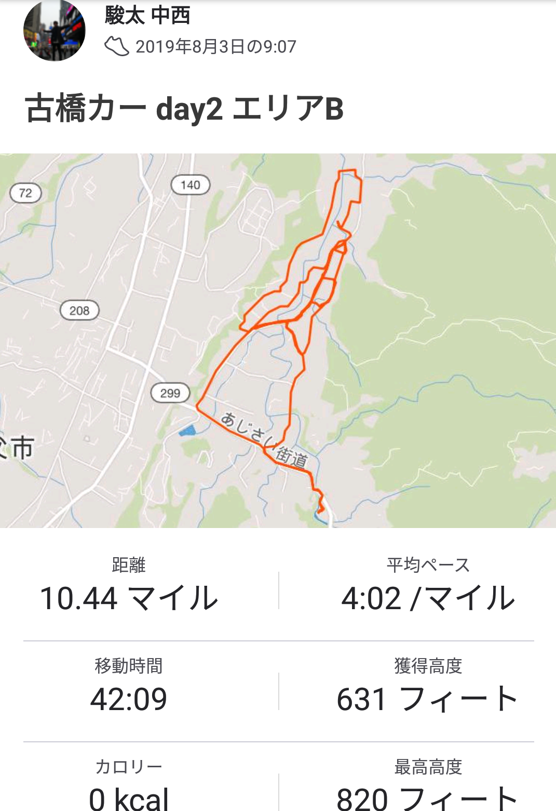
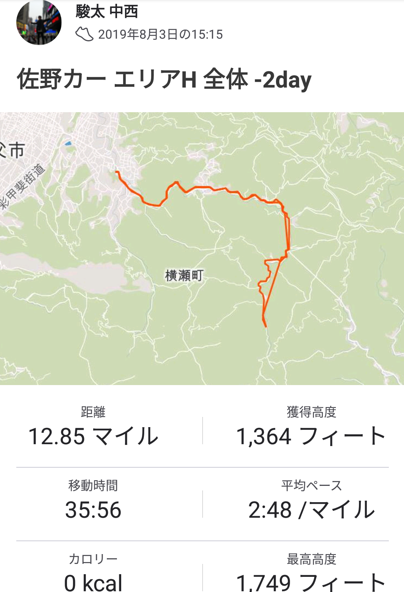
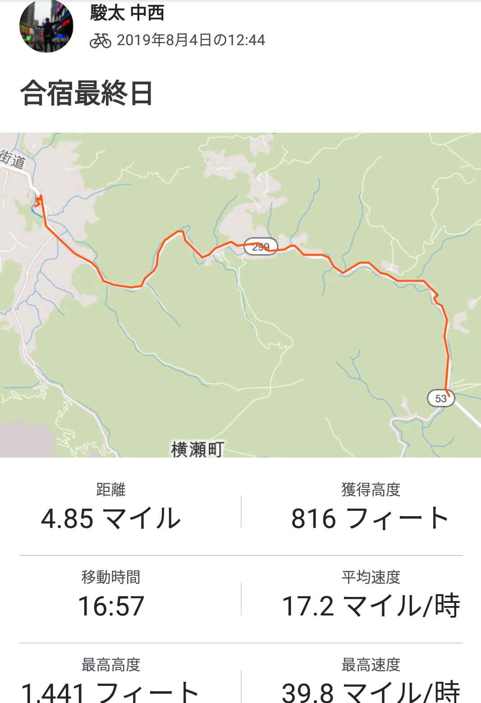

### ゼミ合宿 2019夏～横瀬の情報よこせ！～

みなさんこんにちは。広島東洋カープをこよなく愛する地球社会共生学部３年の中西 駿太です。今回は私にとって初めてのゼミ合宿だったので、手探り状態で合宿の準備から、合宿の日程を消化しました。私のレポートでは、”合宿前日の自分へ”をテーマに合宿に参加する際の準備（持ち物等）、心構えなど様々な情報をお伝えしたいと思います。また、３日間参加した合宿の総括、反省点も合わせて書き記します。

### **― 合宿前日の自分へ ― ～横瀬夏合宿で絶対に必要な持ち物とオススメ商品～**

### ●持ち物

合宿ではテント、寝袋、マット、モバイルバッテリー等々合宿を機に購入するものが多いです。ここで私がオススメするのが、**Amazon Prime Day** が開催されるタイミングでこれらの商品をまとめて購入すること！後でも説明しますがほぼ全ての商品が通常より**30％OFF**で購入することができます。お得に合宿グッズを買い揃えましょう。

**注意点**：古橋ゼミ夏合宿では寝袋は必要ありません。但し天候によっては寒くて寝れなくなる恐れがあるので出発前日に天気予報をチェックして持っていくのかいかないのか判断をしてください。

#### ・二人以上用のテント

二人以上というのが重要なポイント！絶対に一人用のテントは買わないこと！理由は、大きな荷物も一緒にテントに入れると一人用テントだと寝れるスペースがありません！荷物を置くスペースを確保するために二人以上は入れるテントを持って行ったほうがいいです。

#### **オススメのテント**

オススメのテントはNaturehikeさんのテント「Cloud Up」シリーズです。親しい友人がわざわざ丁寧にこの商品を教えてくれて購入しました。（商品と色が複数のゼミ生と被りました。）

最大の特徴はなんといってもこの安さ！Amazon Prime Day で30％OFFで購入し、9,729円で購入しました！丈夫でしっかりしたアウトドア用の本格的なテントながらなんと１万円以下！

組み立ては最初は戸惑うかもしれませんが慣れれば５分程度で組み立て、解体ができます。人気商品なので組み立て動画等がYOUTUBEでアップされているのであらかじめ目を通すといいと思います。

[Naturehike公式ショップ テント 2人用 アウトドア 二重層 超軽量 4シーズン 防風防水 PU4000 キャンピング プロフェッショナルテント（専用グランドシート付）…
Naturehike Cloud-Up 2 Person Lightweight Free-Standing Backpacking Tent with Footprint - 4 Season Dome Backpack Tent…www.amazon.co.jp](https://www.amazon.co.jp/dp/B07HTB2129/ref=twister_B072TVV97Y?_encoding=UTF8&psc=1)

#### ・エアーマット

エアーマットは絶対に購入してください！持ち物では寝袋より重要な必須アイテムです。その理由は、テントを張る場所によっては石ころの上で寝ることになるからです。地面がゴツゴツしてると、とにかく背中が痛くて寝れなくなります。エアーマットをテントの上に敷いてフカフカなマットで快適に寝ましょう。（普通のマットではゴツゴツした地面の上では快適に寝ることはできません。必ずエアーマットを購入した方がいいです。）

#### オススメのエアーマット

私がオススメする商品はKOOLSENさんの「キャンピングマット 枕付き」です。

最大の特徴はなんといってもこの安さ！通常のエアーマットは5,000円する物ですが、Amazon Prime Day で30%OFFの2,363円で購入しました。

値段は安いですが、素材は一級品。とても丈夫ながら超軽量。コンパクトなので持ち運びにも便利！荷物が多い古橋ゼミの合宿には最適！俺の相棒。

[https://www.amazon.co.jp/dp/B07BTT8Y65/ref=twister_B07BTNB7YS?_encoding=UTF8&psc=1](https://www.amazon.co.jp/dp/B07BTT8Y65/ref=twister_B07BTNB7YS?_encoding=UTF8&psc=1)

#### ・モバイルバッテリー

大変恥ずかしながら、今回のゼミ合宿を機にモバイルバッテリーと出会い、購入を果たしました。モバイルバッテリー…めっちゃええやん！ってなったので購入に抵抗がある私みたいな人は是非とも速やかに購入を検討してください。もちろんゼミ合宿では必須アイテムです。家と違ってテント泊なのでコンセントは自由に使えないですよ！

#### オススメのモバイルバッテリー

私がオススメする商品はAnkerさんの「Anker PowerCore 10000」です。

モバイルバッテリーについてはあまり知らないのですが10000mAhくらいあれば十分だと思います。

最大の特徴はなんといってもこの安さ！モバイルバッテリーは値段が高いイメージがあり、実際高い物だと10,000円くらいします。しかし、Amazon Prime Day で30%OFFの2,029円で購入しました。

私が最も恐れている自然発火の心配もベストセラー商品なので大丈夫かなと思っています。迷ったら絶対この商品だぁ！！

[https://www.amazon.co.jp/Anker-PowerCore-%E3%83%A2%E3%83%90%E3%82%A4%E3%83%AB%E3%83%90%E3%83%83%E3%83%86%E3%83%AA%E3%83%BC-Android%E5%AF%BE%E5%BF%9C-2018%E5%B9%B411%E6%9C%88%E6%99%82%E7%82%B9/dp/B019GNUT0C/ref=sr_1_1_sspa?__mk_ja_JP=%E3%82%AB%E3%82%BF%E3%82%AB%E3%83%8A&crid=21S3Q20G57FY5&keywords=%E3%83%A2%E3%83%90%E3%82%A4%E3%83%AB%E3%83%90%E3%83%83%E3%83%86%E3%83%AA%E3%83%BC+anker&qid=1565579099&s=gateway&sprefix=%E3%82%82%E3%81%B0%E3%81%84%2Caps%2C278&sr=8-1-spons&psc=1&spLa=ZW5jcnlwdGVkUXVhbGlmaWVyPUEzNk05NEhYOTdBRVA5JmVuY3J5cHRlZElkPUEwNDEyNDc4MVROSlI0ODQ1TVlUNSZlbmNyeXB0ZWRBZElkPUEyVlBPQ1NTOFhSSjVJJndpZGdldE5hbWU9c3BfYXRmJmFjdGlvbj1jbGlja1JlZGlyZWN0JmRvTm90TG9nQ2xpY2s9dHJ1ZQ==](https://www.amazon.co.jp/Anker-PowerCore-%E3%83%A2%E3%83%90%E3%82%A4%E3%83%AB%E3%83%90%E3%83%83%E3%83%86%E3%83%AA%E3%83%BC-Android%E5%AF%BE%E5%BF%9C-2018%E5%B9%B411%E6%9C%88%E6%99%82%E7%82%B9/dp/B019GNUT0C/ref=sr_1_1_sspa?__mk_ja_JP=%E3%82%AB%E3%82%BF%E3%82%AB%E3%83%8A&crid=21S3Q20G57FY5&keywords=%E3%83%A2%E3%83%90%E3%82%A4%E3%83%AB%E3%83%90%E3%83%83%E3%83%86%E3%83%AA%E3%83%BC+anker&qid=1565579099&s=gateway&sprefix=%E3%82%82%E3%81%B0%E3%81%84%2Caps%2C278&sr=8-1-spons&psc=1&spLa=ZW5jcnlwdGVkUXVhbGlmaWVyPUEzNk05NEhYOTdBRVA5JmVuY3J5cHRlZElkPUEwNDEyNDc4MVROSlI0ODQ1TVlUNSZlbmNyeXB0ZWRBZElkPUEyVlBPQ1NTOFhSSjVJJndpZGdldE5hbWU9c3BfYXRmJmFjdGlvbj1jbGlja1JlZGlyZWN0JmRvTm90TG9nQ2xpY2s9dHJ1ZQ==)

### ＃合宿初日（8/2）

私は「世界遺産入門」の期末試験があったため、合宿全体の２日目から参加させていただきました。合宿に向かうまでは電車で行く予定でしたが親切な友人が車を出してくれてくれて楽に速く埼玉県横瀬町に到着しました。

**＃１日目でやったこと**

・みなさんに挨拶

・バーベキュー

・ゼミ論構想発表会

・肝試し旧道ドライブ

### ＃合宿２日目（8/3）

二日目はマッピング作業を行いました。古橋カーの助手席に座り、古橋教官の指導を受けながらナビゲーターを務めさせていただきました。その後、佐野カーでもナビゲーターをしました。

佐野カーではナビゲーター以外の役割にチャレンジして、指導を受けながら新しい仕事のスキルを身につければよかったと反省してます。

**＃２日目でやったこと**

・道路撮影

・ジェラート屋訪問

・買い出し

・バーベキュー

・武甲の湯（お風呂）

### ＃合宿３日目（最終日 8/4）

最終日はまさかの4:30起床、5:00活動開始という朝からハードなスケジュール。ただ、私の大好きなポケモンGOの活動だったのでスムーズに起き上がることができました。（レックウザ確保失敗）

INGRESSの活動では、INGRESSのチュートリアルに苦戦し、メンバーのみんなに迷惑をかけてしまいました。あらかじめインストールをしてチュートリアルを終えればよかったと反省しています。

**＃３日目でやったこと**

・Pokemon Go＆Ingress

・川遊び

・片付け

・お別れの挨拶

### 最後に

今回の合宿では車をだしていただいたり、古橋邸にお邪魔させていただいたり、大変多くの支えを頂きました。また、合宿の準備から合宿中も様々な親切な友人や先輩方、先生のアドバイス、ご指導で大変有意義な合宿にすることができました。皆さんのお力添えいただいたおかげで合宿を無事に終えられたこと大変うれしく思います。ただただ感謝の気持ちでいっぱいです。本当にありがとうございました。

#### ・Strava

[https://www.strava.com/activities/2583652249](https://www.strava.com/activities/2583652249)

[https://www.strava.com/activities/2585405003](https://www.strava.com/activities/2585405003)

[https://www.strava.com/activities/2585741484](https://www.strava.com/activities/2585741484)

[https://www.strava.com/activities/2588526859](https://www.strava.com/activities/2588526859)
