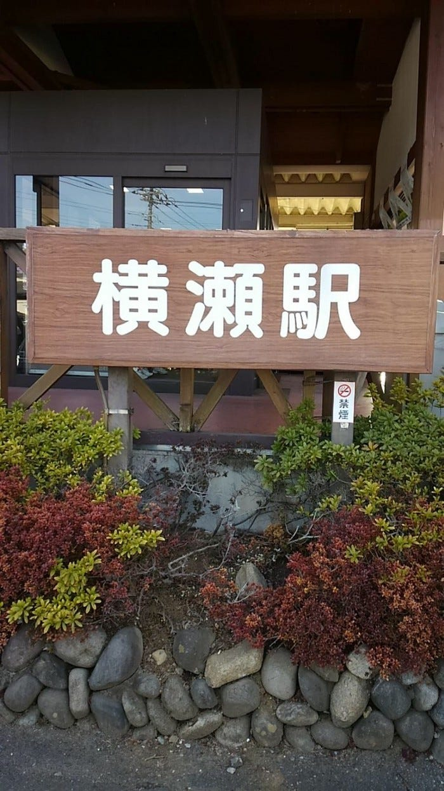

### 初の本格的なマッピングには課題と成果があったいい戦いでした。

初めまして、越後 開登です。

今回の合宿では埼玉県横瀬町全体のマッピングをするために、初日の午後にはLG360という360°撮影可能なカメラを用いて、浜田カーとして約１時間ほどのマッピングを行いました。

しかし、実際は開始３０分ほど経ってから少しずつオーバーヒートを起こしてしまい途中で撮影を他の班に受け継ぎする、という形になってしまいました。完全に作動しなくなったわけではなかったのですが、５秒ほどで自動的に録画を停止してしまう、という状態になっていました。この反省点としては、炎天下の使用では、やはり冷却用に冷えピタなどを使用して、熱を逃がす工夫を施しておけばよかった、と思っています。しかし、その他の面では役割分担を行い、うまく回っていたと感じています。

次の日にはInsta360というカメラを用いて再挑戦しました。こちらのカメラはオーバーヒートすることなく、無事指定されたエリア内を全て終了することができました。 しかし、アップロードの時間、手間がすごくかかる、という難点がありました。このカメラを使いデータを教授に送信するためには、まず撮影時に、撮影班のメンバーがリンクするアプリをインストールして撮影します。そして、そのデータをwi-fi経由で携帯に送り、そのデータを自分のカメラフォルダにダウンロードしたのちに、それをMacにエアドロップで送信して、StravaというGPS記録アプリの記録と並べて、先生に送信する、といった手順を踏む必要がありました。この工程に計５時間ほど要しました。よって、もう少し１つ１つの録画時間のスパンをギリギリの６分などでなく、より短くすることでスムーズに送信、ダウンロードができたのではないのか、と思っています。

しかし、総じて初の本格的なマッピングとしてはよくできたのではないのか、と思っています。というのも、実際、全ての道をマッピングするとなると、やはりわき道などもあったのですが、それらも全て考慮して行きのルート、帰りのルートを考えたり、データを飛ばす工程もわからないところは教えあったりして協力的に手探りながらも、行うことができたためです。

次回はオーバーヒートのこととデータの重さを念頭に置いた上で、撮影から送信までのプランを立てて、分担し効率的なマッピングを行なって行きたいと思っています。

８月３日 午前 のstrava

[午後のランニング - Kyto Echigo's 3.1 mi run
Kyto E. ran 3.1 mi on Aug 3, 2019.www.strava.com](https://www.strava.com/activities/2585745239?share_sig=93534E3B1565790248&utm_medium=social&utm_source=ios_share)

8月4日 午後のstrava

[午後のランニング - Kyto Echigo's 3.1 mi run
Kyto E. ran 3.1 mi on Aug 3, 2019.www.strava.com](https://www.strava.com/activities/2585745239?share_sig=102051021565790355&utm_medium=social&utm_source=ios_share)
