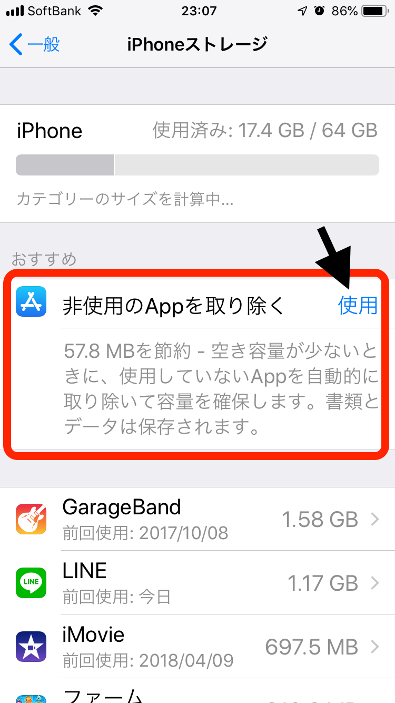
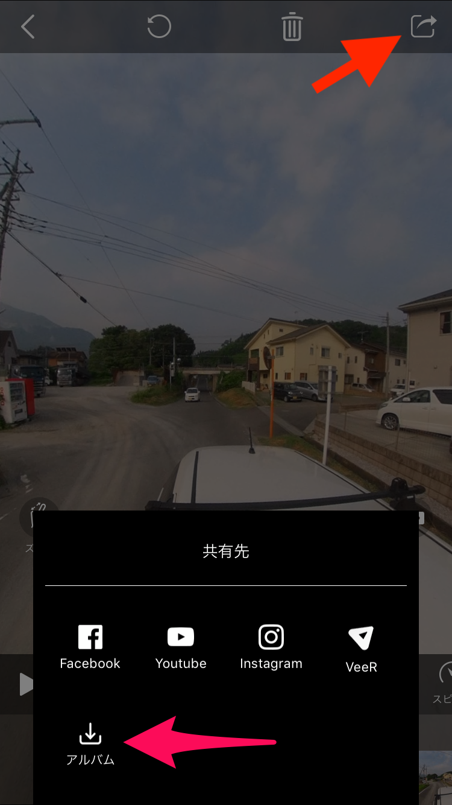
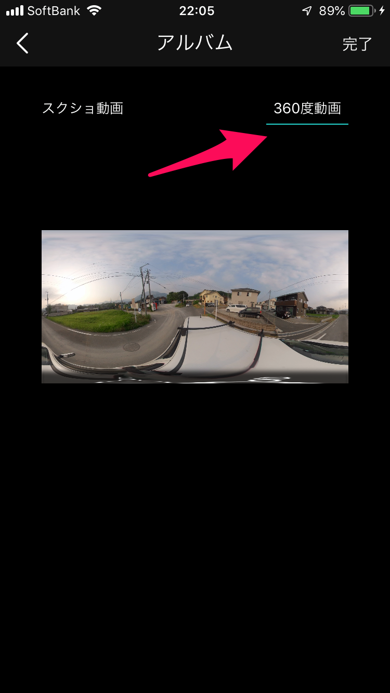

### 360°カメラQooCamを使う！~古橋研究室夏合宿2019~

どうも、青山学院大学古橋研究室4年の末光香織です。

8月1~4日でゼミ合宿が行われました。昨年の様に豪雨に見舞われなくてよかったです。笑

### ゼミ合宿2019の目的は？

今年は埼玉県横瀬町の公道を360°カメラで撮影しMapillaryにアップすること。限られた時間と機材でいかに効率良く撮影するのが決め手となります。

何事も事前に計画して行動しましょう。笑

### QooCamとは

中国を拠点とするKanDao Technologyという企業から出している4K 360°と3D 360°の撮影が可能なカメラです。

撮影した画像を確認するにはAppをインストールして置くことが必要です。

### QooCam ストリートマップマニュアル

QooCamを使って撮影した映像をMapillaryにアップするまでの工程を紹介します。

#### 撮影

今回はストリートマップを作るということで、

1度に4GB以下になる様に動画を撮影していきます。データを変換するときに、動画処理により元のファイルサイズが大きくなる可能性があります。

余裕を持って**3~3.5 GB**で区切る様にするといいでしょう。

> POINT

1. QooCam撮影と同時にStravaを記録する。

→QooCamの撮影するものには位置情報が記録されていません。Stravaを同時に記録する様にしましょう。あとで動画に位置情報を加えます。

2. 動画とStravaは同じタイミングでカットする。

→念のため、
**撮影開始: Strava→QooCam
撮影停止: QooCam →Strava**
の順でスタート、ストップする。

#### 撮影した動画を読み込む

撮影が終わったら、App内で撮影した動画をダウンロードしてパソコンに転送するために一旦スマホのカメラロールに保存します。

> **！注意！** カメラロールに保存する際、スマホ自体の空き容量がないとダウンロードできないので事前に確認しておくこと。

もし容量がなかったら、(iPhoneの場合)

**[設定]→[一般]→[iPhoneストレージ]→[非使用のApp取り除く]**

の機能を使うと、使っていないアプリをまとめて消して容量を増やすことが可能です。

各App内のデータは消されることはないので安心してください。

#### 準備ができたら

ダウンロードが終わったら今度はカメラロールに保存します。

360度パノラマ、**画質は高**を選択して完了するとスタートします。

終わるとスマホのカメラロールに動画が保存されているので、AirDropでパソコンに転送します。

冒頭に述べた様に、QooCamの映像には位置情報がついていないので[Mapillary Legacy Video Uploader](http://Mapillary Legacy Video Uploader) か [Command Line Tool](https://github.com/mapillary/mapillary_tools)にて処理をしていきます。

2019年8月現在はMapillary Legacy Video Uploaderを利用することができますが、今後使えなくなっていくみたいです。Command Line Toolを使える様にしておくといいでしょう！

[古橋研究室夏合宿1日目 - Kaori Suemitsu's 16.3 km walk
Kaori S. completed 16.3 km on Aug 1, 2019.www.strava.com](https://www.strava.com/activities/2581247543)

[古橋研究室夏合宿2日目午前 - Kaori Suemitsu's 29.9 km walk
Kaori S. completed 29.9 km on Aug 1, 2019.www.strava.com](https://www.strava.com/activities/2582955817)

[古橋研究室夏合宿20193日目 - Kaori Suemitsu's 22.0 km walk
Kaori S. completed 22.0 km on Aug 2, 2019.www.strava.com](https://www.strava.com/activities/2585492890)
