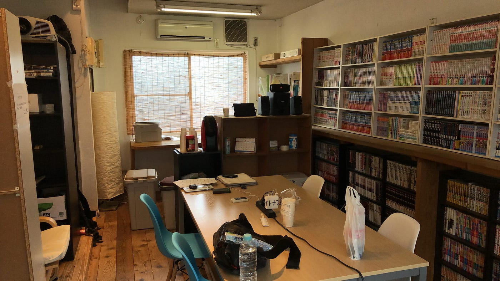
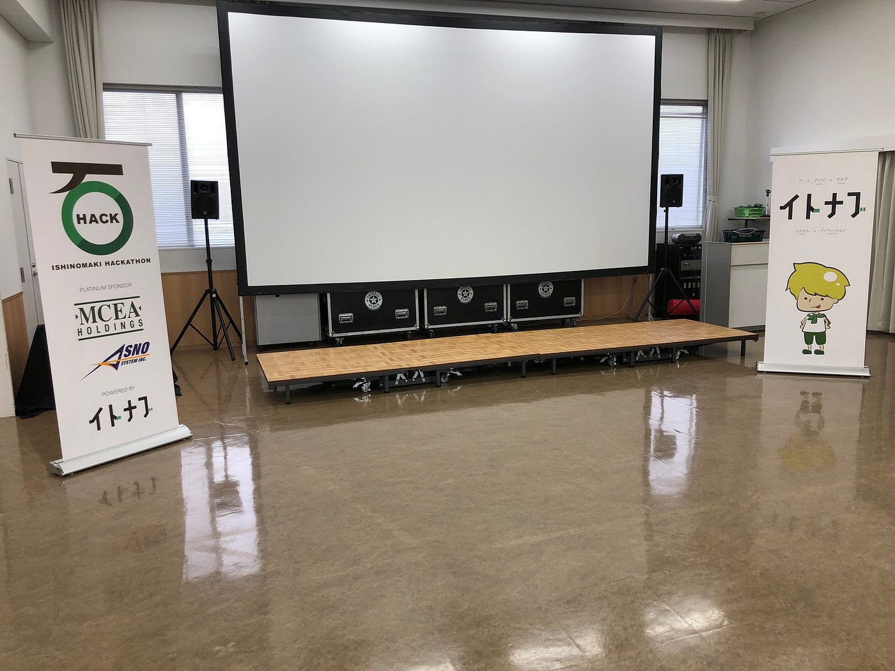
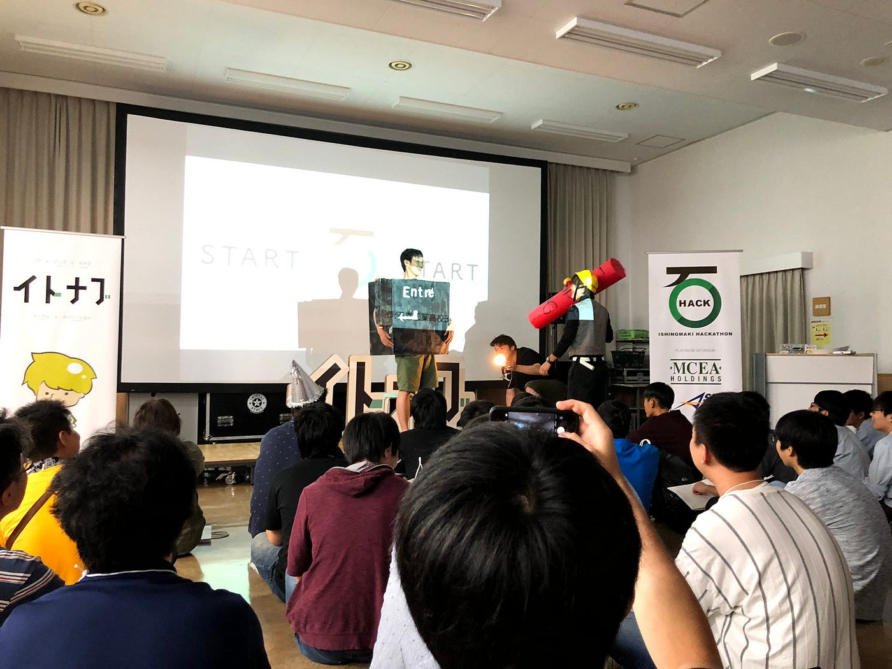
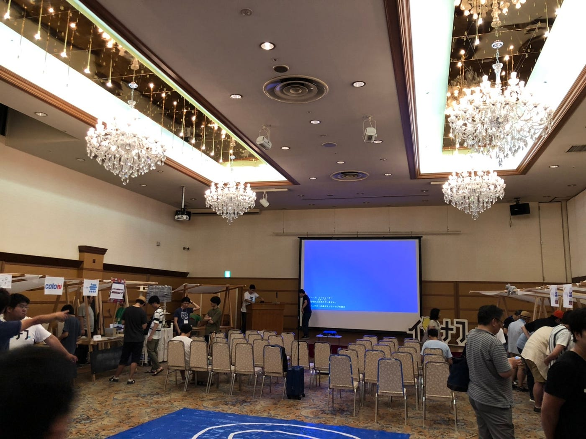
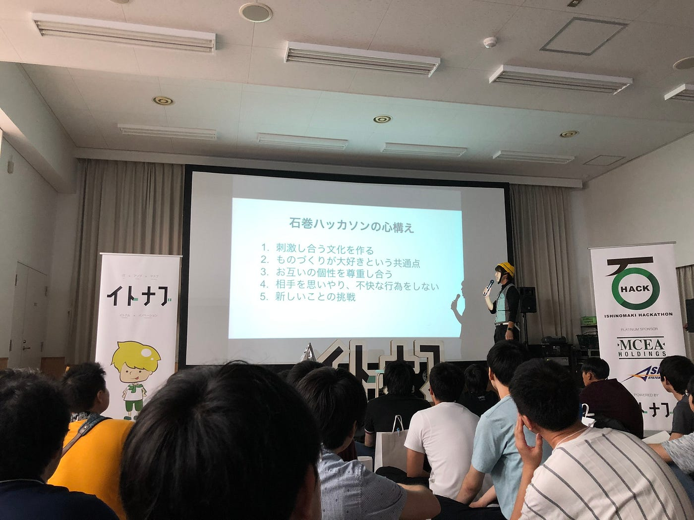
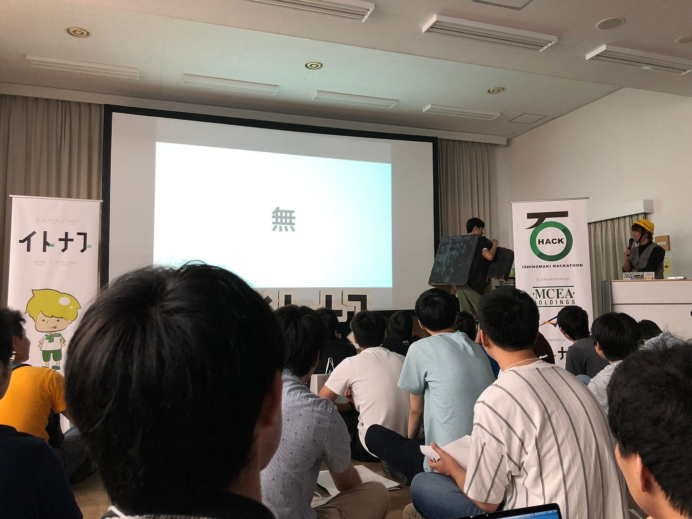
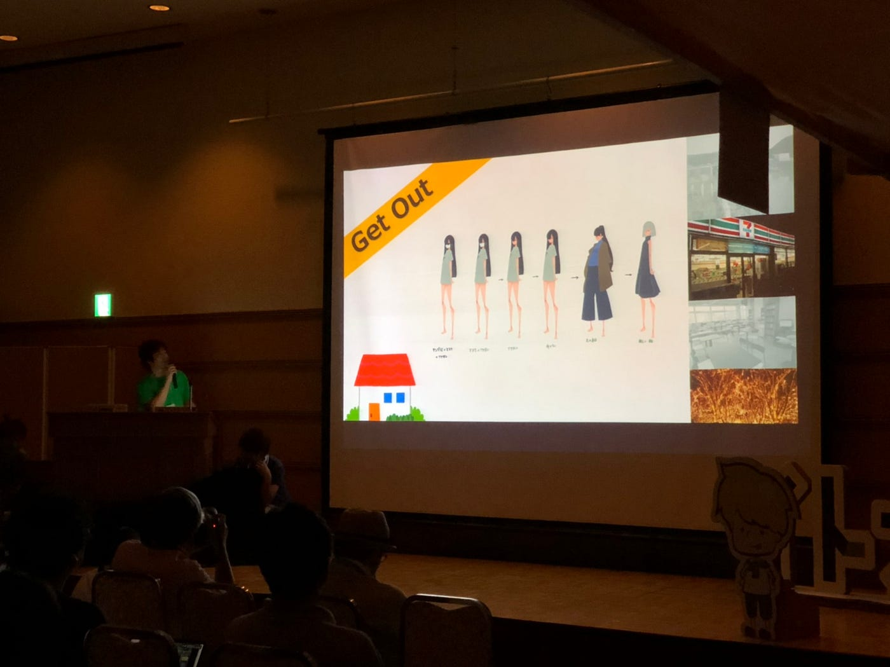
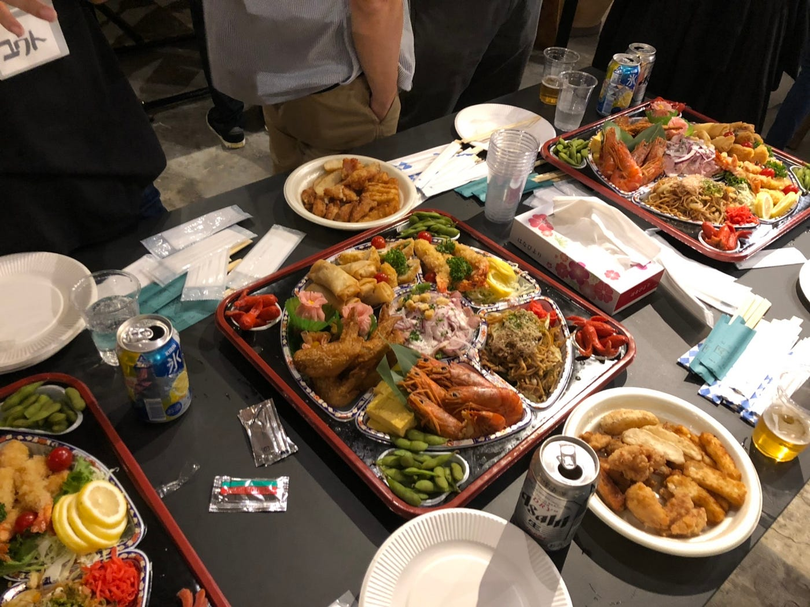

### 石巻で学んだ三日間。

_石巻ハッカソン、運営から見るか参加者から見るか。_

### 1.はじめに

みなさまご無沙汰しております、古橋ゼミ2期生の武末と申します。夏休みも終盤に差し掛かり、すこしずつ一月のまとめに入ろうかというこの時期、皆様は健康に過ごされていますでしょうか。

さて、私は8月16日からの三日間、宮城県石巻で行われた**石巻ハッカソン**へ参加してまいりました。

[石巻ハッカソン
Edit descriptionishinomakihack.com](http://ishinomakihack.com/#/)

ハッカソンと言えばエンジニアの発表会、コンクールのようなイメージが強く、おそらく皆様の頭の中でも賞金バリバリ出て、最先端の技術を駆使したトンデモ開発が飛び交うような会場をイメージしているのではないでしょうか。

最初は私もそのようなイメージを持ちながらびくびくと会場入りしたのですが、参加してみるとみんな優しく、和気あいあいとした雰囲気のまさにお祭りといったイベントでした。

学生と社会人の方が、一つのグループとして作品を作り上げていくこのイベントへ、株式会社イトナブ様のご厚意の元運営スタッフ側と参加者側の両方を体験させていただきました。今回はその二つの視点から「石巻ハッカソン」への参加レポートを書いてみたいと思います。

### 2.Strava報告

[石巻ハッカソン16-18 - Kouki Takesue's 5.7 mi walk
Kouki T. completed 5.7 mi on Aug 16, 2019.www.strava.com](https://www.strava.com/activities/2644163810)

※今回Stravaの記録を二日目から付け忘れていたのでGPXEVにて編集を行いました。現時点ではこのやり方が一番早いと思います。（備忘録を兼ねた追記）

[GPX Editor and Viewer(GPXEV)
This tool is GPX Editor and Viewer.askz.sakura.ne.jp](https://askz.sakura.ne.jp/gpxev/gpx_editor_and_viewer.cgi?lat=0&lng=180&zoom=2)

### 3.運営スタッフから見た石巻ハッカソン

僕たちが石巻に到着したのが朝6時半。加藤さんのご厚意で少し早めにここを開けていただき、ご飯を食べたのちに会場設営へ。

イトナブからアイトピアホールまで資料を運んだり、机を並べたり張り紙したり…。下地となる設営プランはあるものの、配置など細かい点はスタッフ同士で相談し合いながら行った。

全体ミーティングでご挨拶したとはいえ、初見の方とのお仕事で緊張していたが、優しくご指示いただけたり、信じて仕事を任せていただけたりと一時間程度の活動であったがすごく有意義な時間になったと思う。

現場では古山さんも一丸となって準備に取り掛かっており、機材の調整や各方面への連絡など僕から見てるだけでも大忙しであった。そのためかスタッフの方々は各々が自主的に考えて行動され、指示待ちをしている人は一切見受けられなかったように感じた。

それはけして社員の方だからというわけではなく、例えばインターンとして参加されていた方など、僕たちと歳の変わらないような人までもが「運営としての視点」を持って活動されている姿には感服さえも覚えた。

そうして始まったオープニングセレモニーでは、加藤さんと古山さんの寸劇も絶好調。白熱した空気の中、ハッカソンはスタートした。

そして三日目、石巻ホテルでの発表会。僕はギリギリまで作品準備をしていたのでここでの準備には参加できてないのだが聞いたところによると少数精鋭で木材の搬入や組み立てを行ったそう。

撤収作業ではスタッフ以外の人も残って手伝ってくれた。画鋲を外したり、ネジを回収したり..。誰も手伝ってと言われた訳では無い。参加しても誰かに褒められる訳でもない。でもみんな笑顔で活動していた。

三日間を通し運営スタッフ側として石巻ハッカソンを振り返ると、文字通りみんなで作り上げるイベントであったと胸を張って言うことが出来る。

それは参加者全員のモラルの高さや、イベントへの感謝の気持ち、自分たちで作り上げるという気持ちの表れであることは言うまでもない。

しかし、それを生み出したのは間違いなくイトナブ運営の皆様の熱意である。運営の皆様が入念に準備、段取りを行い、当日も一丸となって運営していたからこそ、それを見た参加者の方々も好意を持って参加し、手伝いを行ったのだろうと思う。

つまるところ、運営自体を潤滑に行うためには参加者の誘導や、適切な段取りもさる事ながら、運営自体の熱意の表れを意識的、無意識問わず｢魅せる｣ところにあるのでは無いだろうか。

### 3.参加者から見た石巻ハッカソン

石巻ハッカソンには上記5つのCode of Conductがあり、みんなが楽しく学ぶことのできる環境が常に整っていた。下は小学生から、上はスポンサー様の大人まで、等しく開発に携われるようなイベントとなる基盤に、この行動規範が強く根付いていて、みんながそれを受け入れているのだと感じた。

やはり今年の石巻ハッカソンを語る上で外せないのかこのテーマ、

> 「無」

である。縛りも何もない自由なテーマから生み出された作品は、みんなとても多種多様で素晴らしかった。

釣り好きだから釣った魚を画像認識するアプリを作ってる方や、筋トレとドローンを組み合わせたアプリを作ってるグループなど、本当に色々あった。

色々あったからこそ、グループ選びではそのテーマが主軸になっていたし、賛同する方同士での開発は楽しさもまた一塩だろう。

そんな中僕はAIQ株式会社の中塩さんに拾っていただき、引きこもりを外出させるWebアプリを開発するチームに参加した。

Vue.jsと中塩さんの作ったWebテンプレートを使用したアプリ開発。JavaScript開発未経験だった僕には様々なことが初見で、色々ご迷惑をお掛けしてしまった。

JSの基本的な動作周りを沢山質問ぶつけてしまったが、それでも中塩さんや班のメンバーはみんな親身になって教えてくれた。本当に感謝の気持ちでいっぱいだ。

要求設定やフロー作成、実際の開発手法などを一通り体験し、おかげでフロント開発で仕事をするイメージが少し固まったように思う。

チームには、今回の石巻ハッカソンでスポンサーを務めていらっしゃるORLABの鹿間さんや、キントーンで有名なCybozuの三宅さんにもご参加頂いており、様々な視点から同じ問題にディスカッションを重ねることができました。

前述したとおり、石巻ハッカソンではこのように年齢を問わない学生や、社会人との交流を行うチャンスに溢れているところが素晴らしく、貴重な経験となりました。この場を借りて、ご参加頂いたメンバーの方々全員へ感謝申し上げます。

### 4.まとめ

運営・参加者として様々な立場から関わった三日間が終わり、改めてこのブログという形で振り返ると多くの人達の参加があってこその石巻ハッカソンであったと強く感じた。

正確な数はわからないが、80、100人近くの方がハッカソン、IT BOOT CAMP問わず参加され、オープニングや発表会でひとつの会場に集まった時、その年齢・性別の多種多様性に驚いた。

しかし、みんな｢ものづくりに興味がある｣という点は共通していたためか、スタッフとして参加者の方にコンタクトを取った時も、参加者として自分たちの作品を紹介した時も、心の壁というか疎外感や拒絶感というものは全く感じなかった。

- 1つの思いを皆で共有し、それを尊重すること。

- そして参加者が気持ちを持ち続けられるよう、裏から支えること。

この2つの柱こそが、石巻ハッカソンを楽しく、素晴らしいイベントにしているのだと結論づけることが出来た。

2020年も開催が決定している石巻ハッカソン、ぜひ次こそはしっかり技術力をつけ、よりよいメンバーとなるだけでなく中塩さんのように教える立場に回れるよういっそう努力を重ねようと思いました！
