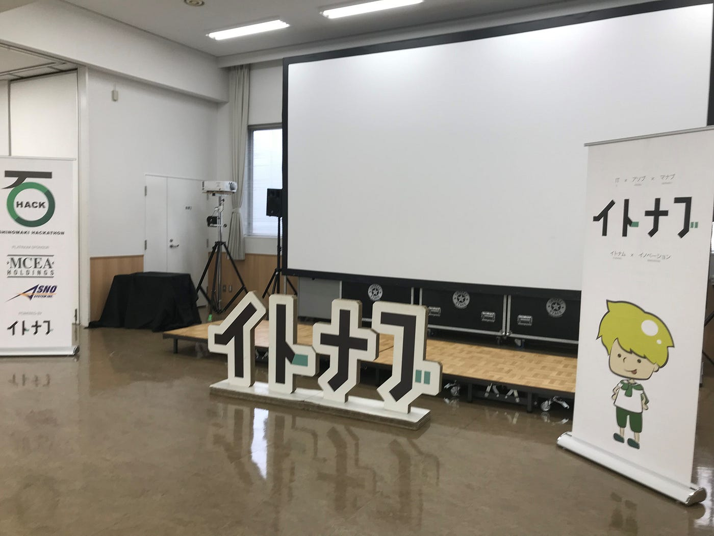
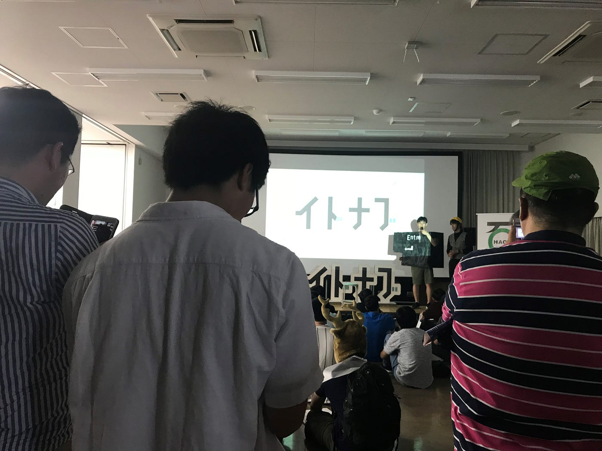
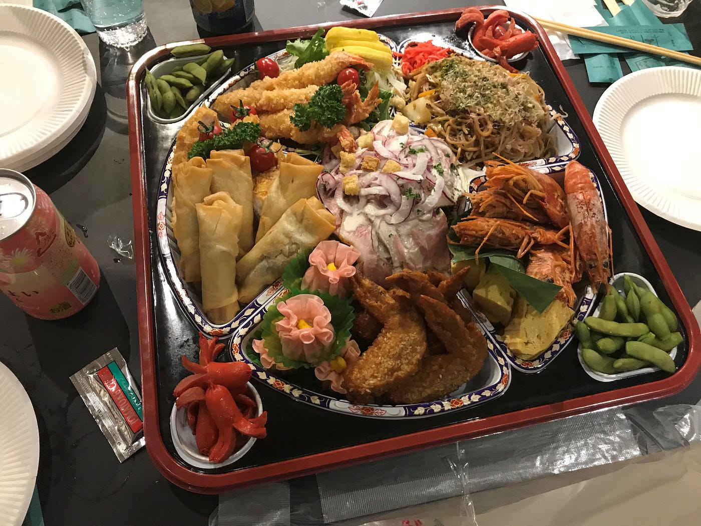
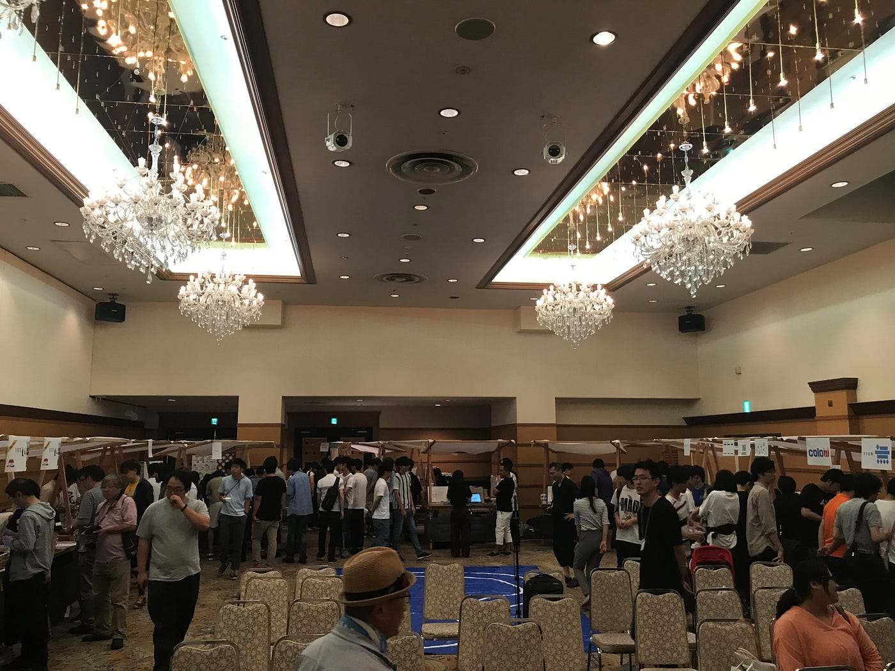

### ハッカソンに参加してきた！

8月16日から18日にかけて城県石巻市で開催されたハッカソンのイベントに参加してきました。僕は技術関係に関してはさっぱりなのでほぼ運営の手伝いに従事しました。本来はこちらでマッピングをするはずでしたが色々と不都合があり地元の香川で行いました。

一日目

夜行バスでの移動で疲れてはいたものの集合時間まで時間があったので魚市場に行く事にしたのですが1時間半も歩いたにも関わらずまさかまさかの休みで全員意気消沈しました。その後タクシーでスタッフの会場入りしあいさつや朝食休憩ミーティングを経て設営を始めました。ミーティング後に雨が降り始めましたが本降りになる前に会場に荷物を運び入れることができ助かりました。上の画像のようなものや受付などを設置しいよいよスタートです。

オープニング挨拶から始まりチーム決めからの作業スペースの構築から各チームごとの作業が始まりました。僕はしばらく休憩した後裏方の方での明日の昼食のカレーの準備の手伝いに従事していました。そんなこんなで時間が過ぎ夕食の時間となりました。

近くの店で立食パーティーを開き他の学生や社会人などとも交流を行いました。僕は疲れが濃かったので少し早く解散しホテルにチェックインしました。

二日目

今回は主に受付のスタッフとしての仕事と昼食のカレー作りの手伝いをしました。参加者の方々は各自チームごとに2つある会場にあつまって作業している様子でした。昼過ぎくらいに受付を変わってもらってレンタルサイクルしてマッピングの作業を開始しました。1時間500円で2時間ほど借りることにしたのですが一番の問題は借りれた自転車が小型のマウンテンバイク型だったことです。マウンテンバイク型なので籠がついておらずバランスも少々取りづらいかったです。籠がないのでハンドルの横などにテープで固定するしかないのですがどう固定してもガッチリ固定することができず、クリップの角度調節の球体部分のせいで高さをあげると倒れ掛かったりとかなり危険でした片手で押さえて走行する手もありましたがカメラの高さ伸ばせない上に舗装されてない道だと危険性しかなくそうこう悪戦苦闘しているうちに時間もきてしまいました。その後は個人で夕食をとって解散しました。

三日目

最終日はホテルの会場を借りて成果発表になりました。ぼくは朝から開始の昼間で設営の手伝いをしてました。荷物を運ぶ以外にも木材とボルトを使ってチームごとの簡易的な作りのですが木材とボルトをずっと触っていると手の水分を取られて手が乾き痛かったです。途中組み立て順序を間違えて作ったものも見つかり解体し一からやり直すといったこともありました。そんなこんなで設営終わった後は受付でイベント終了後の投票のためのコインをくばる仕事に従事してました。

その後時間が来て片付けとなり解体、運び出しの作業をもってハッカソンは終了となりました。

解散後は深夜バスまで焼肉を食べたり時間をつぶしました。なおこの後家に帰ってから数時間後飛行機で香川に帰省するのですがそれはまた別の話

最後にStravaのデータです。

[ハッカソン1日目 - 恭一朗 北野's 5.0 mi run
恭一朗 北. ran 5.0 mi on Aug 16, 2019.www.strava.com](https://www.strava.com/activities/2623422883)

[ハッカソン2日目 - 恭一朗 北野's 2.8 mi run
恭一朗 北. ran 2.8 mi on Aug 17, 2019.www.strava.com](https://www.strava.com/activities/2626098583)

[ハッカソン3日目 - 恭一朗 北野's 33.2 mi run
恭一朗 北. ran 33.2 mi on Aug 18, 2019.www.strava.com](https://www.strava.com/activities/2629259159)
