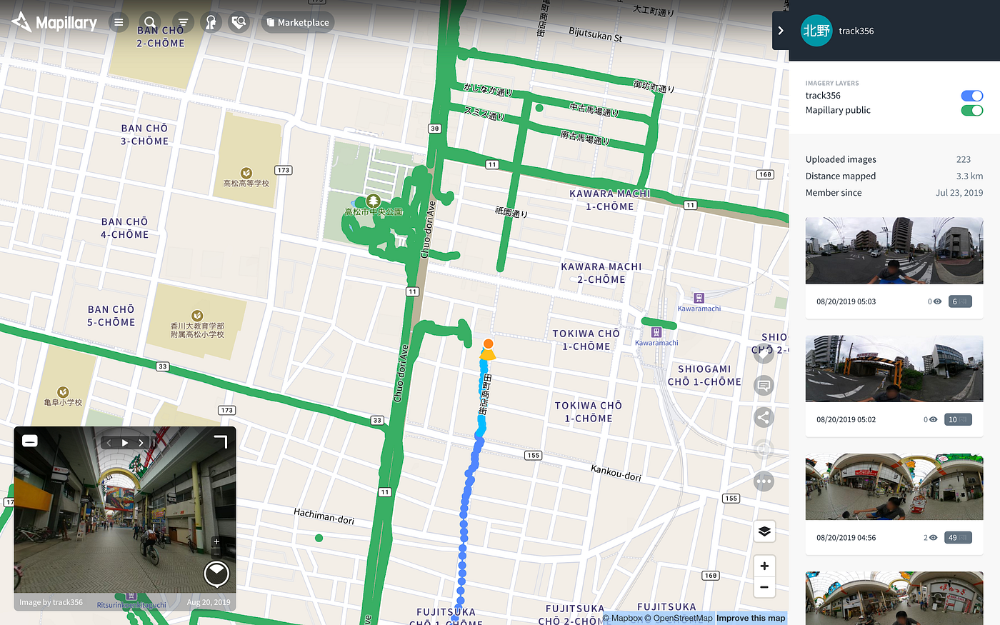

### ゼミ論進歩

以前にもお話した通り石巻市での撮影ができなかったので地元香川で撮影を行いました。友人を観光案内する予定があったのでそれと同時に進めました。

[Somewhere On Earth, image by track356
Map data at scale from street-level imagerywww.mapillary.com](https://www.mapillary.com/app/user/track356?lat=34.33871888007006&lng=134.04901504448708&z=17&tab=uploads&pKey=TOR-3USoy6XitUEP66B0Ow&feedItem=user-7v8xyhM1jhvcUsiP41Lm4Q-activity-user-7v8xyhM1jhvcUsiP41Lm4Q-publishing_done-image%3A1564332383473&focus=map)

最後の方にアクシデントでエラーで撮影ができなくなり電源ボタンを押してもオフにならないという事態になり強制電源オフにしました。このこについてはカメラが熱を持ち過ぎたのではないかとみています。カメラが黒に加えて猛暑で素手で触るのが少々躊躇われるぐらいになっており暑い時期の活動時間については考え直さなければいけません。その後のチェックでは故障は見られませんでした。

その後帰省から帰ってきてしばらくしたのですが20枚以上の画像データを上げようとするとアプリが強制的に落ちるのでかなり時間がかかりました。
