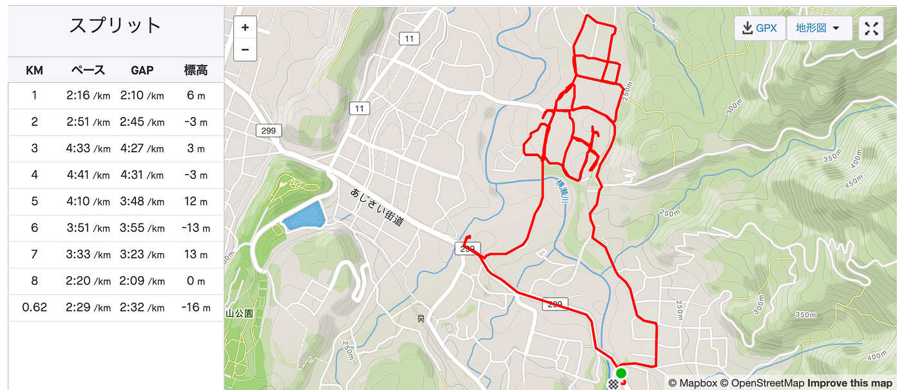

2019年夏古橋ゼミ合宿の心得

3年安田です。ゼミ合宿って何・・？となっている新しいゼミ生のために、スーパーわかりやすく夏のゼミ合宿について説明しよう。

夏のゼミ合宿とは一言でいえば（2019年度の場合）

### **埼玉の横瀬にある古橋先生の持ち家の裏の河原にテントで寝泊まりしながら、横瀬のマッピングを計画から撮影まで行う**

です。

たまにIngressとポケモンGOをしたり、ジェラートを食べに行ったり、します。

### 合宿でやるべきこと

#### 事前準備編

・FacebookとSlack（LINEも）を活用し、情報を追っておく

わからない時は、たすけてもらう。わかるやつがだれなのか把握しておく

・必要なアプリを全部ダウンロードして、ログインしておく

必要なアプリに関しては以下を参照

[furuhashilab/README
古橋研究室（古橋ゼミ）に興味のある学生は、必ず最初に読んでください。このREADMEを理解していない学生は所属を認めません。 ( 2019/08/16 13:00JST Updated) フィールドワーク重視 --ゼミ所属の学生は全員 /…github.com](https://github.com/furuhashilab/README?source=post_page-----b164cef25972----------------------)

・用具を準備しておく

最低限自分が生きていくために必要なもの、河原で寝泊まりしてもこれがあれば私は大丈夫！となるものは何なのか理解しておく必要があると思います。行ってみて、私には意外とあれが必要だったんだ、と気づかされることも多いです。河原の付近には徒歩5分くらいのところにセブンイレブンがあるので最悪買い足すことはできます。何が自分のQOLを挙げているのか知りましょう。失ってから気づくのでは遅いです。

セブンイレブンの場所はこちら

私は必要最低限だけ持っていって、あとは現地調達型なので積極的に買い出しの手伝いをして、その際に買い物をするようにしていました。

車で5分くらいのところに大型のスーパーがあります。

#### 当日編

自分の得意なことを理解して、力を活かせる場で活躍しましょう。

今年度なら、主な役割分担は以下の通りです。

・ルートを計画する

・カメラを車に設置する

・自動車または自転車を運転する運転

・Stravaで記録する

・カメラの動きをチェックする

・データをアップデートする

これを4人1チームくらいで回していきます。

#### 事後編

合宿後には私が今書いているようにレポートを書きます。原則終了後一週間以内に提出します（私は何か月も経っていますが、あきらめないことは大事です）

参加していない人もわかるように、専門用語などは解説しながら、位置情報や背景知識なども明らかにして、古橋ゼミに関して全く知識がない人でも読めるものを書くよう意識するといいと思います。

レポートのポイントは最後に以下のようにStravaでとった記録がわかるようなリンクを張ることです。これで、参加したことが証明されます。

[大庭カー 8/3 午前 - Haruka Yasuda's 8.6 km run
Haruka Y. ran 8.6 km on Aug 3, 2019.www.strava.com](https://www.strava.com/activities/2585404899)

[ヨダカー 8/2 午後① - Haruka Yasuda's 2.2 km run
Haruka Y. ran 2.2 km on Aug 2, 2019.www.strava.com](https://www.strava.com/activities/2583337357)
