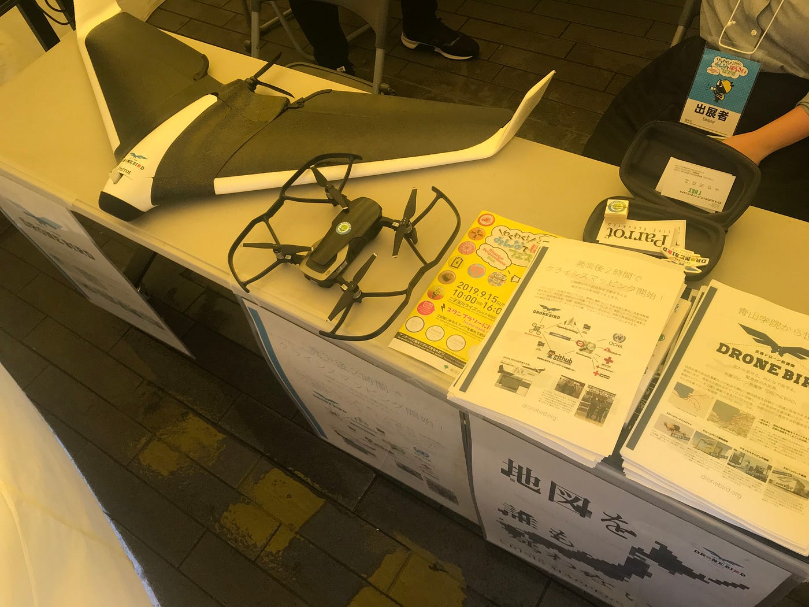

### これもそなえ！防災イベントに向けてやることは？

どうも、古橋研究室4年の末光です。

9月15~16日に二子玉川で わくわく！みんなでぼうさいフェスタ！が行われました。

私は16日のみの参加でしたが、引き継ぎも含め今後古橋ゼミ生として防災イベントに参加する上での大切なことを共有していきたいと思います。

### 2日目開催前の状況

朝から雨が降っており、強風だったためテントの幕は下ろさずに準備を進めていました。本部の方からもスタート時間を見合わせるため待機する様伝えられました。

こういう時は何もせずただ待っているだけではいけないはず。

#### **正確な時間やイベント自体に変更等ないか、自分たちはどうしたらいいのかは積極的に本部のスタッフさんに聞きに行こう！**

外部の状況を把握しておくことはイベントに限らず大事ですよね。

最終的にはスタート時間が10時から11時に変更となりました。

ブース前がホールだったので、ホール内でのイベント終わりに立ち寄ってくれる方が多かった印象です。

### ここで一番共有したいこと

それは、、、

#### **クライシスマッパーズ・ジャパンについての知識！**

今後も必要になってくるのでこの記事を読んでくれたゼミ生にはぜひ覚えていってほしいです。

防災関係の方から家族連れ・お年寄りまで話を聞きにくる層が広いです。同じ内容でも相手によって説明の仕方を変えることで理解につながります。

下記の解答を丸覚えではなく自分の知識として落とし込みましょう！

[ドローンバードよくある質問 想定問答集 · Issue #7 · dronebird/docs4dronebirds
You can't perform that action at this time. You signed in with another tab or window. You signed out in another tab or…github.com](https://github.com/dronebird/docs4dronebirds/issues/7?fbclid=IwAR1tJ5YMYfguIG_-_yC6kfcMWhY15ngeSgCNJOf7jZcr0OMUMqvWcDpSeIM)

他にあった質問では、

ドローンバード・オープンストリートマップの本拠地は？等ありました。

今回はAppleTVで動画を流すということもあり、Wifiを主催者側から借りていました。しかし2日目のメンバーはそれを知らず古橋先生の私物だと思い込み返却せず、、、。

#### 引き継ぎ大事！する側もされる側もこまめに確認しよう！

今回のイベントはドローン体験会がなかったので呼びかけに悩む部分が多かったです。

他のブースは色々コンテンツがあったので、私たちもドローンが飛ばせない時のために何か考えるのもいいのでは？と思いました。

初めて後輩とイベントに参加しました。

今のうちに2・3年生に4年の持っているノウハウを引き継ぐことも仕事だなあと感じた1日になりました。

[わくわく！みんなでぼうさいフェスタ！ - Kaori Suemitsu's 3.1 km walk
Kaori S. completed 3.1 km on Sep 16, 2019.www.strava.com](https://www.strava.com/activities/2713005005)
