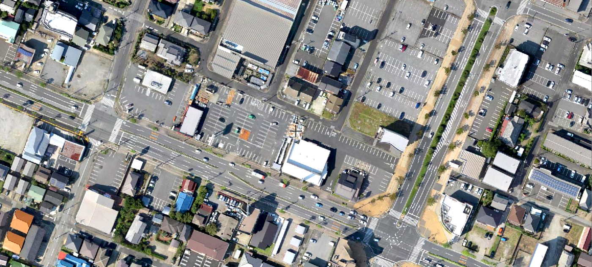
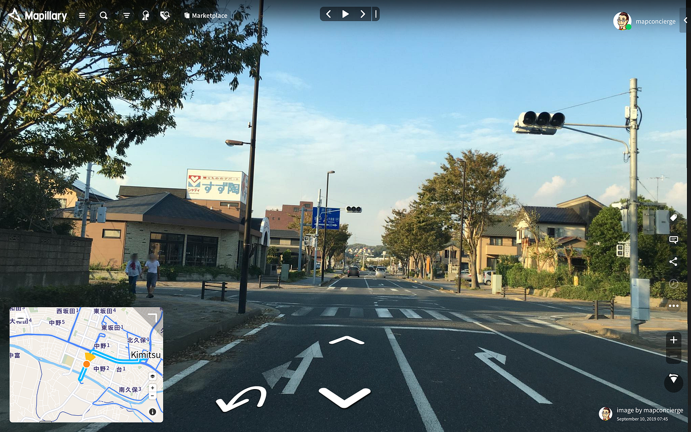
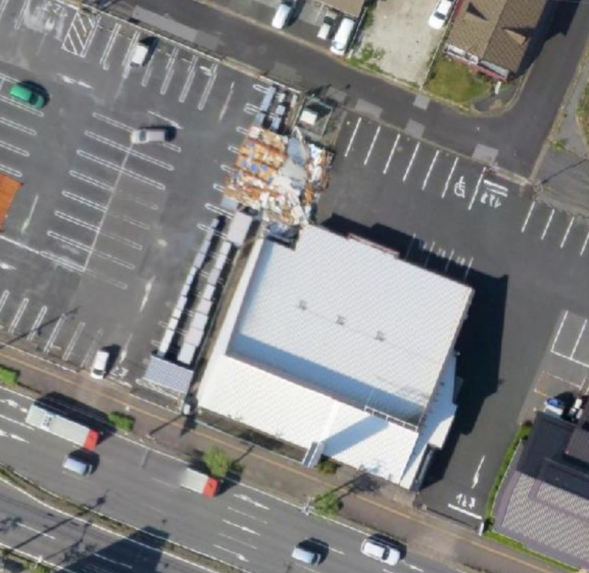
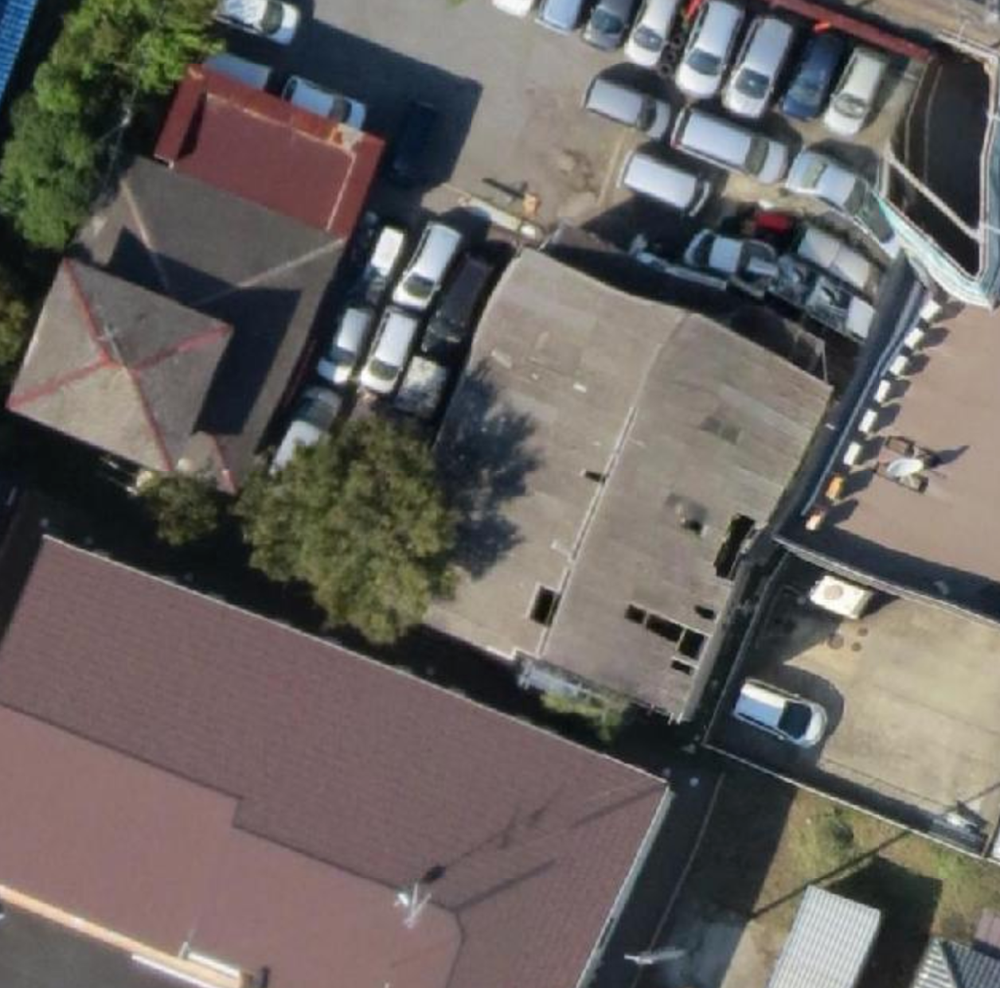
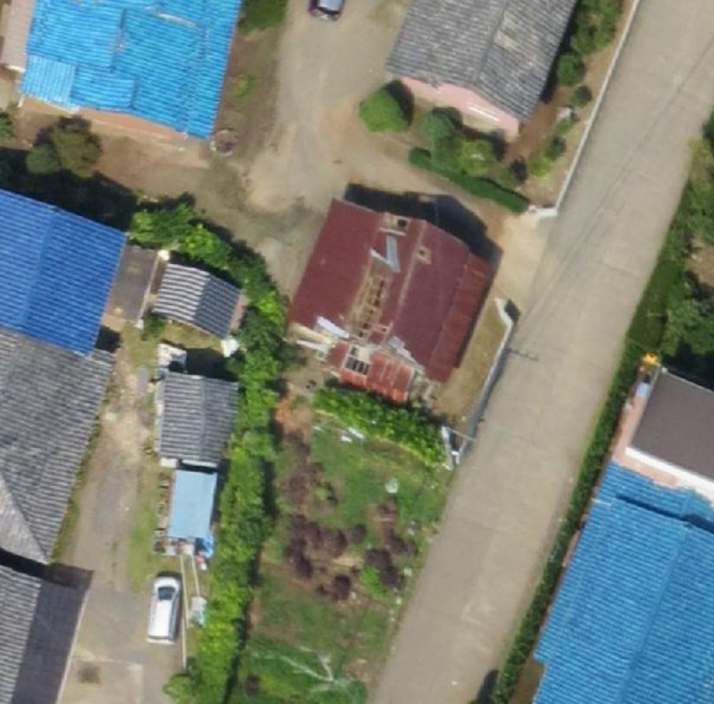
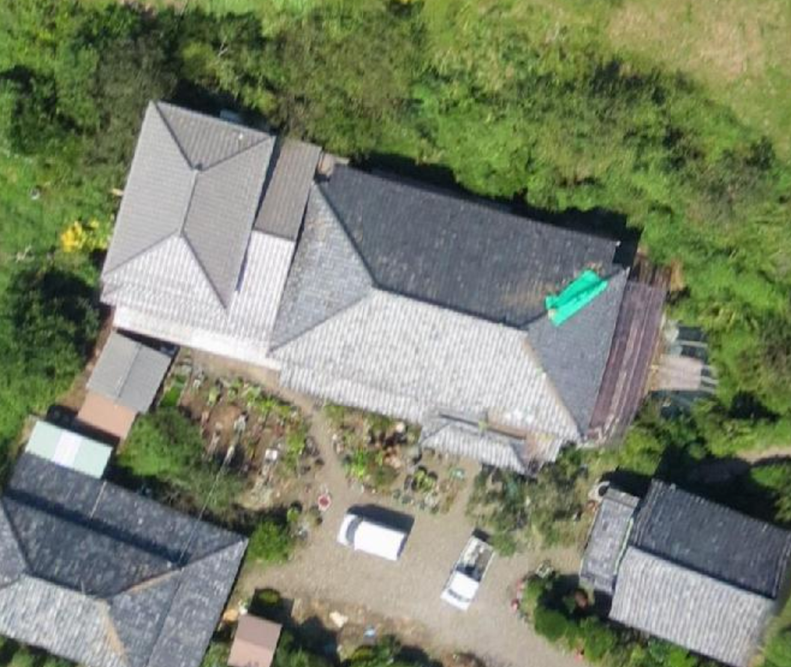

### 2019年九州北部豪雨・台風15号被災地クライシスマッピング中間報告

9月8日朝、気象予報士として尊敬している[森田さんのTweet](https://twitter.com/wm_morita/status/1170480630196363264)を見た瞬間に台風15号は被害が甚大になるだろうと覚悟を決めた。まず台風の中心気圧が960hPaからまったく変わっていない(勢力が衰えていない)こと。更に気象学の基礎知識として台風の進行方向右側である[危険半円](https://ja.wikipedia.org/wiki/%E5%8F%B0%E9%A2%A8#%E5%8F%B0%E9%A2%A8%E3%81%AE%E6%A7%8B%E9%80%A0)が伊豆諸島から房総半島を通過すること。最後に8日夜10時には、[中心気圧が955hPaと更に勢力が強まっていること](https://twitter.com/mapconcierge/status/1170685284586885120)で、ほぼ翌朝の情報収集は房総半島にターゲットを絞って被害状況の確認を行った。TwitterなどのSNSから得られた情報は、強風による屋根や建物の損壊が散見されていた。気象予報士の資格取得者でもある秘書と情報を精査し、総合的に判断して、速やかに現地に行くべきであると結論づけた。そして、固定翼ドローンを車に載せ、[災害協定締結自治体](https://github.com/crisismappersjapan/agreement4dronebird_CMJxLGOV)である千葉県君津市の危機管理課に一報を入れ、災害ドローン救援隊DRONEBIRDコアメンバーに声をかけながら、現地へと向かった。

我々が君津市中心部にたどり着いたのは9月10日11時頃であった。

アクアラインを経由し、木更津市側に入ると、辺りは停電し、交差点の信号も一部を除いて殆どが点灯していない状況である。現地での移動時には常に[ストリートビュー撮影アプリ Mapillary](https://www.mapillary.com/) で記録をとっていたが、以下のような交差点がいくつもあり、十分に注意しながらの走行でなかなか速度を出すことができない。

[Japan, image by mapconcierge
Map data at scale from street-level imagerywww.mapillary.com](https://www.mapillary.com/app/?lat=35.328815200597056&lng=139.89191830140726&z=17&pKey=zXxbMW7sDtEg8A-hYddtGg&feedItem=user-zJ_bdNImo0LAEWxLpbwbmQ-activity-user-zJ_bdNImo0LAEWxLpbwbmQ-publishing_done-image%3A1568105208582&tab=uploads&focus=photo&x=0.5059370923207921&y=0.4967385444879204&zoom=0&fbclid=IwAR2OZPahcQW9R4vWQvlK3xd0MuBuI2aEskT4lHjMfYYKJEG6RsIg4uUB5ME)

君津駅前に集合した我々は、君津市との災害協定及び航空法（昭和２７年法律第２３１号）第１３２条の３（捜索、救助等のための特例）に基づいて、君津駅南側の[君津ふれあい公園](https://what3words.com/%E3%81%AE%E3%82%84%E3%81%BE%E3%83%BB%E3%81%8A%E3%81%9B%E3%81%A1%E3%83%BB%E3%81%9D%E3%81%86%E3%81%97%E3%82%93)をベースに、固定翼ドローン eBee Classic を設定し、合計４回の空撮フライトを実施した。

今回の災害は主に屋根や家屋の損壊を中心に把握する目的から、約5cm分解能での撮影を想定して高度は地上140mと設定した。

写真撮影枚数は約1,100枚、撮影した元データや飛行ログのKMLデータなど関連する情報は[ GitHub にそれぞれレポジトリ化](https://github.com/dronebird?utf8=%E2%9C%93&q=oam_chiba20190910kimitsu&type=&language=)した。同時に、撮影当日の夕方には君津市役所に訪れ、撮影データをKML化し、オフライン環境でもGoogle Earthで閲覧可能なデータセットとしてSDカードごとデータを危機管理課に手渡した。災害対応で忙しい中、君津市長も数分だけ顔を出されて撮影データの一部を見てもらった。

翌日には1,100枚の写真をオルソモザイク化した画像を [OpenAerialMap に展開し](https://map.openaerialmap.org/#/139.89432334899902,35.33088188025679,13/square/133002130113321?_k=tn0prn)、誰もが閲覧可能な状態にするとともに、XYZタイルセットとして、様々な地理情報システム（GIS）で読み込み可能なオープンデータとして公開した。

**XYZタイルURL**: **[https://tiles.openaerialmap.org/5d795ad16b723c0005e7f0ef/0/5d795ad16b723c0005e7f0f0/{z}/{x}/{y}**](https://tiles.openaerialmap.org/5d795ad16b723c0005e7f0ef/0/5d795ad16b723c0005e7f0f0/{z}/{x}/{y})

宮崎県のひなたGISに展開した場合は、[このようなPermalink](https://hgis.pref.miyazaki.lg.jp/hinata/hinata.html#xxl0PhBXBUgk)でワンクリックで閲覧でき、屋根の損壊状況や、アンテナの状況、建物の倒壊など、一見被害がなさそうに見える君津市中心部においても、瓦屋根を中心に被害の度合いが判読できる。

[ひなたGIS
Edit descriptionhgis.pref.miyazaki.lg.jp](https://hgis.pref.miyazaki.lg.jp/hinata/hinata.html#xxl0PhBXBUgk)

同じデータは、現在 [防災科研xSiP4D の令和元(2019)年 梅雨期・台風期 クライシスレスポンスサイト](http://arcg.is/LeL8u)でも閲覧できる。

[クライシスレスポンスサイト
This story map requires JavaScript, but running JavaScript is not currently allowed by your web browser. If you wish to…arcg.is](http://arcg.is/zbzKi)

このような形で、ドローンを用いて迅速に空撮を行うことができたのは、2019年4月に事前に災害協定を締結していたことが大きい。

君津市の罹災証明発行は、発災後10日以上経過した9/21より順次始まっている。現地での確認や発災直後の写真などと組み合わせて、このような空撮画像もまた、被害状況を客観的に判断する情報として扱われていくだろう。

台風15号の襲来前には九州北部豪雨もあり、佐賀県においても我々はドローン空撮を実施している（追記予定）。できるかぎり迅速にすばやく被害状況を把握するためにも、我々が目指すべき空撮手法とその結果のより迅速な共有、そして今回のように停電及び通信回線の断絶によるインフラ復旧段階での情報提供の手法など課題はまだまだ多い。

そしてなにより、事前の災害協定を締結していなかったエリアでの積極的な活動が行いにくい現状は、地道にドローン災害協定の輪を広げていくしか無い。

今回の経験を踏まえて、地域の防災力と災害対応力を高めるためにも、まだまだやるべきことが沢山存在する。愚直にそれをすすめるしか道はない。

最後に 9/10 の移動ログを共有する。

[Follow Taichi on Strava to see this activity. Join for free.
Join Taichi and get inspired for your next workoutwww.strava.com](https://www.strava.com/activities/2695892888)
