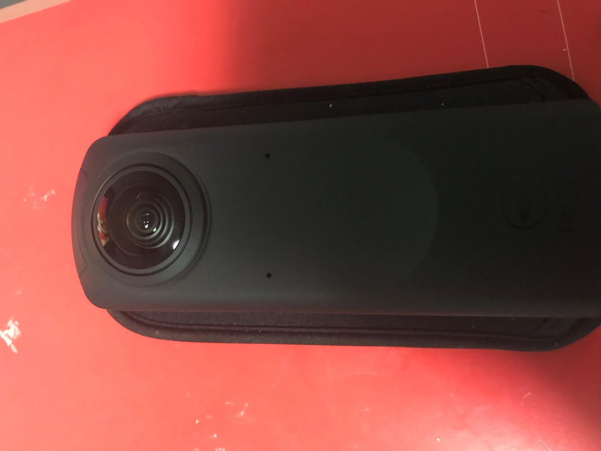
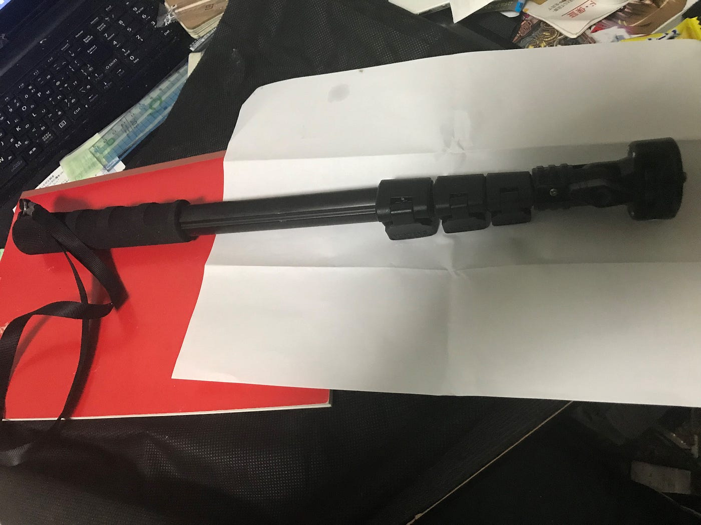
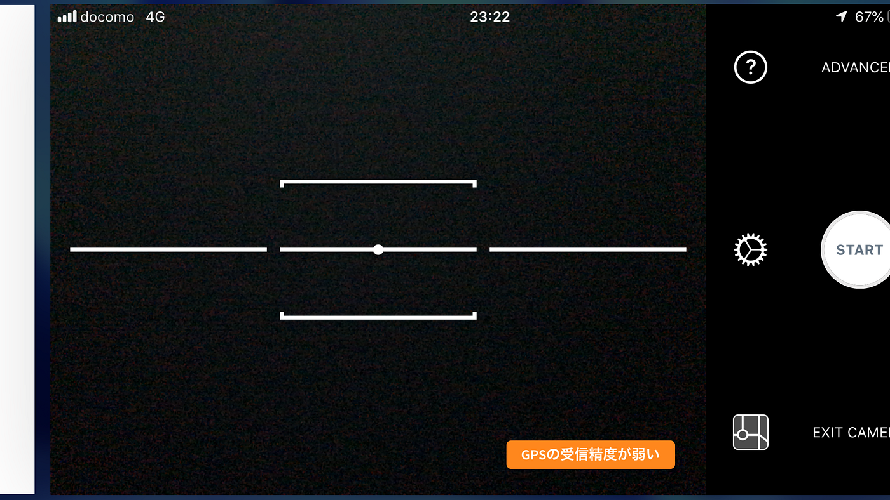
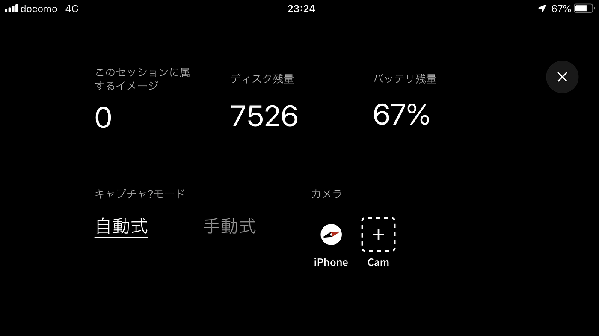
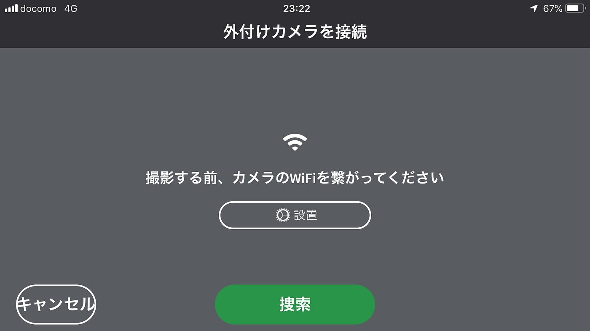

### THETAカメラ撮影

THETAと自転車を使っての野外撮影についての説明をしていこうと思います。

用意するものについてはTHETAのカメラ、自転車、カメラを自転車に固定する道具、スマートフォンでスマートフォンにはTHETAのアプリとMapillaryのアプリをあらかじめ入れておいてください。

次にカメラとスマートフォンのつなぎ方ですがWi-Fiで接続します。カメラのWi-Fiボタンを押してアプリのチュートリアルに従います。

固定する道具としては今回下の画像のようなものを使っています。

THETAのカメラの底と画像の棒の右端の部分をねじの様に回して固定します。自転車への固定は不格好極まりないのですがガムテープを使ってください。

その後Mapillaryのアプリを開き撮影モードに切り替え右上のADVANCEの部分をタッチします。

そうすると次の画面になるのでカメラのＣamの部分にタッチして次の画面の捜索にタッチして完了です

これで撮影可能になるので各自設定で撮影間隔や撮影ベースなどを調整して周りに気を付けながら撮影してください。
