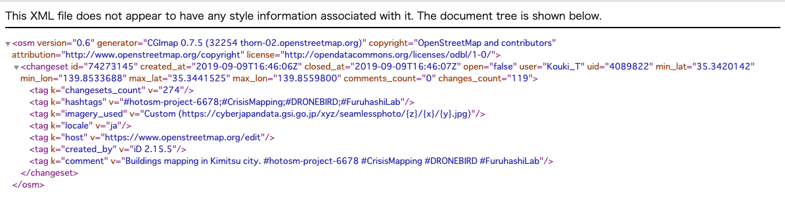
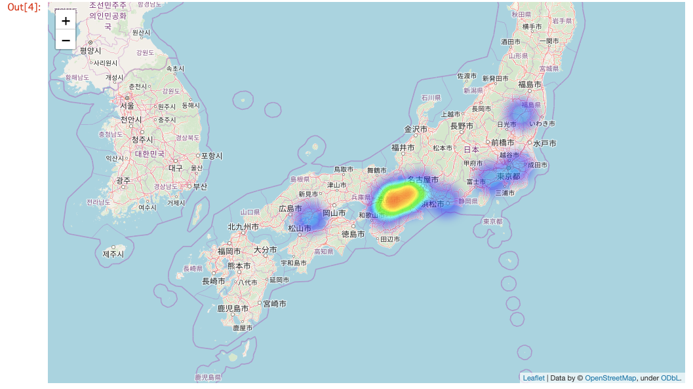

### OSM Updata Checker中間進捗報告

_だいぶ様になってきました。OSMUCをご紹介。_

### はじめに

皆様ご無沙汰しております、古橋研究室2期生の武末です。夏休みも終わり、後期の授業も始まる時期となりました。私は卒業単位を取得済みなので今季に授業はありませんが、就職先で使うJavaの勉強やゼミ論などやることは尽きません。

さて、ゼミ論であるOSM UCについて来る9月30日の中間発表に向けて一度現状の整理と報告をしようと思い、このブログを書かせて頂いています。

結論から言うと、サーチエンジンとヒートマップ表示機能自体は完成したので後はdbの更新作業とそれを公開するサーバー側の準備になります。

今回は現在完成している稼働部分の説明をしていこうと思います。

### 稼働部分について

[kouki-T/osmchnage
You can't perform that action at this time. You signed in with another tab or window. You signed out in another tab or…github.com](https://github.com/kouki-T/osmchnage/blob/master/osmchange.py)

詳しいコードの説明についてはGithubを確認してもらうとして（MediumはGistとかのソースコード埋込みが出来ないので..）

どういう流れでヒートマップ表示までいくのかを説明してこうと思う。

まず、OSMにはchangesetAPIが存在しており、https://www.openstreetmap.org/changeset/<変更セット番号> そちらを叩いてXML形式でchangesetの中身を取得する。

[https://www.openstreetmap.org/api/0.6/changeset/74273145](https://www.openstreetmap.org/api/0.6/changeset/74273145)

changesetの中身はこのようになっており、この中から緯度（lat）と経度（lon）の値を取得する。

現在changesetデータは全部で7506万件以上存在し、1件取得に約5秒掛かるなど全世界を範囲にするのが難しいと判断し、現状は日本のみをサービス範囲としている。

取得した緯度経度が日本かどうかを判別するために農研機構のAPIで逆ジオコーティングを行い、Status値を確認している。

[簡易逆ジオコーディングサービス
ひとことお願いします 簡易的な逆ジオコーディング(リバースジオコーディング)サービスです。 全国各地の陸地(無人島等の一部は除く)の緯度経度座標(世界測地系)を指定すると、その地点の属する都道府県、市区町村名を検索することができます。…www.finds.jp](https://www.finds.jp/rgeocode/index.html.ja)

無事Status値に200が帰ってきた場合、日本のデータとしてSQLのdbに保存する。

流れとしては至って簡単。dbさえ作ってしまえば後はfoliumにこのデータを渡すだけ。HeatMapプラグインはdata、name（省略可能）の順番なので緯度経度のデータをそのまま渡せる。

以上が稼働部分の説明だ。本当に簡単なスクリプトでやりたいことが出来そうなので非常に楽。ただ、一つだけ課題が発生した。

### 現状の課題

現状の課題点として、Herokuや無料貸し出しサーバーなどではsqliteが動かないというところが非常に問題である。

MySQLやPostgreSQLが一般的、というかサーバーとの接続タイプを採用するのが普通。なのでここを書き換える必要がある..。

正直ここに来て使ったことない言語にぶつかるのはキツいがなんとか実装まで持っていければ..と思う。

逆に言えばfoliumはmap表示機能があるのでdb周りだけ整備できればあとはHerokuなりcgiなりで動かせるので、もう少しかなという感想である。

また、現状だとデータ部分にタイムスタンプが付いてないのでソートや範囲指定が出来ないのも問題。これを追加しようか現在思案中である。

以上、中間報告となる。

当初の目標通り10月中にはWebデプロイ出来る予想ではある。色々上手くいかない点も多いが一つ一つ自分の成長に繋がっていると確信できているので、この調子で頑張っていく所存だ。
