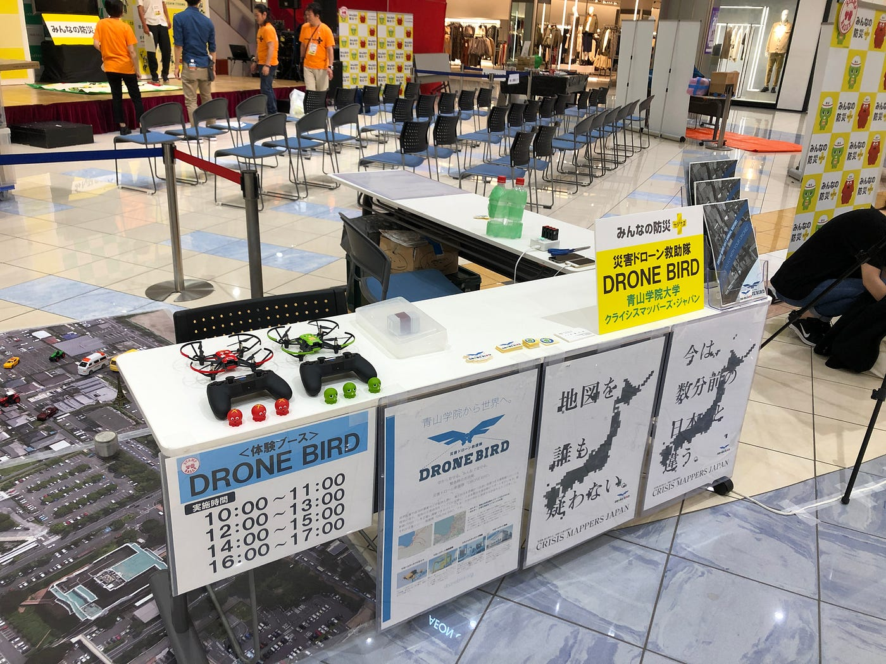
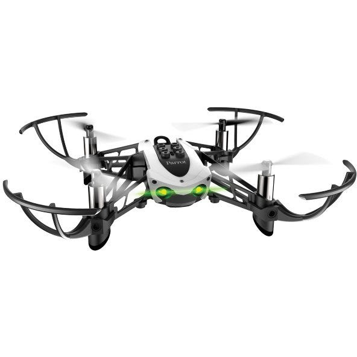
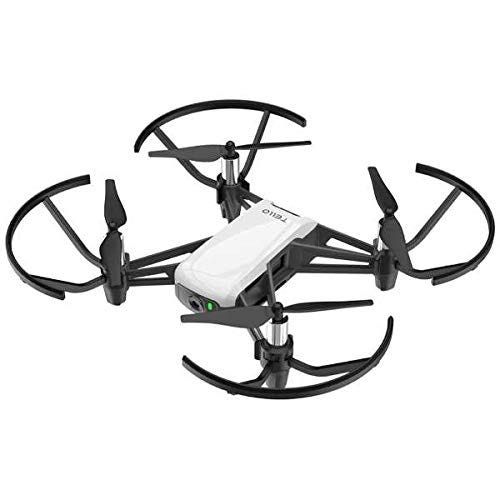
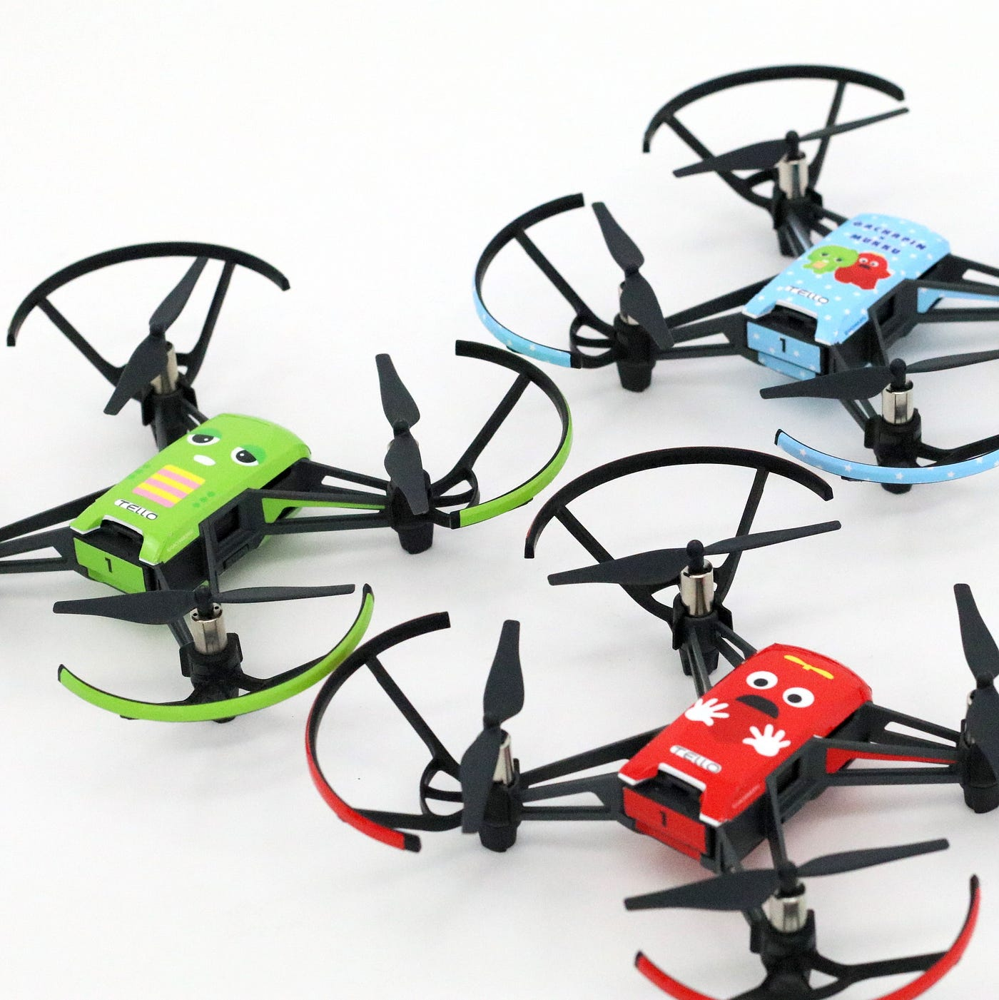

### みんなの防災＠イオンモール高崎

こんにちは。古橋ゼミ四年の牧です。

9月14日にイオンモール高崎店にて開催されたみんなの防災にて、ドローンの飛行体験会を運営しましたので、その報告をまとめます。

**今回まとめること**
① 使用したドローンについて

② 子どもとの接し方

> ① 使用したドローンについて

これまで使用していた機体はMAMBOという機体でしたが、今後TELLOを使っていくのでそれらの違いをまとめます。

これが、これまで使用していたMANBOという機体です。

TELLOとの違いは大きく２つあります。一つ目は、操作性がいいことです。あくまでTELLOとの比較でですが、操作性が良いため、子供たちも使用しやすいです。

二つ目は、付属品の充実性です。機体の上部のレゴのように出っ張っている所に付属品をつけることで、使用の幅を広げられます。例えば、アームをつけて、何かを掴んだまま飛行できます。他にもBB弾を発射する付属品をつけることもできます。

ただ、今後MANBOは製造されないとのことなので、使用機体がTELLOに変更されました。

これが今後使用するTELLOという機体になります。

こちらの違いは大きく３つあります。

一つ目は、カメラがついているということです。飛行している時のドローンの目線がわかるので、子供たちの興味関心を引けますよ（笑）

二つ目は、操作性が悪いことです。操作はコントローラーで行いますが、個人的な体感ベースでいうと、操作に対する機体の反応が0.5秒遅れます。そのため、MANBOを使用していた時に比べ、墜落する回数が増えました。墜落すると子ども達や親御さんは、申し訳なさそうにするので、なるべく墜落させない様に指導すると良いです。実際に僕はが実践したことは、ドローンを離陸させる前に、コントローラのスティックをデモンストレーションとして操作させ、その感覚を覚えておくように教えました。これするかしないかで全然変わります！

三つ目は、デコレーションシールです。昨年、[TELLOをデコレーションするガチャピンとムック柄のデコレーションシール](https://shop.dronewraps.blue/items/18679258)が作られ、体験会で使用する機体にもすでに貼られています。

> ②子どもとの接し方

子どもは本当に素直です。成功したらとても喜びますが、逆に失敗したらとても残念そうにします。

どうすれば良いのか？答えは、、

### とにかく褒め、うまく比較するです。

これ本当に大事です。

例えば、ドローンを暴走させた子がいたら、

#### そんなにドローンを素早く飛ばせてすごいねって言うんです（笑）

そして、

#### 僕より、早く飛ばせてすごいね！！と言って、うまく自分と比較し、子どもの自尊心を高める。

その後に、でも、こうするともっとうまく飛ばすことができるよって説明すると、ちゃんと言う通りに飛ばしてくれるんです。それでも、暴走してしまうなら、手を添えて一緒に操作してあげると良いでしょう。

褒め上手になる。これ社会に出る前に身につけておくこと大事です。ぜひ、この機会を利用して、自分成長にも繋げてください！

[Follow Toshiaki on Strava to see this activity. Join for free.
Join Toshiaki and get inspired for your next workoutwww.strava.com](https://www.strava.com/activities/2268105681)
