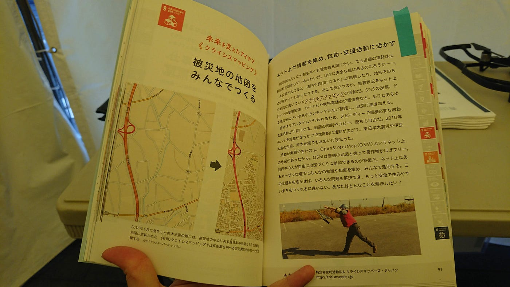
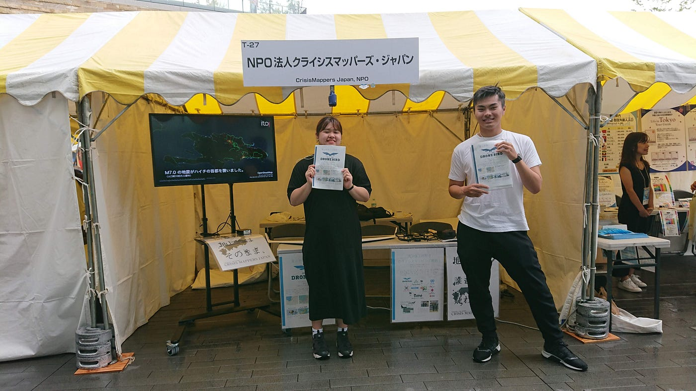
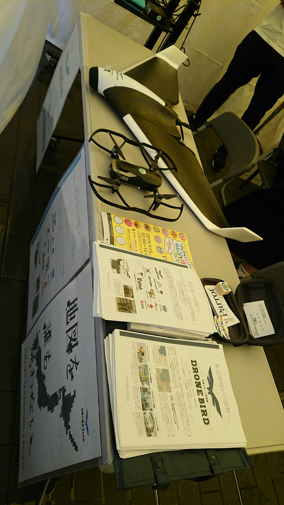

### わくわく！みんなでぼうさいフェスタ！スタッフの動き方

３年の安田遥です。

日時9月15日（日曜日）から16日（月曜日・祝日）のわくわく！みんなで防災フェスタ！が開催され、私は２日目のみ参加してきました。
時間は午前10時00分から午後4時00分でしたが、当日は９時に集合し、ブースの準備などを行いました。

当日は雨と強風で、結果的に開始が１時間半ほど遅れましたが無事開催されました。準備自体は１５分ほどで終わりました。準備の内容に関しては後述します。

### 場所

二子玉川ライズ（東京都世田谷区玉川2–21–1）
世田谷区立二子玉川公園（東京都世田谷区玉川1–16–1）内の一部

### 主な内容

都や関係機関等の防災対策の紹介、災害対策用車両展示、子ども向けワークショップ、ステージイベント、防災に関する啓発映画の上映 ほか

[「わくわく！みんなでぼうさいフェスタ！」を開催します！
いつ起こるかわからない首都直下地震をはじめとする大規模災害に備えるためには、防災に関する正しい知識を身につけ、行動に移すことが大切です。…www.bousai.metro.tokyo.lg.jp](https://www.bousai.metro.tokyo.lg.jp/taisaku/topics/1000019/1006282/1006584.html)

公式の情報は上記のリンクから確認できます。

### 防災訓練前日まですること

これはほかのゼミ生も言っていますが、**防災訓練の詳細な資料**と、Github上の「**[古橋研究室イベント運営マニュアル**](https://github.com/furuhashilab/README/issues/16#issue-493828246) 」と「**[ドローンバードよくある質問 想定問答集**](https://github.com/dronebird/docs4dronebirds/issues/7#issue-369751146)」はしっかりと読み込んでおきましょう。

また、これまでの防災訓練でどのようなことが行われてきたのか、参加する訓練でどのように動けばよいのか、先生の過去の記事を読むと当日の流れが掴みやすかったです。

ドローンバードに関する説明と、古橋ゼミで行っていることの説明はできるようになっておくと安心です。

### 準備の仕方：ブースの設営

当日は、ポスターとドローンを用意します。

今回はディスプレイを借りていたので、YouTubeをつなぎ、ドローンバード関連の動画を流しました。

イベント開始後は、チラシを配りながらドローンバードの説明をします。

その際にはこたえられるように事前準備が必要です。

### 改善点

・ドローンバードスライドなどがあるとよい

ドローンの説明などを行う際に動画を流すのもよいがスライドなどがあっても説明しやすいと思った。

以下ストラバの記録です。

[ワクワク防災フェスタ - Haruka Yasuda's 4.6 km run
Haruka Y. ran 4.6 km on Sep 16, 2019.www.strava.com](https://www.strava.com/activities/2713018023)
