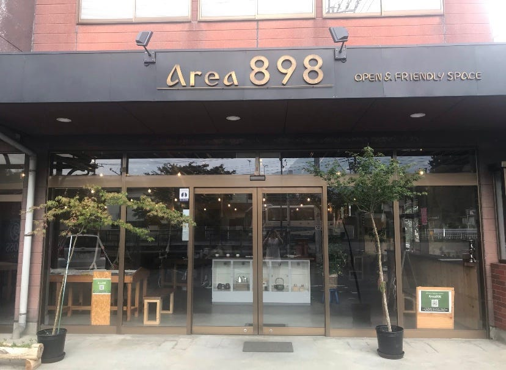

### 横瀬夏合宿〜撮影に車と空き容量は必須！〜

(途中までの参加のため2日目までの内容になります)

8月1日〜4日で、秩父横瀬で実施された夏合宿のブログを投稿したいと思います。

わたしは高校3年生になる弟の最後のインターハイに家族で応援に行くべく、8月3日から沖縄入りだったため2日までの参加となりました。(私用すぎて申し訳なかったです…)

1日目は朝から3年生依田の車に乗せてもらい、横瀬へ出発。

わたしは昨年の夏合宿に参加できなかったので、横瀬のイベントに参加するのは初でした。

以前秩父、正丸峠のあたりには観光で行ったことがあったので、見たことのある街並みがちらほらありました。

途中山道でzoom通話をはじめたので、若干車酔いしながら（笑）、集合場所のエリア898へ。

到着してお昼を食べつつ、一緒に車で来ていた3年生3人のゼミ論構想発表タイムに。

留学や授業もあり、今日初めてゼミに参加します！という子もいたので、自己紹介も兼ねて自分の興味のある分野を中心にゼミ論の構想を練っていました。4年としてアドバイスを求められましたが、正直わたしも3年生の話になるほどなと思うことばかりで先輩らしいことはなに１つ言ってあげられませんでした…（笑）

そのあとは、これから2日目、3日目に本格的に行う横瀬での撮影についての計画を4年中心に立てていきました。

今回の夏合宿のミッションは、横瀬の公道を360度カメラで撮影、マッピラリーにアップしていくこと。

わたしは依田カーでQooCamを使った撮影を行いました。

### 撮影マニュアル

#### **手順1**

#### QooCamのアプリをインストール

QooCamはスマートフォンで操作できるようアプリが配信されています。そちらをまずインストール。撮影前に車内のデバイスと接続が可能か確認しておきましょう。

#### 手順2

#### Stravaで位置情報記録を開始

QooCamのみでは位置情報を記録することが出来ないので、Stravaで位置情報を記録し後ほど動画に加えます。

なので、

#### **撮影する際はStrava→QooCamの順に、**

#### 逆に**撮影を終える際はQooCam →Stravaの順に**

念のため操作しておくと良いです。

こうしておけば動画、位置情報共に抜けが防げます。

### 手順3

#### 1つの動画が4ギガ以下になるように撮影する

後から処理を行う際に動画が大きすぎるとアップロードできない可能性があるので、あらかじめ小さめの動画にしておくことをお勧めします。

後から動画を切って位置情報も合わせて…となると手間がかかるので細切れの動画にしておくと後の処理が格段に楽になります。

撮影の手順はここまでです。

この後はアプリ内に本体から動画を保存、そこから更にスマートフォン等のデバイスに動画をダウンロードし、それをパソコンに転送して、位置情報を合わせて、アップロードすれば完了となります。

この後はアプリ内に本体から動画を保存、そこから更にスマートフォン等のデバイスに動画をダウンロードし、それをパソコンに転送して、位置情報を合わせて、アップロードすれば完了となります。

わたしは2日目の撮影までの参加となってしまったのでここまでの作業となりました。

### 注意点

スマートフォンに動画をダウンロードする際には、デバイスに空き容量がないとダウンロード出来ない&Wi-Fi環境下でないと通信制限にかかってしまうかもなのでご注意を！

わたしは空き容量がほとんどなかったため、何度もダウンロードに失敗しました…

空き容量がないと時間も手間もかかるため、あらかじめ空き容量のあるメンバーを探しておくことを強くお勧めします…！

またこれは撮影のそもそも根幹の部分ですが、

撮影には絶対に車があった方がいいです！

特に夏の撮影の時は炎天下を歩いて作業するのかはかなり辛いと思うので車を使うことを強くお勧めします！

今の3年生、そしてこれから古橋ゼミに入ろうと思っている子達は、是非免許取得をしておくことをお勧めします…笑

久々のキャンプだったのと、3年生とも交流ができたので、短時間での参加となりましたが楽しい合宿でした！

[横瀬1日目 - ほり ひなこ's 11.5 mi walk
ほり ひ. completed 11.5 mi on Aug 1, 2019.www.strava.com](https://www.strava.com/activities/2581251527)

[古橋研究室夏合宿2日目午前 - Kaori Suemitsu's 29.9 km walk
Kaori S. completed 29.9 km on Aug 1, 2019.www.strava.com](https://www.strava.com/activities/2582955817)
