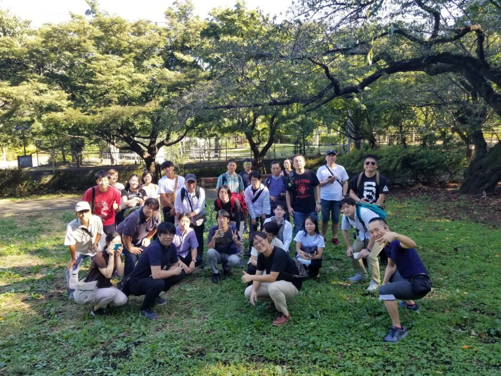
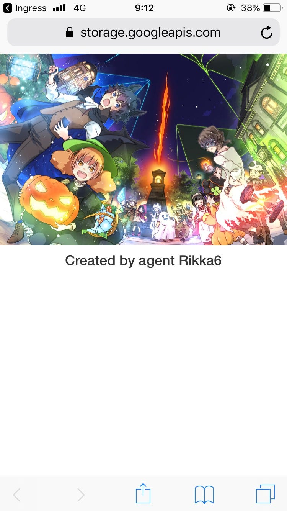
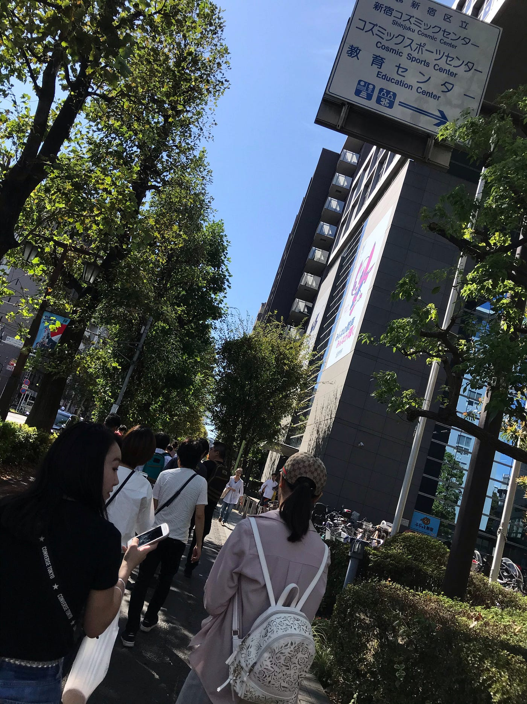
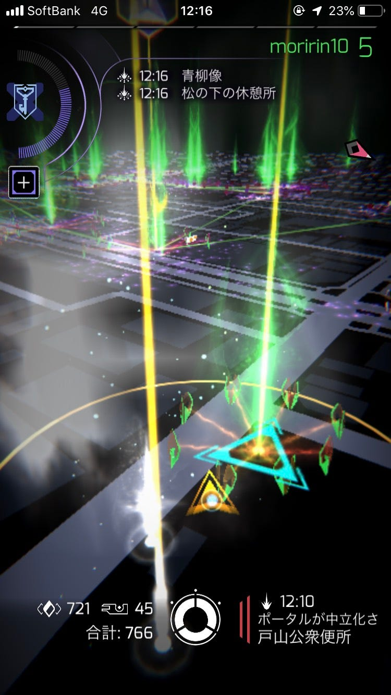
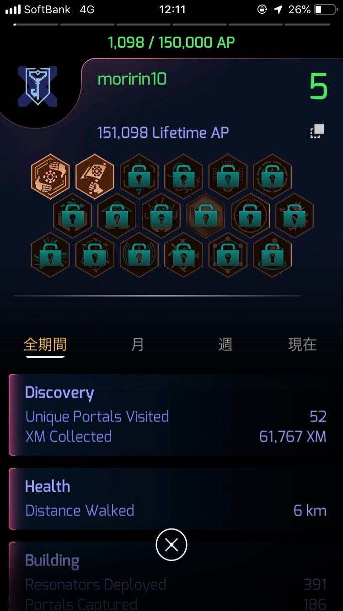

### ingress FS 参加報告

こんばんは、古橋研究室３年の森玲子です。

本日、新宿で行われた ingress First Saturday というイベントに参加してきました。

集合場所は戸山公園で、まずは参加者全員で写真撮影を行いました。

参加者の方々は皆非常に親切であり、序盤から私たち学生を引っ張ってくださいました。

メインの都民ふれあいコーナーでハック＆デプロイを行うと、以下のような参加証をもらいました。

その後、新大久保付近の街中を歩きました。街中では、白いポータルから青、緑のポータルを多く発見できましたが、すぐ周りの人に取られてしまいかなりの争奪戦でした・・・

一般市民の方々も通る街中で、携帯を見ながら・位置情報ゲームをしながら歩く姿はちょっと・・・印象的でした。

それからは公園に戻りつつ、神社まで行きました。そこでは同じ陣営の方が、APの稼ぎ方としてグリフという機能を教えてくださり、進展に繋がりました！

イベントも終盤に差し掛かり、進捗チェックの体制に入りました。ですが、ゼミ生の中でも私が最も遅れていました・・・みんなレベル6まで到達したが私はまだレベル3の終わりでした・・・

一人で切羽詰まってしまい終わるのだろうかと悩んでいましたが、参加者の方々は皆、勢ぞろいで私にお力を貸してくださいました。学生のみなさんもあらゆる手を使って手伝ってくれました😢

上の図のように、メインの場所である「都民ふれあいコーナー」で白いポータルを何本も作ってくださる方、レゾネーターを何百本もくださる方、「あと少し、頑張れ！！！」という励ましのお言葉・・・

おかげで、なんとか時間内に終わらせることが出来ました。

今回のイベントで、ingressの技術向上のメソッドを習得できたことはもちろんのこと、周囲の人々の温かみや協調性を改めて感じ取ることが出来ました。

これからの学生生活、ゼミ、進路、部活動に活かしていきたいと思います。

途中からの記録なのですが、Stravaです。

[https://strava.app.link/C5spGEukx0](https://strava.app.link/C5spGEukx0)
