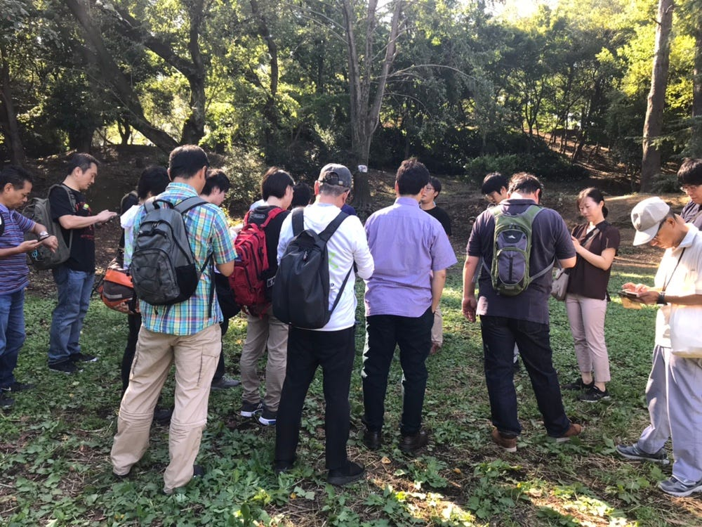
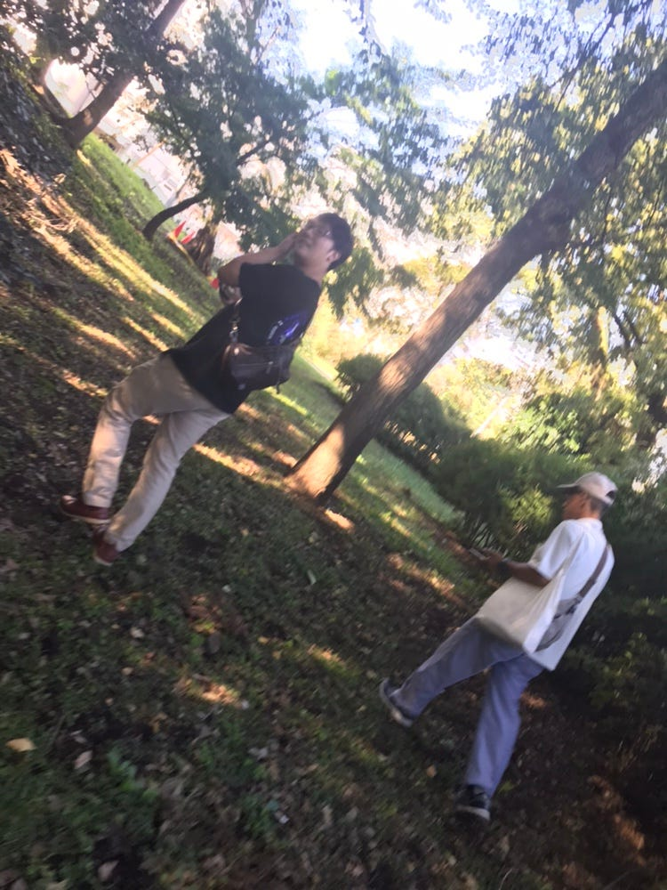
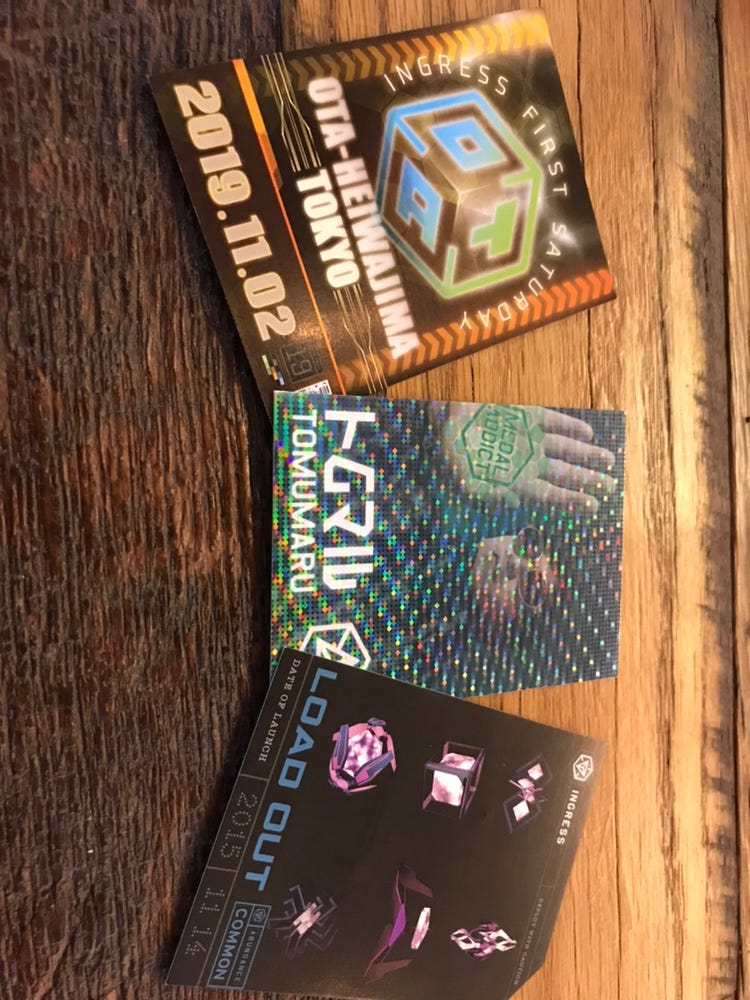
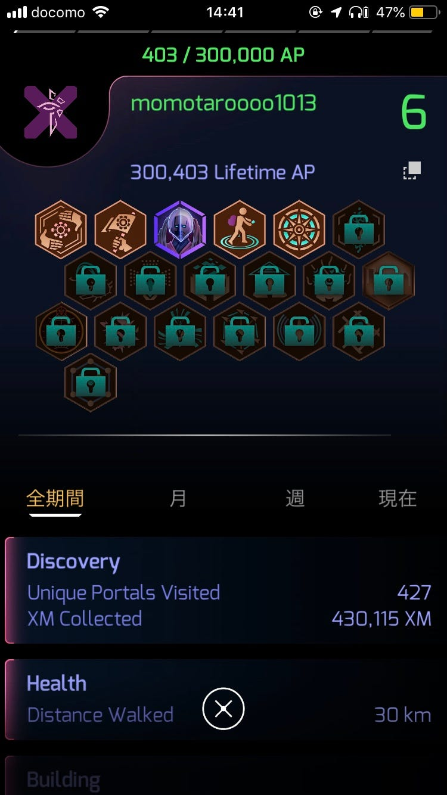

ingressFSイベント参加報告

ingressの新宿イベント（FS）に参加してきました！

ingress初心者ということを伝えると、大勢の方が助けてくださいました。

私たちが初心者ということもあり、レベルの高い方々が一緒について回ってくださり、私たちのレゾネーターがなくなると、課金してレゾネーターをカプセルに入れて落としてくれました。ただカプセルは早い者勝ちだったので、私は一回しか取れませんでした、、

レベルの高い方が壊してくださったところをdeployし、自分のレゾネーターを立て、レベル上げに励みました！！

今回のイベント時間の9:00〜11:00まで、APが2倍になるとのことで、一生懸命、ハックしてレゾネーターを集めて、立てて、レベルの低いポータルがあればアタックして、、というのを2時間行いました。しかし、APが2倍になるのは1週間後に反映されるそうなので、自分がどれぐらい稼ぐことができたのか、イベントを行う前に、スクショを撮っておくと分かりやすかったなと思います。

集団で行動してたのですが、少し離れたところで、強い方たちがアタックする余波で壊れるポータルがあるので、そこを狙うのが一番効率の良いやり方だと思いました。また、違う色同士で、1人がレゾネーターたてて、もう1人が壊して、また、空いたところにレゾネーターを立てて、また、壊して、、と2人でタッグを組んでやるのも１つの手だと思いました！

次の参加イベントのカードや、アイテムゲットできるカードも頂きました！

初心者にも優しく丁寧に色々やり方を教えてくださり、ingressを楽しくレベル上げすることができました！

最後に、、、

イベント会場にもよると思いますが、私はすごく虫にさされたので、蚊除けスプレーなど持っていくと、もっと楽しくできたと思います！

途中からしか計測できてないのですが、ストラバです。

[https://strava.app.link/2Mgx1zCRw0](https://strava.app.link/2Mgx1zCRw0)
