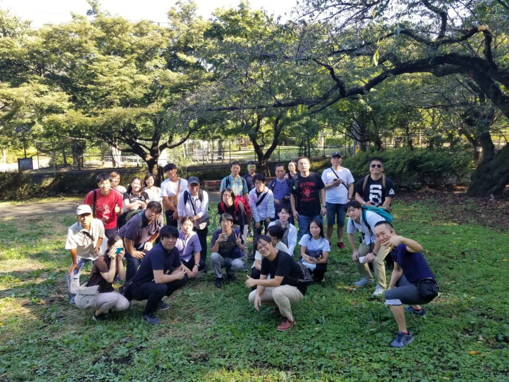
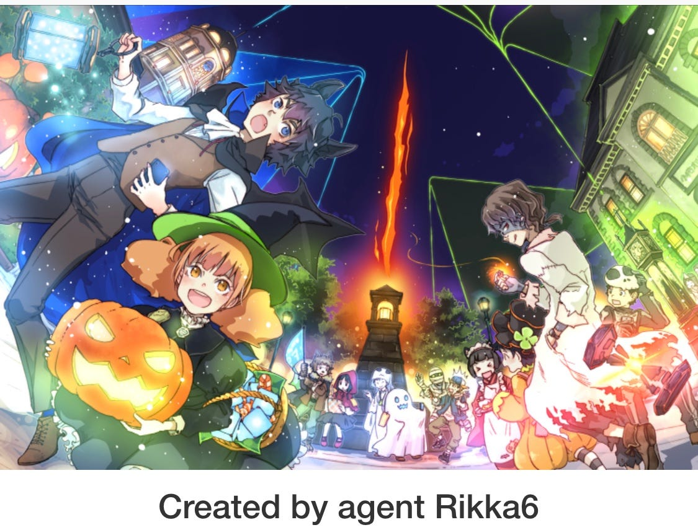
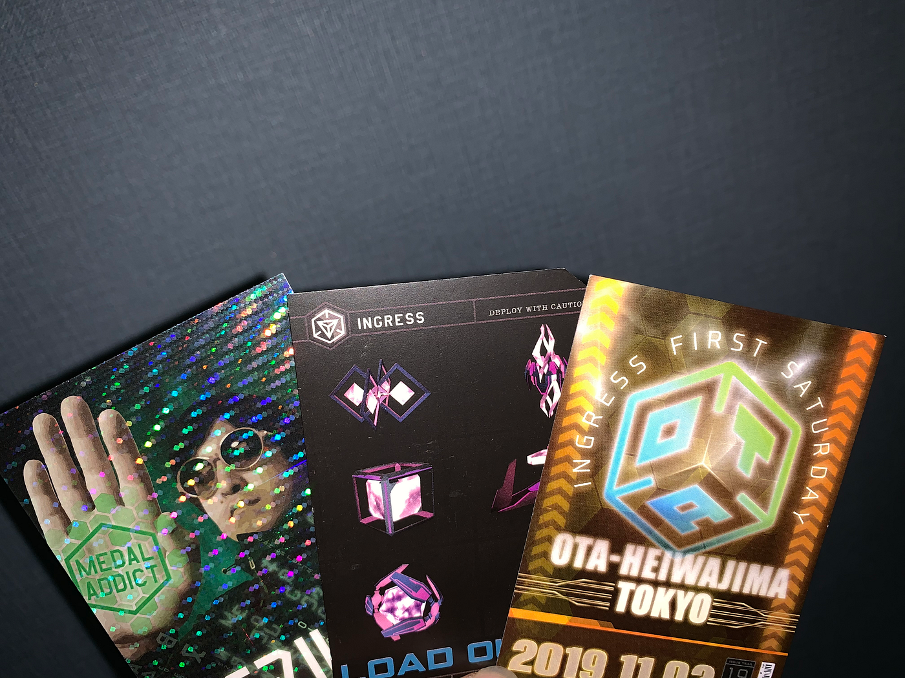
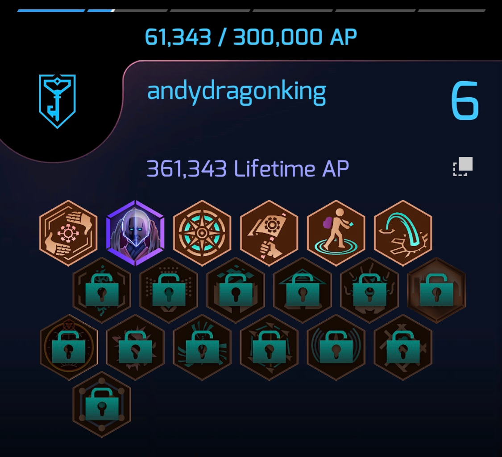
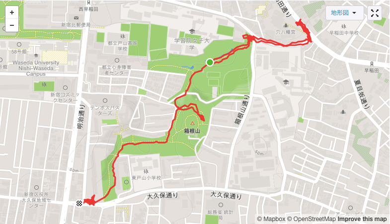

### 10/5 Ingress FS ＠新宿

こんにちは安保龍一です。

今回は新宿で開催されたingressのイベント**FS**に参加してきました。普段からingressをされている方々との交流から大人数でプレーする楽しさを感じました。

### 当日のスケジュール

> 8:00〜 受付

> 8:45 集合写真

> 9:00〜11:00 Ingress（FS）

### Ingress（FS）スタート

集合写真と撮り終えてみんなで確認事項を再確認していよいよ開始。イベント参加には、会場ごとで定められたポータルをハックすることで入手できるレジストレーションバッジが必須ということでみんなでッポータルをハック。今回は_Rikka6_さんというエージェントが描いたイラストが使用されていました。

9:00~11:00のイベント時間内では獲得できるAPが2倍になるということでレゾネーターをさして、Hackして、レベルの低いポータルをAttackを2時間ひたすら繰り返しました。肉体的にはとてもハードでした。

（実際には2倍のAPを当日にもらえるのではなく、約一週間後にその日の獲得分が反映されるというシステム）

基本的にはレベルの高いガチ勢の方々がポータルを焼き、僕たちが空になったポータルにレゾネーターをさしていくという感じで進めて行きました。みんなで協力するチームプレーの反面、空のポータルに1本目のレゾネーターを刺すと625APもらえるので周りの人との勝負でもあり、ingressの本来の楽しみ方ができたと思います。

個人的にはAPの稼ぎ方に工夫を加えて臨みました。集団で移動していたので若干後ろを歩いて最後のおこぼれを狙ったり、集団でDeployしていたので少し離れたところで1つポータルを決めてひたすらレゾネーターをさすなど、やっていく中で考えて変化を加えられたことは良かったと思います。また、自分とは陣営の違う人とタッグを組んでAttack、Deployをする方法も推奨します。

そして、今回のイベントではagentたちにたくさん協力していただきました。レゾレーターが足りなくなったからと課金までしてプレゼントしてくださった方や、アイテムを取得できるコードを提供してくれる方などの協力なしではレベル上げは無理だったと言い切れます。久しぶりにFSらしいことをしたと喜んでくださっているのも見て、ingressと通じて人と繋がる面白さも実感できました。

イベントでは開始前と終了後にAgent Stats を提出するので自分がその日でどのくらいAPを獲得できたかというのを把握することができます。

今回の新宿のFSではレベル５の1/5から写真で載せたところまでレベルを上げることができました。レベル上げに苦労している方がいましたら是非。

> モバイルバッテリー携帯必須！！！

**『ストラバ記録』**

<iframe height=’405' width=’590' frameborder=’0' allowtransparency=’true’ scrolling=’no’ src=’[https://www.strava.com/activities/2763388314/embed/1d0651c7d910f164b6c5a136ca83d48488b3d21f'](https://www.strava.com/activities/2763388314/embed/1d0651c7d910f164b6c5a136ca83d48488b3d21f')></iframe>
