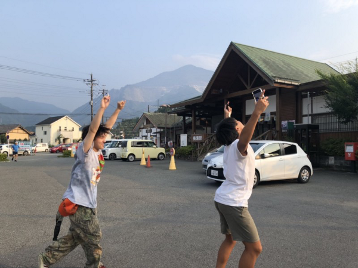
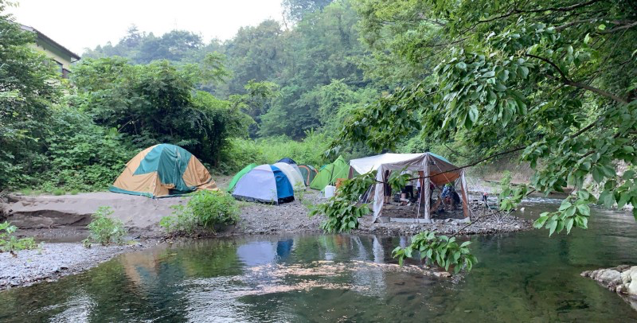
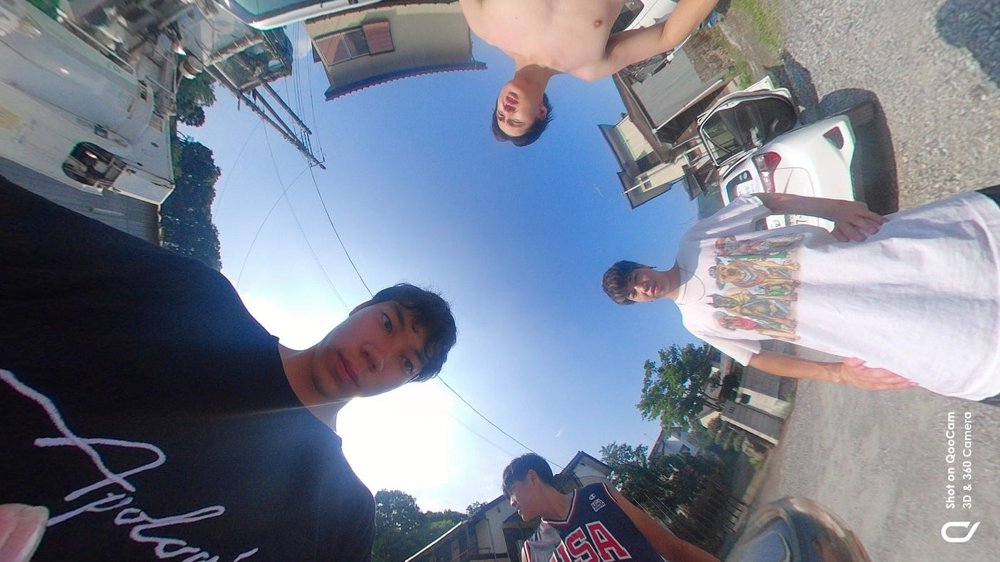
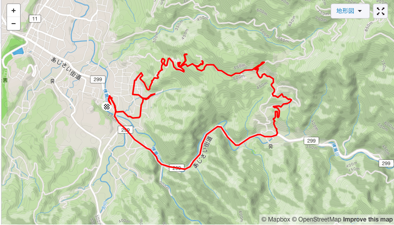

### 8/2~8/4 合宿＠横瀬町

はじめまして安保龍一です。

今回の合宿がゼミ活動への初参加ということで新発見の連続でした。8/2~8/4の自分が参加した３日間の記録について報告します。

### 『8/2 ゼミ合宿1日目』

・テント張り

・BBQ

・ゼミ論構想発表

１３時に町田をスタート。下道を走ること約3時間半ついに合宿地である横瀬町に到着。そして古橋亭到着後早速テント張り。テントを張れるスペースがほとんどなかったため、川の対岸にテントを張りました。移動のたびに川を渡らなければならないし、テントを張った場所が川に近すぎたので次回から改善が必要。初日は到着時間が遅かったため特に活動はなく到着後すぐにBBQ！お酒もお肉も美味しくいただきましたが、若干ギルティーを感じていました。。

BBQも終わり時刻は２２時を回りゼミ論の構想発表の時間になりました。今回僕がゼミ論として取り上げるのは「スポーツとGPS」ということで、所属している体育会サッカー部の試合をGPSを用いてデータとして分析し、試合の結果と選手の動くがどのように関係しているのかを明らかにすることです。また、ドローンの活用も出来たら実際に選手がピッチ内のどこの位置にいるかという上空からの映像も取れるのでそちらの検討もしていきたい。先生の方からは、慶應大学の神武先生の研究を参考にすることを提案いただいた。

### 『8/3 ゼミ合宿2日目』

・360度マッピング

・BBQ

#### 「横瀬町全域の360°マッピング」始動！！

（午前）

合宿２日目にいよいよマッピング開始。午前中はLG３６０を使用。車ごとに役割とルートを分担していざ出発、、早速機材トラブル発生。携帯とカメラの接続が切れてしまい撮影ができない状態に。何度か自分たちで試すも解決できず、Googleで検索かけてもダメ。ついにzelloで助けを求める形に。原因はカメラからのWiFiを携帯で受信できるようにする設定ができていなっかたこと。自分たちが初めて使う機材は、出発前に経験者から使用法を必ず聞くこと。そして、何かトラブルが起きたらすぐに報告。絶対にそっちの方が早く解決する。スタートにつまずいた僕たちもついに横瀬町の公道のマッピングスタート。ここでまた新たなトラブル発生、、５秒おきにカメラが自動的にストップ。全くマッピングを勧められない状況に。のちにカメラのオーバーヒートと判明。確かに横瀬町は暑かったが、他のカメラには大きな問題はなかったためLGの性能の低さであるのではないかと感じた。たまたま近くを通っていた別にチームに残りのマッピングを依頼し、午前のマッピングか終了。カメラの熱暴走を防止する方法として携帯同様に冷えピタを貼るや、そもそも黒のカメラにしないことが必要かと。台数的に厳しいが、描く車に二台配置できればバッテリーや今回のトラブルの際に代用が可能に。とにかく夏場のマッピングでは予期しないことが天候によって起こるということが判明。ポジティブに捉えたら次回以降に繋がる収穫かと。

（午後）

午後はカメラをQooCamに変更してマッピング再開。午前中のトラブルが頭をよぎるが何事もなくマッピング終了。やはりLGに原因があった。次回以降はLG以外のカメラでの撮影を推奨します。

### 『8/4ゼミ合宿3日目』

・Pokémon GO

・Ingress

合宿最終日はみんなで携帯を片手に５時から行動開始。ingressのチュートリアル等を済ませてどのようにプレーすれば効率よくレベル上げが可能かなど学びました。実際に先生からフィールドアートの課題が出てみんなでトライ、、、しかしingressガチ勢の大きな壁に惨敗。来年はリベンジを！

#### #あれば便利はグッズ

・ヘッドライト

合宿中は基本的にライトなどがないことが多い。今回のように川の対岸にテントを張った時などは必ず川を渡らなければならないため携帯よりヘッドライトが便利。夜はテントの内側に結びつけてランンプ代わりに。また、ペットボトルの下に入れるとおしゃれなライトに！

> [バッテリーガードLED ヘッドランプ/300https://ec.coleman.co.jp/item/IS00060N07907.html](https://ec.coleman.co.jp/item/IS00060N07907.html)

・マット

今回はゴツゴツとした岩の上での睡眠だったためあまり気持ちよく寝ることができなっかた。別でマットを購入する必要があるかと、、

> [Z Lite™ SolＺライトソルhttps://www.e-mot.co.jp/therm-a-rest/product.asp?id=176](https://www.e-mot.co.jp/therm-a-rest/product.asp?id=176)

・上着

８月だからいらないと思っていたが、朝方は普通に冷え込むため軽くは終えるものがあればいいかと思う。何かはおれれば防虫対策にも！

**『STRAVA記録』**

<iframe height=’405' width=’590' frameborder=’0' allowtransparency=’true’ scrolling=’no’ src=’[https://www.strava.com/activities/2599034434/embed/2969aaa0e6ee68d892636df71e747d76bca7b0d9'](https://www.strava.com/activities/2599034434/embed/2969aaa0e6ee68d892636df71e747d76bca7b0d9')></iframe>

<iframe height=’405' width=’590' frameborder=’0' allowtransparency=’true’ scrolling=’no’ src=’[https://www.strava.com/activities/2585707579/embed/575afdbf9378cb6a90f8f9d837761171eb4cec5a'](https://www.strava.com/activities/2585707579/embed/575afdbf9378cb6a90f8f9d837761171eb4cec5a')></iframe>

<iframe height=’405' width=’590' frameborder=’0' allowtransparency=’true’ scrolling=’no’ src=’[https://www.strava.com/activities/2585717880/embed/3ccd018742fdb1f4b5bf197b3c67ba4c79e04d28'](https://www.strava.com/activities/2585717880/embed/3ccd018742fdb1f4b5bf197b3c67ba4c79e04d28')></iframe>
